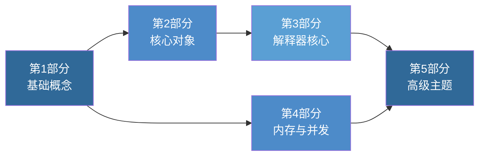

# 🐍 Python源码解析——深度剖析CPython

> **"源代码就是最好的文档。"** —— 理解Python底层的C实现，是成为Python高手的必经之路。

---

## 📖 为什么要读CPython源码？

Python 以其简洁优雅的语法深受开发者喜爱，但许多Python程序员对"Python是如何工作的"只停留在表面理解。你是否曾好奇：

- `[1, 2, 3]` 在内存中到底长什么样？
- `dict` 为什么这么快？哈希表是如何实现的？
- Python的GIL到底是什么？为什么它存在？
- 协程和生成器是如何在不创建新线程的情况下实现并发的？
- 垃圾回收是如何自动管理内存的？

本书将带你深入 **CPython 3.12.x** 的C语言源码，从底层的对象模型到解释器主循环，从内存管理到协程实现，全面、系统地剖析Python的内部工作原理。

---

## 🎯 目标读者

| 读者群体 | 前置要求 | 收获 |
|---------|---------|------|
| **Python高级开发者** | 3年以上Python经验 | 理解性能瓶颈，写出更高效的代码 |
| **系统程序员** | 熟悉C语言 | 理解脚本语言的C实现范式 |
| **计算机专业学生** | 数据结构基础 | 将理论知识与工业实现对照 |
| **技术面试准备者** | Python基础 | 深入理解语言特性背后的原理 |
| **开源贡献者** | Git基础 | 为CPython贡献代码做好准备 |

---

## 🗺️ 学习路径图



**推荐阅读顺序**：
1. **第1部分**（基础概念）：建立对CPython源码结构和对象模型的整体认知
2. **第2部分**（核心对象）：深入理解Python内置类型的底层实现
3. **第3部分**（解释器核心）或 **第4部分**（内存与并发）：两者相对独立，可按兴趣选择
4. **第5部分**（高级主题）：在前四部分基础上，探索Python的高级特性

---

## 📚 全书概览

### 第1部分：基础概念

| 章节 | 标题 | 核心内容 |
|------|------|---------|
| 第1章 | CPython概述与开发环境 | CPython与其他Python实现的区别、源码获取、编译环境搭建 |
| 第2章 | CPython源码结构 | 源码目录树概览、编译流程、关键文件索引 |
| 第3章 | Python对象模型基础 | 一切皆对象的设计哲学、PyObject/PyVarObject、类型系统 |

### 第2部分：核心对象系统

| 章节 | 标题 | 核心内容 |
|------|------|---------|
| 第4章 | PyObject与引用计数 | ob_refcnt字段、Py_INCREF/Py_DECREF宏、循环引用 |
| 第5章 | int对象深度解析 | PyLongObject结构体、小整数缓存、大整数运算 |
| 第6章 | list对象深度解析 | PyListObject、动态扩容、append/insert时间复杂度 |
| 第7章 | dict对象深度解析 | 哈希表实现、compact dict优化、开放寻址 |
| 第8章 | str/bytes对象深度解析 | PyUnicodeObject、字符串intern、紧凑表示 |

### 第3部分：解释器核心

| 章节 | 标题 | 核心内容 |
|------|------|---------|
| 第9章 | 字节码与编译器 | .py→AST→符号表→字节码的编译流水线 |
| 第10章 | 解释器主循环 | ceval.c主循环、计算栈帧、字节码分派 |
| 第11章 | 函数调用与栈帧 | PyFrameObject、调用约定、闭包实现 |
| 第12章 | 异常处理机制 | 异常表、try/except字节码、traceback |

### 第4部分：内存与并发

| 章节 | 标题 | 核心内容 |
|------|------|---------|
| 第13章 | 内存管理 | 内存层级(arena/pool/block)、pymalloc分配器 |
| 第14章 | GIL与并发 | GIL的C实现、条件变量、PEP 684 per-interpreter GIL |
| 第15章 | 垃圾回收 | 分代回收、引用计数+循环检测、弱引用 |

### 第5部分：高级主题

| 章节 | 标题 | 核心内容 |
|------|------|---------|
| 第16章 | import系统 | importlib、finders/loaders、包导入 |
| 第17章 | 类型系统与元类 | type的C实现、MRO C3线性化、描述符 |
| 第18章 | 协程与生成器 | 生成器C实现、yield from、async/await |

---

## 🛠️ 环境准备

### 获取CPython源码

```bash
# 克隆 CPython 主仓库
git clone https://github.com/python/cpython.git
cd cpython

# 切换到 3.12 分支
git checkout 3.12

# 查看源码结构
ls -la
```

### 编译CPython（macOS）

```bash
# 安装依赖
brew install openssl xz zlib gdbm tcl-tk

# 配置（调试模式，保留符号信息）
./configure --with-pydebug --with-openssl=$(brew --prefix openssl)

# 编译（使用多核加速）
make -j$(sysctl -n hw.logicalcpu)

# 验证
./python.exe -c "import sys; print(sys.version)"
```

### 编译CPython（Linux）

```bash
# 安装依赖（Ubuntu/Debian）
sudo apt-get build-dep python3
sudo apt-get install -y build-essential gdb lcov pkg-config \
  libbz2-dev libffi-dev libgdbm-dev libgdbm-compat-dev \
  liblzma-dev libncurses5-dev libreadline-dev \
  libsqlite3-dev libssl-dev lzma lzma-dev tk-dev \
  uuid-dev zlib1g-dev

# 配置与编译
./configure --with-pydebug
make -j$(nproc)
```

### 推荐开发工具

| 工具 | 用途 | 说明 |
|------|------|------|
| **VS Code** | 代码浏览 | 安装 C/C++ 扩展，配置 `compile_commands.json` |
| **GDB / LLDB** | 调试 | 附加到 CPython 进程，设置断点 |
| **ctags / cscope** | 符号索引 | 快速跳转到函数定义 |
| **Compile Explorer** | 在线分析 | 快速查看编译后的汇编/字节码 |

> **提示**：使用 `make tags` 可以生成 ctags 索引文件，在 Vim/VS Code 中快速导航源码。使用 Bear 工具（`bear -- make`）可以生成 `compile_commands.json` 以获得更好的 IDE 支持。

---

## 📊 项目数据

| 指标 | 数值 |
|------|------|
| 📚 总章数 | 18 章 |
| 📝 内容量 | 7,500+ 行 |
| 🗂️ 代码示例 | 200+ 源码片段 |
| 📐 Mermaid 图 | 50+ 张可视化图表 |
| 🎯 源码版本 | CPython 3.12.x |
| 🌐 部署方式 | Docsify + GitHub Pages |

---

## 📄 许可证

本书采用 [CC BY-SA 4.0](https://creativecommons.org/licenses/by-sa/4.0/) 许可协议。CPython 源码引用遵循 [Python Software Foundation License](https://docs.python.org/3/license.html)。

---

## 🙏 致谢

- 感谢 [Datawhale](https://github.com/datawhalechina) 开源社区的支持
- 感谢 CPython 核心开发者和所有贡献者
- 本书参考了大量 CPython 官方文档、PEP 提案和开发者邮件列表中的讨论

---

<p align="center">
  <strong>准备好了吗？让我们从 <a href="/part1-basics/ch01-cpython-overview">第1章 CPython概述与开发环境</a> 开始吧！</strong>
</p>
