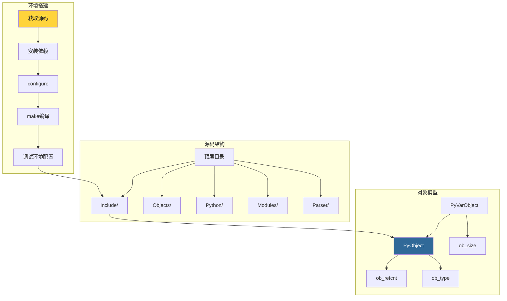

# 第1部分：基础概念

> 本部分共3章，带你建立对CPython源码结构和对象模型的整体认知，为后续深入源码分析打好基础。

---

## 📑 章节导航

| 章节 | 标题 | 你将学到 |
|------|------|---------|
| [第1章](./ch01-cpython-overview.md) | CPython概述与开发环境 | CPython的历史地位、与其他实现的区别、源码获取与编译 |
| [第2章](./ch02-source-structure.md) | CPython源码结构 | 源码目录树、编译流程、关键文件索引 |
| [第3章](./ch03-object-model.md) | Python对象模型基础 | 一切皆对象的设计哲学、PyObject/PyVarObject结构体、类型系统 |

---

## 🎯 学习目标

完成本部分后，你将能够：

1. ✅ 独立编译和调试 CPython 3.12
2. ✅ 在庞大的源码树中快速定位关键文件
3. ✅ 理解 `PyObject` 结构体及其在整个CPython中的核心地位
4. ✅ 掌握Python类型系统的C语言实现基础

---

## 📐 知识地图

---

准备好了吗？从 [第1章 · CPython概述与开发环境](./ch01-cpython-overview.md) 开始吧！
