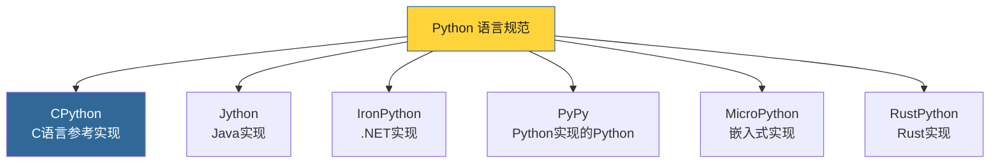
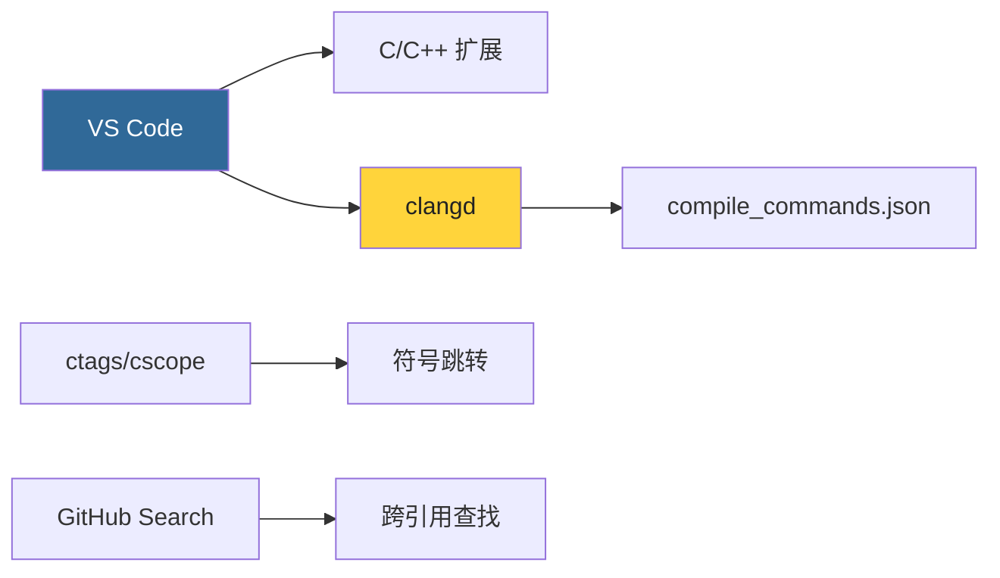

# 第1章 · CPython概述与开发环境

> **本章要点**：了解CPython的历史地位、与其他Python实现的区别，并搭建完整的CPython开发和调试环境。

---

## 1.1 什么是CPython？

### 1.1.1 Python语言的实现谱系

当我们说"Python"时，通常指的是**CPython**——用C语言编写的Python参考实现。但Python语言规范本身与它的具体实现是分离的。



| 实现 | 语言 | 特点 | 适用场景 |
|------|------|------|---------|
| **CPython** | C | 参考实现，生态最完整 | 通用开发、数据科学 |
| **PyPy** | RPython | JIT编译，运行速度快 | 计算密集型任务 |
| **Jython** | Java | 与JVM生态互操作 | Java平台集成 |
| **IronPython** | C# | 与.NET生态互操作 | .NET平台集成 |
| **MicroPython** | C | 极简内存占用 | 嵌入式/IoT设备 |
| **RustPython** | Rust | 内存安全 | 新兴实验项目 |
| **GraalPy** | Java (Truffle) | 高性能多语言互操作 | GraalVM生态 |

> **关键认知**：CPython是Python语言的**事实标准**。PEP（Python Enhancement Proposal）的通过以CPython实现为准。当人们谈论"Python的新特性"时，实际上谈论的是CPython。

### 1.1.2 CPython的核心架构

CPython的架构可以用以下流水线来描述：


**五大核心组件**：

| 组件 | 源码位置 | 功能 |
|------|---------|------|
| **Parser** | `Parser/` | 将.py源码解析为CST（具体语法树），再转为AST |
| **Compiler** | `Python/compile.c` | 将AST编译为字节码指令序列 |
| **Interpreter** | `Python/ceval.c` | 字节码虚拟机，逐条执行指令 |
| **Memory** | `Objects/obmalloc.c` | pymalloc内存分配器 |
| **Runtime** | `Python/` | 模块导入、异常处理、内置函数等运行时支持 |

---

## 1.2 CPython版本历史

### 1.2.1 重要版本里程碑

| 版本 | 发布时间 | 关键特性 |
|------|---------|---------|
| Python 3.0 | 2008.12 | Python 3首个版本，不兼容2.x |
| Python 3.6 | 2016.12 | 字典compact实现、f-string、类型提示 |
| Python 3.7 | 2018.06 | 数据类、async/await改进 |
| Python 3.8 | 2019.10 | 海象运算符`:=`、位置参数限定 |
| Python 3.9 | 2020.10 | 字典合并运算符、类型提示泛型 |
| Python 3.10 | 2021.10 | 结构化模式匹配、PEP 626精确行号 |
| Python 3.11 | 2022.10 | 错误位置细化、自适应解释器、~25%性能提升 |
| **Python 3.12** | **2023.10** | **PEP 684 per-interpreter GIL、推导式内联、Tier 2优化器** |

> **本书基于 CPython 3.12.x**。3.12是一个分水岭版本，引入了per-interpreter GIL基础设施和持续的性能优化。

### 1.2.2 Python 3.12 的核心变化

```c
// Python 3.12 引入了 Tier 2 优化器
// Python/bytecodes.c 中定义了所有字节码的语义

// 新增的字节码（部分）:
// - CALL_INTRINSIC_1/2: 内联常用函数调用
// - LOAD_SUPER_ATTR: super() 优化
// - BINARY_SLICE / STORE_SLICE: 切片操作优化
```

---

## 1.3 获取CPython源码

### 1.3.1 克隆官方仓库

```bash
# 克隆主仓库（完整历史，约1.2GB）
git clone https://github.com/python/cpython.git
cd cpython

# 切换到3.12分支
git checkout 3.12

# 验证
git log --oneline -5
```

### 1.3.2 源码浏览方式

| 方式 | 优点 | 适用场景 |
|------|------|---------|
| **本地克隆** | 完整历史、离线可用、支持搜索 | 深度分析（推荐） |
| **GitHub Web** | 无需下载、快速查看 | 快速参考 |
| **GitHub Codespaces** | 云端开发环境 | 快速实验 |

### 1.3.3 源码统计

```bash
# 统计源码规模
cd cpython
echo "=== 文件数量 ==="
find . -name "*.c" -o -name "*.h" | wc -l

echo "=== C源码行数 ==="
find . -name "*.c" -o -name "*.h" | xargs wc -l | tail -1

echo "=== Python源码行数 ==="
find Lib/ -name "*.py" | xargs wc -l | tail -1
```

CPython 3.12 大致规模：**约3000个C/H文件，超过80万行C代码**，外加Python标准库约40万行。

---

## 1.4 编译CPython

### 1.4.1 macOS 编译

```bash
# 1. 安装依赖
brew install openssl@3 xz gdbm tcl-tk

# 2. 配置（调试模式）
./configure \
    --with-pydebug \
    --with-openssl=$(brew --prefix openssl@3) \
    --prefix=$(pwd)/build

# 3. 编译
make -j$(sysctl -n hw.logicalcpu)

# 4. 验证
./python.exe --version
# Python 3.12.x

# 5. 运行测试
./python.exe -m test -j4
```

> **`--with-pydebug`** 是关键选项，它启用：
> - 引用计数调试（`sys.gettotalrefcount()`）
> - 内存分配追踪
> - 额外的断言检查
> - 更低优化级别的编译（-O0）

### 1.4.2 Linux (Ubuntu/Debian) 编译

```bash
# 1. 安装构建依赖
sudo apt-get build-dep python3
sudo apt-get install -y \
    build-essential gdb lcov pkg-config \
    libbz2-dev libffi-dev libgdbm-dev libgdbm-compat-dev \
    liblzma-dev libncurses5-dev libreadline-dev \
    libsqlite3-dev libssl-dev tk-dev uuid-dev zlib1g-dev

# 2. 配置与编译
./configure --with-pydebug --prefix=$(pwd)/build
make -j$(nproc)

# 3. 验证
./python -c "import sys; print(sys.version)"
```

### 1.4.3 编译选项详解

| 选项 | 作用 | 推荐 |
|------|------|------|
| `--with-pydebug` | 调试模式 | ✅ 本书场景 |
| `--with-assertions` | 开启断言 | ✅ |
| `--with-valgrind` | Valgrind支持 | 内存分析时 |
| `--with-trace-refs` | 追踪引用 | 调试循环引用 |
| `--enable-optimizations` | PGO优化 | 生产环境 |
| `--with-lto` | 链接时优化 | 生产环境 |

### 1.4.4 编译产物

```bash
# 编译后的关键产物
ls -la python*           # 可执行文件
ls -la build/lib*/       # 共享库
ls -la Modules/          # 内置扩展模块(.so)
```

编译后生成 `python`（或 `python.exe`）可执行文件，它实际是一个很小的包装器，链接到 `libpython3.12.so`（或 `.dylib`）。

---

## 1.5 调试CPython

### 1.5.1 使用GDB调试

```bash
# 启动GDB
gdb --args ./python -c "print('Hello CPython!')"

# GDB 常用命令
(gdb) break _PyEval_EvalFrameDefault  # 在主循环入口设断点
(gdb) break PyList_New                # 在list创建处设断点
(gdb) run
(gdb) bt                              # 查看调用栈
(gdb) p *op                           # 打印PyObject
(gdb) continue
```

### 1.5.2 使用LLDB调试（macOS）

```bash
# LLDB 调试
lldb -- ./python.exe -c "x = [1,2,3]"

(lldb) b PyList_Append
(lldb) run
(lldb) bt
(lldb) p *(PyListObject*)list_ptr
```

### 1.5.3 Python级别的调试辅助

```python
import sys
import dis
import gc

# 查看引用计数（需要 --with-pydebug 编译）
print(sys.gettotalrefcount())

# 反汇编函数
def add(a, b):
    return a + b
dis.dis(add)

# 手动触发GC
gc.collect()
```

### 1.5.4 调试小技巧 — 打印追踪

在CPython源码中添加临时调试点：

```c
// 在关键位置添加打印
printf("DEBUG: list->ob_size = %zd, list->allocated = %zd\n",
       op->ob_size, op->allocated);

// 或使用Python C API的打印函数
PyObject_Print(op, stdout, 0);
printf("\n");
```

---

## 1.6 CPython源码阅读工具

### 1.6.1 推荐工具链



### 1.6.2 生成编译数据库

```bash
# 方法1：使用 Bear（推荐）
bear -- make -j$(nproc)

# 方法2：使用 compiledb
compiledb make -j$(nproc)

# 生成 compile_commands.json 后，clangd 将提供精确的代码智能
```

### 1.6.3 生成符号索引

```bash
# ctags - 通用符号索引
make tags

# cscope - 更强大的交叉引用
cscope -R -b -q

# 在 Vim 中使用
# :tag PyList_New      -- 跳转到定义
# :cscope find c func  -- 查找调用者
```

### 1.6.4 VS Code 配置建议

`.vscode/settings.json`:

```json
{
  "C_Cpp.default.compileCommands": "${workspaceFolder}/compile_commands.json",
  "C_Cpp.default.includePath": [
    "${workspaceFolder}/Include",
    "${workspaceFolder}"
  ],
  "search.exclude": {
    "**/build": true,
    "**/.git": true,
    "**/__pycache__": true
  },
  "files.watcherExclude": {
    "**/build/**": true,
    "**/.git/objects/**": true
  }
}
```

---

## 1.7 CPython编码规范

### 1.7.1 C代码风格

CPython遵循 **PEP 7**（C代码风格指南），核心规则：

```c
// ✅ 正确的CPython C代码风格

/* 函数定义：返回类型单独一行 */
static PyObject *
list_append(PyListObject *op, PyObject *newitem)
{
    // 使用 4 空格缩进
    // 大括号不换行（K&R风格）
    if (op->ob_size == op->allocated) {
        // 错误处理和资源清理使用 goto
        if (list_resize(op, op->ob_size + 1) < 0) {
            return NULL;
        }
    }

    Py_INCREF(newitem);
    PyList_SET_ITEM(op, op->ob_size, newitem);
    op->ob_size++;
    Py_RETURN_NONE;
}
```

### 1.7.2 命名约定

| 前缀 | 含义 | 示例 |
|------|------|------|
| `Py` | 公开API | `PyList_New`, `Py_INCREF` |
| `_Py` | 内部API（可能变更） | `_PyObject_Init`, `_Py_Dealloc` |
| `py` | 内部函数 | `pymalloc_alloc`, `pylifecycle.c` |

---

## 1.8 本章小结

- **CPython** 是Python的C语言参考实现，是Python生态的事实标准
- Python 3.12 引入了 per-interpreter GIL 和 Tier 2 优化器等重要变化
- 使用 `--with-pydebug` 编译调试版CPython，可以追踪引用计数和内存分配
- GDB/LLDB + VS Code + ctags 构成了高效的CPython源码阅读工具链
- 理解PEP 7代码风格有助于顺利阅读CPython源码

> **下一步**：在 [第2章](./ch02-source-structure.md) 中，我们将深入CPython的源码目录树，了解各目录的职责和关键文件。
