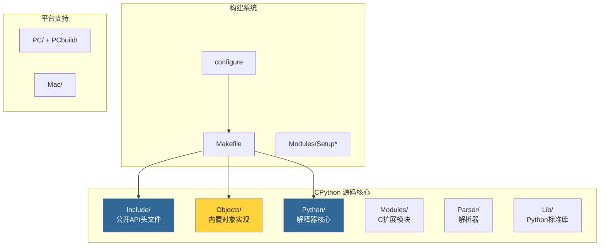
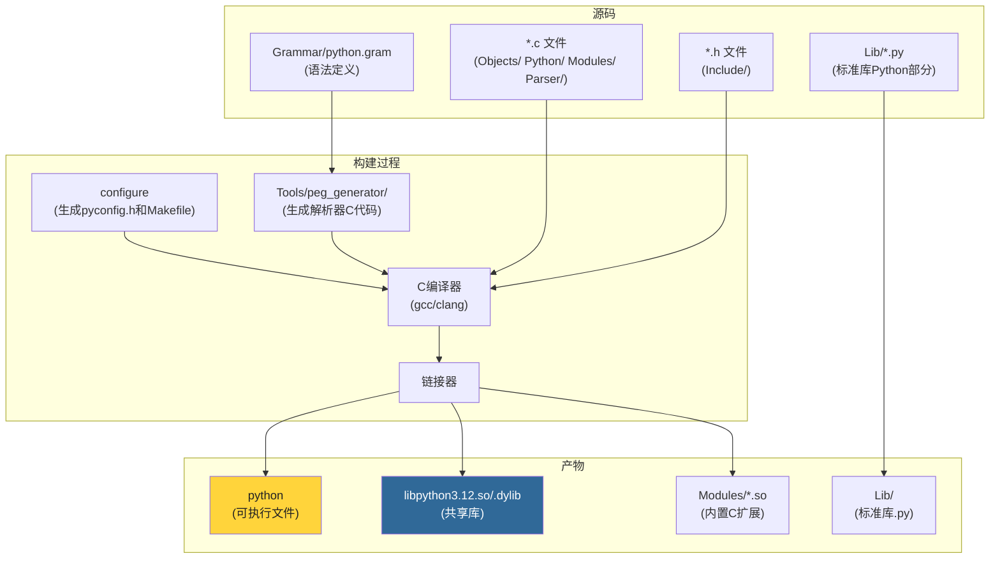
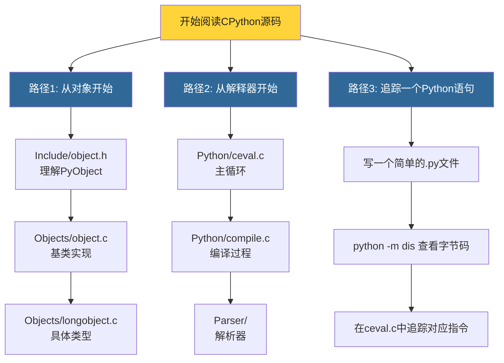

# 第2章 · CPython源码结构

> **本章要点**：全面了解CPython的源码目录树结构、编译流程以及关键文件索引，建立源码导航能力。

---

## 2.1 顶层目录一览

```bash
cpython/
├── Include/        # 公开C头文件（API定义）
├── Objects/        # 内置对象实现
├── Python/         # 解释器核心（主循环、编译器、运行时）
├── Modules/        # C扩展模块
├── Parser/         # 解析器（词法分析、语法分析）
├── Lib/            # Python标准库（纯Python部分）
├── Programs/       # 可执行入口
├── PC/             # Windows平台相关
├── PCbuild/        # Windows构建文件
├── Doc/            # 文档源文件（reST格式）
├── Tools/          # 开发辅助工具
├── Grammar/        # PEP 617 PEG语法定义
├── Misc/           # 杂项（历史文档、变更日志）
├── Mac/            # macOS相关
├── Modules/Setup*  # 模块构建配置
├── configure*      # 配置脚本
├── Makefile*       # 构建规则
└── pyconfig.h*     # 平台配置头文件（自动生成）
```



---

## 2.2 Include/ — 公开API定义

`Include/` 目录包含CPython对外暴露的所有C API头文件。这是理解CPython内部机制的最佳入口。

### 2.2.1 核心头文件

| 文件 | 作用 |
|------|------|
| `object.h` | **PyObject、PyVarObject、PyTypeObject** 定义，类型系统基石 |
| `pyport.h` | 平台兼容性宏、类型定义（`Py_ssize_t`等） |
| `ceval.h` | 解释器评估循环相关声明 |
| `code.h` | 代码对象 PyCodeObject |
| `frameobject.h` | 栈帧对象 PyFrameObject |
| `pystate.h` | 解释器状态、线程状态、GIL |
| `modsupport.h` | 模块初始化支持 |
| `methodobject.h` | 内置方法对象 |
| `abstract.h` | 对象协议抽象层 |
| `dictobject.h` | 字典对象API |
| `listobject.h` | 列表对象API |
| `longobject.h` | 整数对象API |
| `unicodeobject.h` | 字符串对象API |

### 2.2.2 内部头文件

```bash
Include/internal/       # 内部API（不保证向后兼容）
├── pycore_abstract.h   # 抽象对象协议内部
├── pycore_code.h       # 代码对象内部
├── pycore_ceval.h      # 解释器内部
├── pycore_interp.h     # 解释器状态内部
├── pycore_object.h     # 对象系统内部
├── pycore_pymem.h      # 内存管理内部
└── pycore_runtime.h    # 运行时内部
```

---

## 2.3 Objects/ — 内置对象实现

这是理解Python数据模型的核心目录，每个内置类型都有对应的 `.c` 文件。

### 2.3.1 核心实现文件

| 文件 | 实现的对象 | 本书章节 |
|------|-----------|---------|
| `object.c` | **PyObject基类、类型对象** | 第3、4章 |
| `typeobject.c` | **type元类、MRO、描述符** | 第17章 |
| `longobject.c` | **int（PyLongObject）** | 第5章 |
| `listobject.c` | **list（PyListObject）** | 第6章 |
| `dictobject.c` | **dict（PyDictObject）** | 第7章 |
| `unicodeobject.c` | **str（PyUnicodeObject）** | 第8章 |
| `bytesobject.c` | **bytes（PyBytesObject）** | 第8章 |
| `tupleobject.c` | **tuple（PyTupleObject）** | — |
| `setobject.c` | **set、frozenset** | — |
| `classobject.c` | **类对象、实例对象** | 第17章 |
| `funcobject.c` | **函数对象** | 第11章 |
| `codeobject.c` | **代码对象** | 第9章 |
| `frameobject.c` | **栈帧对象** | 第11章 |
| `genobject.c` | **生成器、协程** | 第18章 |
| `iterobject.c` | **迭代器** | — |
| `moduleobject.c` | **模块对象** | 第16章 |
| `methodobject.c` | **内置方法** | — |
| `weakrefobject.c` | **弱引用** | 第15章 |

### 2.3.2 内存管理相关

| 文件 | 作用 |
|------|------|
| `obmalloc.c` | **pymalloc** 内存分配器 | 第13章 |
| `gcmodule.c` | **垃圾回收** 模块 | 第15章 |

### 2.3.3 命名模式

```c
// Objects/ 目录中的命名模式：

// 1. XXXXobject.c — 某个具体类型的完整实现
//    listobject.c → PyList_Type, PyList_New(), list_append()

// 2. XXXXmodule.c — C扩展模块
//    gcmodule.c → gc 模块

// 3. object.c — 基类（PyObject）
//    typeobject.c — 元类（PyTypeObject）
```

---

## 2.4 Python/ — 解释器核心

`Python/` 目录是CPython的大脑，包含字节码编译器、主循环、运行时支持等。

### 2.4.1 核心文件

| 文件 | 作用 | 本书章节 |
|------|------|---------|
| `ceval.c` | **解释器主循环**（字节码虚拟机） | 第10章 |
| `compile.c` | **编译器**（AST → 字节码） | 第9章 |
| `symtable.c` | 符号表分析 | 第9章 |
| `ast.c` | AST节点构建 | 第9章 |
| `ast_opt.c` | AST优化 | 第9章 |
| `flowgraph.c` | 控制流图构建 | 第9章 |
| `codegen.c` | 代码生成 | 第9章 |
| `bytecodes.c` | **字节码定义**（Python 3.12+） | 第9章 |
| `frame.c` | 栈帧实现 | 第11章 |
| `errors.c` | 异常处理 | 第12章 |
| `import.c` | import系统 | 第16章 |
| `pystate.c` | 解释器状态、GIL | 第14章 |
| `ceval_gil.c` | **GIL实现**（Python 3.12+） | 第14章 |
| `sysmodule.c` | sys模块的C部分 | — |
| `bltinmodule.c` | 内置函数（print、len等） | — |
| `pylifecycle.c` | 解释器生命周期（启动/关闭） | — |
| `initconfig.c` | 初始化配置 | — |
| `preconfig.c` | 预初始化配置 | — |
| `pathconfig.c` | 路径配置 | — |
| `traceback.c` | 回溯信息生成 | 第12章 |

### 2.4.2 特殊文件：bytecodes.c

Python 3.12 引入 `Python/bytecodes.c`，使用 **DSL（领域特定语言）** 集中定义所有字节码的语义：

```c
// Python/bytecodes.c 的 DSL 示例（简化）
inst(BINARY_OP, (unused/1, left, right -- res)) {
    // 二元操作符的通用实现
    res = PyNumber_Add(left, right);  // 实际会根据oparg选择操作
}
```

这种集中定义方式使得优化器可以自动生成高效的字节码执行代码。

---

## 2.5 Modules/ — C扩展模块

### 2.5.1 高性能模块

| 文件 | 模块 | 说明 |
|------|------|------|
| `_io/` | `io` | 文件I/O底层实现 |
| `_json.c` | `json` | JSON编解码加速 |
| `_pickle.c` | `pickle` | 序列化加速 |
| `_datetimemodule.c` | `datetime` | 日期时间 |
| `_decimal/` | `decimal` | 高精度十进制 |
| `_collectionsmodule.c` | `collections` | deque等 |
| `_functoolsmodule.c` | `functools` | lru_cache等 |
| `itertoolsmodule.c` | `itertools` | 迭代器工具 |
| `mathmodule.c` | `math` | 数学函数 |
| `cmathmodule.c` | `cmath` | 复数数学 |
| `_randommodule.c` | `random` | 随机数 |
| `_ssl/` | `ssl` | TLS/SSL |
| `_socket/` | `socket` | 网络 |
| `_csv.c` | `csv` | CSV解析 |
| `_heapqmodule.c` | `heapq` | 堆队列 |
| `_statisticsmodule.c` | `statistics` | 统计函数加速 |
| `_asynciomodule.c` | `asyncio` | 异步I/O底层 |

---

## 2.6 Parser/ — 解析器

### 2.6.1 解析流程（Python 3.9+）

CPython 3.9 起使用 **PEG（Parsing Expression Grammar）** 解析器取代了原来的LL(1)解析器。


### 2.6.2 关键文件

| 文件 | 作用 |
|------|------|
| `Grammar/python.gram` | PEG语法定义文件 |
| `Grammar/Tokens` | Token类型定义 |
| `Parser/tokenize.c` | 词法分析器 |
| `Parser/pegen.c` | PEG解析器引擎 |
| `Parser/pegen.h` | PEG解析器头文件 |
| `Parser/parser.c` | 解析器接口 |
| `Parser/token.c` | Token操作 |
| `Tools/peg_generator/` | PEG解析器代码生成器 |

---

## 2.7 Lib/ — Python标准库

`Lib/` 目录包含纯Python实现的标准库，这是学习Python编程风格的最佳范例。

```bash
Lib/
├── asyncio/        # 异步I/O框架
├── collections/    # 容器数据类型
├── concurrent/     # 并发编程
├── ctypes/         # C语言外部函数接口
├── distutils/      # (已废弃) 分发工具
├── email/          # 邮件处理
├── encodings/      # 字符编码
├── html/           # HTML处理
├── http/           # HTTP协议
├── importlib/      # import机制（纯Python部分）
├── json/           # JSON编解码
├── logging/        # 日志系统
├── multiprocessing/# 多进程
├── os.py           # os模块Python部分
├── pathlib.py      # 面向对象路径操作
├── pydoc.py        # 文档生成器
├── sqlite3/        # SQLite接口
├── tkinter/        # GUI工具包
├── typing.py       # 类型提示支持
├── unittest/       # 单元测试框架
├── urllib/         # URL处理
└── xml/            # XML处理
```

---

## 2.8 编译流程全景



### 2.8.1 编译阶段详解

1. **configure**：检测平台特性，生成 `pyconfig.h` 和 `Makefile`
2. **PEG生成器**：从 `Grammar/python.gram` 生成解析器C代码
3. **编译**：将所有 `.c` 文件编译为 `.o` 目标文件
4. **链接**：将 `.o` 文件链接为 `python` 可执行文件和 `libpython` 共享库
5. **标准库**：`Lib/` 中的 `.py` 文件直接复制（无需编译）

---

## 2.9 快速导航技巧

### 2.9.1 "我从哪里开始看？"



### 2.9.2 源码搜索命令

```bash
# 搜索某个函数的定义
grep -rn "PyList_New" Include/ Objects/

# 搜索某个宏的定义
grep -rn "#define Py_INCREF" Include/

# 搜索某个类型的引用
grep -rn "PyListObject" Include/ Objects/ Python/

# 查找某个字符串常量的使用
grep -rn '"list"' Objects/listobject.c
```

---

## 2.10 本章小结

| 目录 | 核心职责 | 关键文件 |
|------|---------|---------|
| `Include/` | 公开API定义 | `object.h`, `listobject.h`, `dictobject.h` |
| `Objects/` | 内置对象实现 | `object.c`, `listobject.c`, `dictobject.c` |
| `Python/` | 解释器核心 | `ceval.c`, `compile.c`, `bytecodes.c` |
| `Modules/` | C扩展模块 | `mathmodule.c`, `_asynciomodule.c` |
| `Parser/` | 解析器（PEG） | `pegen.c`, `tokenize.c` |
| `Lib/` | Python标准库 | `asyncio/`, `pathlib.py` |

> **下一步**：在 [第3章](./ch03-object-model.md) 中，我们将深入CPython最核心的设计理念——"一切皆对象"，理解PyObject结构体及其在整个类型系统中的基石地位。
