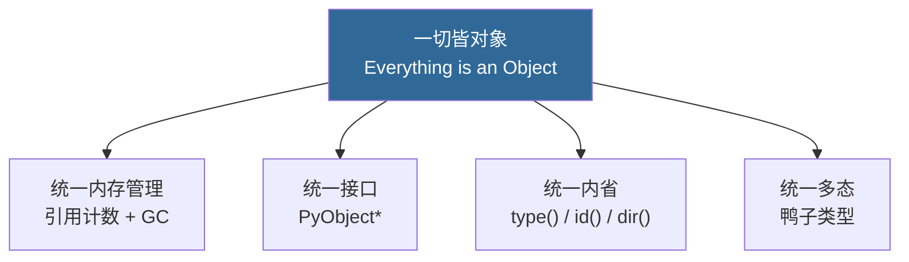
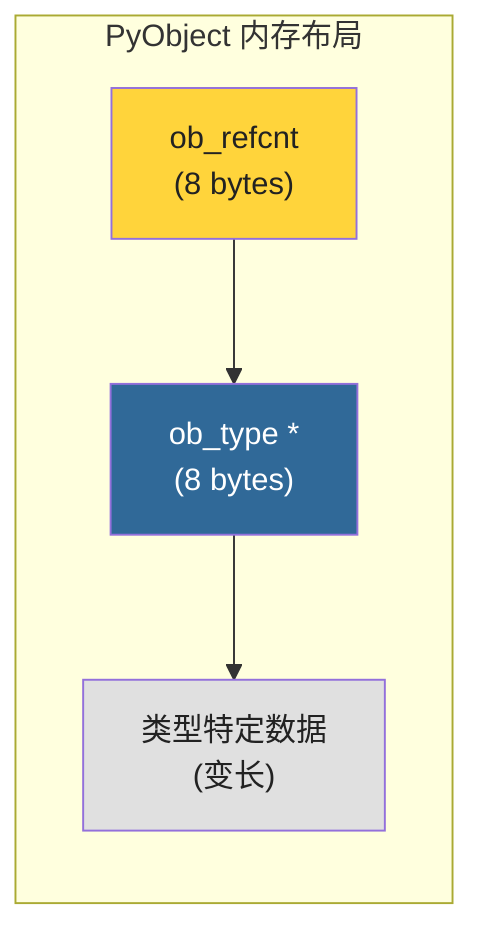
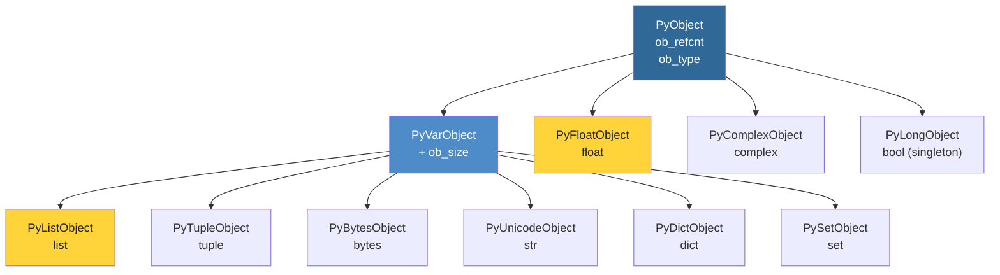
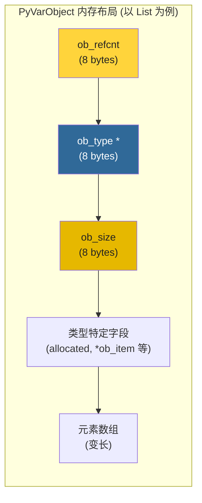
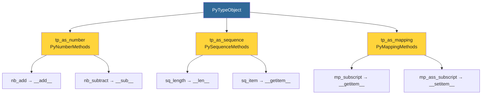
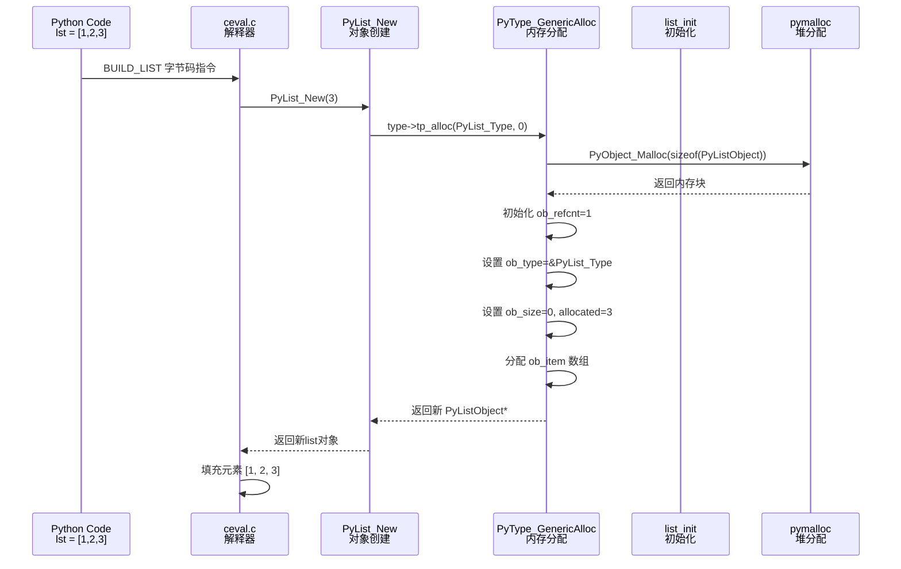
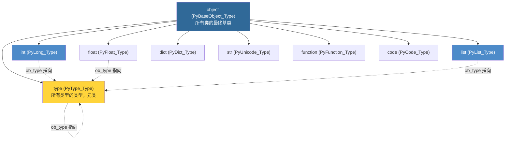
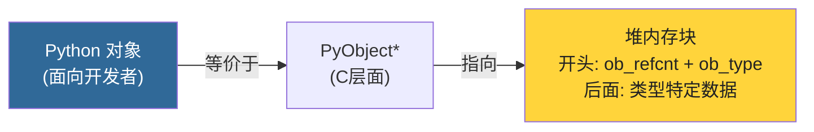

# 第3章 · Python对象模型基础

> **本章要点**：理解CPython的核心设计哲学"一切皆对象"，深入分析PyObject和PyVarObject结构体，掌握类型对象PyTypeObject的构成，追踪对象创建流程。

---

## 3.1 "一切皆对象"的设计哲学

### 3.1.1 从Python层面看对象

在Python中，**一切都是对象**：

```python
# 整数是对象
x = 42
print(type(x))        # <class 'int'>
print(id(x))          # 内存地址（CPython中即对象指针）

# 函数是对象
def foo():
    pass
print(type(foo))      # <class 'function'>

# 类型本身也是对象
print(type(int))      # <class 'type'>

# 模块是对象
import sys
print(type(sys))      # <class 'module'>

# 甚至代码也是对象
print(type(foo.__code__))  # <class 'code'>
```

### 3.1.2 设计哲学



> **核心洞察**：在CPython中，**所有Python层面的"东西"在C层面都是 `PyObject*` 指针**。无论是 `42`、`"hello"`、`[1,2,3]` 还是 `print` 函数，它们在C层面都指向堆上的一块内存，这块内存的前几个字段完全相同。

---

## 3.2 PyObject — 万物之基

### 3.2.1 结构体定义

`PyObject` 定义在 `Include/object.h` 中，是所有Python对象的共同基类：

```c
// Include/object.h (简化版本)

typedef struct _object {
    Py_ssize_t ob_refcnt;    // 引用计数
    PyTypeObject *ob_type;   // 指向类型对象的指针
} PyObject;
```

### 3.2.2 字段详解

| 字段 | 类型 | 含义 |
|------|------|------|
| `ob_refcnt` | `Py_ssize_t` | **引用计数**：记录有多少个引用指向此对象。当计数降为0时，对象被释放。 |
| `ob_type` | `PyTypeObject *` | **类型指针**：指向该对象的类型对象。通过此指针可以找到类型的名称、方法表、分配/释放函数等。 |

### 3.2.3 内存布局（定长对象）



```c
// 定长对象的模拟内存布局（x86-64）
// 地址      内容
// 0x1000    ob_refcnt = 1
// 0x1008    ob_type = &PyFloat_Type
// 0x1010    ob_fval = 3.14     ← 类型特定数据
```

---

## 3.3 PyVarObject — 变长对象之基

### 3.3.1 结构体定义

对于长度可变的对象（如 list、str、bytes），还有额外的 `ob_size` 字段：

```c
// Include/object.h (简化版本)

typedef struct {
    PyObject ob_base;       // 继承 PyObject
    Py_ssize_t ob_size;     // 元素数量（可变长度）
} PyVarObject;
```

### 3.3.2 继承层次



### 3.3.3 变长对象内存布局



---

## 3.4 PyTypeObject — 类型的类型

### 3.4.1 "类型也是对象"

PyTypeObject 是CPython中最重要的结构体之一，它定义了**类型的行为**：

```c
// Include/cpython/object.h (大幅简化)

typedef struct _typeobject {
    PyObject_VAR_HEAD                    // ob_refcnt, ob_type, ob_size
    const char *tp_name;                 // 类型名称，如 "int", "list"
    Py_ssize_t tp_basicsize;            // 实例对象的基本大小
    Py_ssize_t tp_itemsize;             // 每个元素的大小（变长类型）

    // 析构函数
    destructor tp_dealloc;

    // 哈希
    hashfunc tp_hash;

    // 获取属性
    getattrfunc tp_getattr;

    // 数字协议
    PyNumberMethods *tp_as_number;

    // 序列协议
    PySequenceMethods *tp_as_sequence;

    // 映射协议
    PyMappingMethods *tp_as_mapping;

    // 更多方法...
    reprfunc tp_repr;
    getattrofunc tp_getattro;
    setattrofunc tp_setattro;
    newfunc tp_new;
    initproc tp_init;
    allocfunc tp_alloc;
    // ... 还有很多字段
} PyTypeObject;
```

### 3.4.2 类型对象的关键字段

| 字段 | 作用 | 示例 (list) |
|------|------|-------------|
| `tp_name` | 类型名 | `"list"` |
| `tp_basicsize` | 实例大小 | `sizeof(PyListObject)` |
| `tp_itemsize` | 元素大小 | `sizeof(PyObject*)` |
| `tp_dealloc` | 析构函数 | `list_dealloc` |
| `tp_repr` | repr()实现 | `list_repr` |
| `tp_hash` | hash()实现 | `PyObject_HashNotImplemented`（list不可哈希） |
| `tp_as_sequence` | 序列协议 | `&list_as_sequence` |
| `tp_as_mapping` | 映射协议 | NULL（list不是映射） |
| `tp_new` | `__new__` | `list_new` |
| `tp_init` | `__init__` | `list_init` |
| `tp_alloc` | 内存分配 | `PyType_GenericAlloc` |

### 3.4.3 协议（Protocols）

CPython通过**协议结构体**实现鸭子类型：

```c
// 序列协议
typedef struct {
    lenfunc sq_length;           // __len__
    binaryfunc sq_concat;        // __add__ (连接)
    ssizeargfunc sq_repeat;      // __mul__ (重复)
    ssizeargfunc sq_item;        // __getitem__
    // ...
} PySequenceMethods;

// 映射协议
typedef struct {
    lenfunc mp_length;           // __len__
    binaryfunc mp_subscript;     // __getitem__
    objobjargproc mp_ass_subscript; // __setitem__
} PyMappingMethods;

// 数字协议
typedef struct {
    binaryfunc nb_add;           // __add__
    binaryfunc nb_subtract;      // __sub__
    binaryfunc nb_multiply;      // __mul__
    // ...
} PyNumberMethods;
```



---

## 3.5 对象创建流程

### 3.5.1 创建流程全景

当在Python中执行 `lst = [1, 2, 3]` 时，底层经历了以下步骤：



### 3.5.2 核心源码：PyType_GenericAlloc

```c
// Objects/typeobject.c (简化)

PyObject *
PyType_GenericAlloc(PyTypeObject *type, Py_ssize_t nitems)
{
    PyObject *obj;
    const size_t size = _PyObject_VAR_SIZE(type, nitems);

    // 通过 pymalloc 分配内存
    obj = (PyObject *)PyObject_Malloc(size);

    if (obj == NULL)
        return PyErr_NoMemory();

    // 初始化 PyObject 头部
    // ob_refcnt 设为 1（刚创建，有一个引用）
    // ob_type 指向类型对象
    _PyObject_Init(obj, type);

    return obj;
}
```

### 3.5.3 _PyObject_VAR_SIZE 宏

```c
// Include/object.h

// 计算变长对象的总大小
#define _PyObject_VAR_SIZE(typeobj, nitems)     \
    (size_t)Py_SIZE(typeobj)                    \  // 类型对象大小
    + ((nitems) ?                               \
       ((size_t)(typeobj)->tp_itemsize * (nitems)) : 0)  // 元素总大小
```

> **定长对象**（如 float）：`nitems=0`，大小 = `tp_basicsize`
>
> **变长对象**（如 list）：`nitems=N`，大小 = `tp_basicsize + tp_itemsize * N`

---

## 3.6 内置类型对象定义示例

### 3.6.1 PyLong_Type 定义（int）

```c
// Objects/longobject.c (简化)

PyTypeObject PyLong_Type = {
    PyVarObject_HEAD_INIT(&PyType_Type, 0)   // ob_type = &PyType_Type
    "int",                                    // tp_name
    offsetof(PyLongObject, ob_digit),         // tp_basicsize
    sizeof(digit),                            // tp_itemsize
    long_dealloc,                             // tp_dealloc (析构)
    0,                                        // tp_repr (用 tp_str)
    &long_as_number,                          // tp_as_number (数字协议)
    0,                                        // tp_as_sequence
    0,                                        // tp_as_mapping
    (hashfunc)long_hash,                      // tp_hash
    0,                                        // tp_call
    long_to_decimal_string,                   // tp_str (str()实现)
    // ... 更多字段
    long_new,                                 // tp_new (创建)
    PyObject_Del,                             // tp_free (释放)
};
```

### 3.6.2 PyList_Type 定义（list）

```c
// Objects/listobject.c (简化)

PyTypeObject PyList_Type = {
    PyVarObject_HEAD_INIT(&PyType_Type, 0)
    "list",
    sizeof(PyListObject),
    0,                                        // tp_itemsize = 0 (元素单独分配)
    (destructor)list_dealloc,                 // tp_dealloc
    0,                                        // tp_repr
    0,                                        // tp_as_number
    &list_as_sequence,                        // tp_as_sequence (序列协议！)
    0,                                        // tp_as_mapping  (不是映射)
    PyObject_HashNotImplemented,              // tp_hash (list不可哈希)
    // ...
    list_new,                                 // tp_new
    PyObject_GC_Del,                          // tp_free
};
```

---

## 3.7 类型系统的继承层次



> **关键认知**：`type` 的 `ob_type` 指向它自己！这就是元类自指的实现：`type(type) is type`。

---

## 3.8 C层面的对象操作

### 3.8.1 常用宏

```c
// 引用计数操作
#define Py_INCREF(op)  ((op)->ob_refcnt++)
#define Py_DECREF(op)  \
    do { \
        if (--(op)->ob_refcnt == 0) { \
            _Py_Dealloc(op); \
        } \
    } while (0)

// 类型检查
#define Py_TYPE(ob)     (((PyObject*)(ob))->ob_type)
#define Py_SIZE(ob)     (((PyVarObject*)(ob))->ob_size)

// 类型判断
#define PyLong_Check(op)    PyObject_TypeCheck(op, &PyLong_Type)
#define PyList_Check(op)    PyObject_TypeCheck(op, &PyList_Type)
#define PyDict_Check(op)    PyObject_TypeCheck(op, &PyDict_Type)
```

### 3.8.2 对象判等

```c
// Include/object.h

// 引用相等（is 运算符）
static inline int
Py_Is(PyObject *x, PyObject *y)
{
    return (x == y);
}

// 值相等（== 运算符）
// 内部调用 PyObject_RichCompare(op1, op2, Py_EQ)
```

### 3.8.3 属性访问

```c
// 获取属性（对应 Python 的 obj.attr）
PyObject *attr = PyObject_GetAttrString(obj, "attr_name");

// 设置属性（对应 Python 的 obj.attr = value）
int result = PyObject_SetAttrString(obj, "attr_name", value);

// 检查是否有属性
int has_attr = PyObject_HasAttrString(obj, "attr_name");
```

---

## 3.9 实战：观察对象内存

### 3.9.1 使用ctypes查看对象内存

```python
import ctypes
import sys

def show_object(obj):
    """打印PyObject头部信息"""
    # 获取对象地址
    addr = id(obj)

    # 读取 ob_refcnt（第一个8字节）
    refcnt = (ctypes.c_longlong).from_address(addr)
    print(f"地址: 0x{addr:x}")
    print(f"ob_refcnt = {refcnt.value}")

    # ob_type 在8字节偏移处
    type_addr = (ctypes.c_void_p).from_address(addr + 8)
    print(f"ob_type  = 0x{type_addr.value:x}")
    print(f"type()   = {type(obj)}")

# 示例
x = [1, 2, 3]
show_object(x)

y = x  # 增加引用
show_object(x)
```

### 3.9.2 验证引用计数

```python
import sys

a = []
print(f"初始引用: {sys.getrefcount(a) - 1}")  # -1 减去getrefcount自己的引用

b = a
print(f"赋值后: {sys.getrefcount(a) - 1}")     # +1

c = [a]
print(f"放入列表后: {sys.getrefcount(a) - 1}")  # +1

del b
print(f"删除b后: {sys.getrefcount(a) - 1}")     # -1

del c
print(f"删除c后: {sys.getrefcount(a) - 1}")     # -1 (回到1)
```

> **注意**：`sys.getrefcount()` 返回的值比实际引用多1，因为函数参数本身也是一个引用。

---

## 3.10 本章小结

| 核心概念 | 对应结构体 | 位置 |
|---------|-----------|------|
| 基对象 | `PyObject` (`ob_refcnt`, `ob_type`) | `Include/object.h` |
| 变长对象 | `PyVarObject` (`+ ob_size`) | `Include/object.h` |
| 类型对象 | `PyTypeObject` (tp_name, tp_dealloc, 协议等) | `Include/cpython/object.h` |
| 对象创建 | `tp_alloc` → `_PyObject_Init` | `Objects/typeobject.c` |
| 引用计数 | `Py_INCREF` / `Py_DECREF` | `Include/object.h` |

**关键心智模型**：



> **下一步**：在 [第4章](../part2-core-objects/ch04-pyobject-refcount.md) 中，我们将深入PyObject的引用计数机制，理解CPython如何自动管理对象生命周期。
