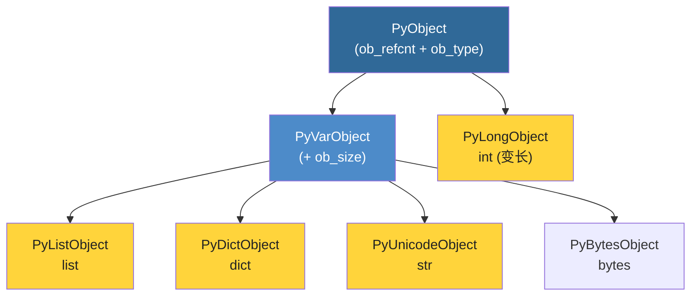

# 第2部分：核心对象系统

> 本部分共5章，深入解析Python内置类型的C语言实现，包括引用计数机制、整数、列表、字典和字符串。

---

## 📑 章节导航

| 章节 | 标题 | 核心内容 |
|------|------|---------|
| [第4章](./ch04-pyobject-refcount.md) | PyObject与引用计数 | Py_INCREF/Py_DECREF宏、循环引用问题、弱引用 |
| [第5章](./ch05-int-object.md) | int对象深度解析 | PyLongObject内部结构、小整数缓存、大整数算法 |
| [第6章](./ch06-list-object.md) | list对象深度解析 | PyListObject布局、动态扩容策略、操作复杂度分析 |
| [第7章](./ch07-dict-object.md) | dict对象深度解析 | 哈希表实现、开放寻址、compact dict优化 |
| [第8章](./ch08-str-bytes-object.md) | str/bytes对象深度解析 | PyUnicodeObject紧凑表示、intern机制、buffer protocol |

---

## 🎯 学习目标

完成本部分后，你将能够：

1. ✅ 理解引用计数的工作机制及其对Python代码的影响
2. ✅ 掌握 `int`、`list`、`dict`、`str` 的内存布局
3. ✅ 从底层解释常见操作的性能特征
4. ✅ 用C语言思维理解Python数据模型

---

## 📐 核心对象关系

> 这些核心对象的实现占据了 `Objects/` 目录中最重要、最复杂的部分代码。理解它们，就读懂了CPython的半壁江山。
