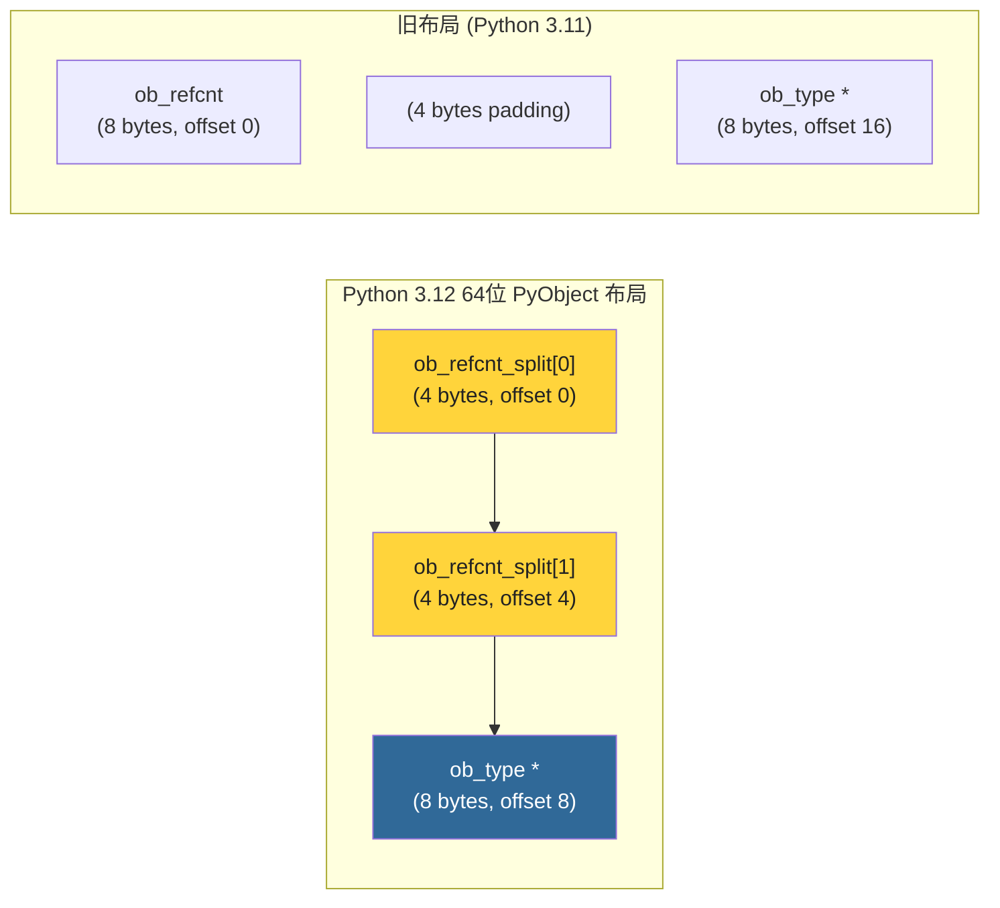
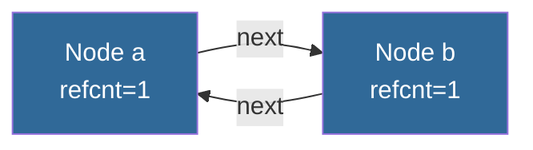
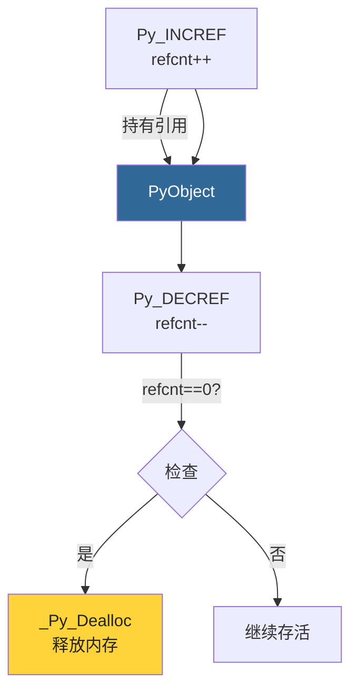

# 第4章 · PyObject与引用计数

> **本章要点**：深入理解CPython的自动内存管理核心——引用计数机制，分析Py_INCREF/Py_DECREF的底层实现，探讨循环引用问题和解决方案。

---

## 4.1 为什么需要引用计数？

CPython使用**引用计数**作为主要的内存管理策略。它的核心理念是：

> **每个对象记录有多少个地方"引用"了它。当引用计数降为0时，没有任何代码可以再访问该对象，因此可以安全释放。**

```python
a = [1, 2, 3]    # list对象引用计数 = 1 (a)
b = a            # 引用计数 = 2 (a, b)
c = [a, a]       # 引用计数 = 4 (a, b, c[0], c[1])
del a            # 引用计数 = 3 (b, c[0], c[1])
del b            # 引用计数 = 2 (c[0], c[1])
del c            # 引用计数 = 0 → 释放！
```

---

## 4.2 PyObject头部详解

```c
// Include/object.h — PyObject 的精确定义

typedef struct _object {
#if SIZEOF_VOID_P > 4
    /* 64位平台：使用两个32位字段避免结构体空洞 */
    uint32_t ob_refcnt_split[2];
#else
    /* 32位平台：直接使用 Py_ssize_t */
    Py_ssize_t ob_refcnt;
#endif
    PyTypeObject *ob_type;
} PyObject;
```

### 4.2.1 64位平台的特殊处理

在Python 3.12中，64位平台使用 `ob_refcnt_split[2]` 而不是直接的 `Py_ssize_t`，这是为了**优化内存对齐**：



```c
// 读写 ob_refcnt 的辅助宏（Python 3.12）

static inline Py_ssize_t Py_REFCNT(PyObject *ob) {
    return (Py_ssize_t)(
        ((uint64_t)ob->ob_refcnt_split[1] << 32)
        | ob->ob_refcnt_split[0]
    );
}

static inline void Py_SET_REFCNT(PyObject *ob, Py_ssize_t refcnt) {
    ob->ob_refcnt_split[0] = (uint32_t)(refcnt);
    ob->ob_refcnt_split[1] = (uint32_t)((uint64_t)refcnt >> 32);
}
```

---

## 4.3 Py_INCREF 与 Py_DECREF

### 4.3.1 定义

```c
// Include/object.h

// 增加引用计数 — 确保对象不会被释放
static inline void _Py_INCREF(PyObject *op)
{
#if SIZEOF_VOID_P > 4
    uint32_t cur = op->ob_refcnt_split[0];
    op->ob_refcnt_split[0] = cur + 1;
    if (op->ob_refcnt_split[0] == 0) {  // 低32位溢出
        op->ob_refcnt_split[1]++;
    }
#else
    op->ob_refcnt++;
#endif
}

#define Py_INCREF(op) _Py_INCREF(_PyObject_CAST(op))

// 减少引用计数 — 计数为0时释放对象
static inline void _Py_DECREF(PyObject *op)
{
#if SIZEOF_VOID_P > 4
    uint32_t cur = op->ob_refcnt_split[0];
    if (cur == 0) {  // 需要借位
        op->ob_refcnt_split[1]--;
        op->ob_refcnt_split[0] = UINT32_MAX;
    }
    else {
        op->ob_refcnt_split[0] = cur - 1;
    }

    // 检查是否变为0
    if (op->ob_refcnt_split[0] == 0 && op->ob_refcnt_split[1] == 0) {
        _Py_Dealloc(op);
    }
#else
    if (--op->ob_refcnt == 0) {
        _Py_Dealloc(op);
    }
#endif
}

#define Py_DECREF(op) _Py_DECREF(_PyObject_CAST(op))
```

### 4.3.2 _Py_Dealloc — 对象析构

```c
// Objects/object.c (简化)

void _Py_Dealloc(PyObject *op)
{
    destructor dealloc = Py_TYPE(op)->tp_dealloc;

    // 调用类型特定的析构函数
    (*dealloc)(op);

    // 析构函数负责最后调用 PyObject_Free 释放内存
}
```

### 4.3.3 引用计数操作速查

| 操作 | 引用计数变化 | 说明 |
|------|------------|------|
| `a = obj` | +1 | 变量赋值 |
| `lst.append(obj)` | +1 | 加入容器 |
| `d[key] = obj` | +1 | 字典赋值 |
| `del a` | -1 | 删除变量 |
| `lst.pop()` | -1（返回之前先+1） | 从容器移除 |
| 函数返回对象 | +1（调用者持有） | 返回值 |
| 函数参数传入 | +1（临时） | 参数传递过程中 |

---

## 4.4 引用计数实战

### 4.4.1 观察引用计数的变化

```python
import sys

def trace_ref(label, obj):
    """追踪引用计数变化"""
    # getrefcount 自身产生一个临时引用，所以减1
    count = sys.getrefcount(obj) - 1
    print(f"[{label}] refcount = {count}")
    return count

lst = [1, 2, 3]
trace_ref("创建后", lst)       # 1 (lst变量)

lst2 = lst
trace_ref("lst2 = lst", lst)   # 2

lst3 = [lst]
trace_ref("放入列表", lst)     # 3 (lst变量 + lst2 + lst3[0])

def func(arg):
    trace_ref("函数参数", lst) # 4 (lst + lst2 + lst3[0] + arg)
    return arg

result = func(lst)
trace_ref("函数返回后", lst)   # 3 (result + lst2 + lst3[0])

del lst2
trace_ref("删除lst2", lst)     # 2

del lst3
trace_ref("删除lst3", lst)     # 1
```

### 4.4.2 性能考量

引用计数操作非常轻量（通常只是整数加减），但它们是**无处不在**的，构成了CPython的显著开销：

```python
a = 1
b = a        # Py_INCREF(a)
c = a + b    # Py_INCREF(b) ← 参数传递
             # 内部创建新对象...
             # Py_DECREF(b) ← 参数结束使用
```

---

## 4.5 循环引用问题

### 4.5.1 问题说明

引用计数最大的缺陷是**无法处理循环引用**：

```python
class Node:
    def __init__(self):
        self.next = None

a = Node()
b = Node()
a.next = b
b.next = a

# 即使删除外部引用，内部循环引用使计数永远不会为0
del a
del b
# a和b的引用计数 = 1 (互相引用)，永远不会释放！
```



### 4.5.2 解决方案：垃圾回收器

CPython使用**分代垃圾回收器**来处理循环引用。支持循环检测的对象通过 `Py_TPFLAGS_HAVE_GC` 标记：

```c
// 支持GC的对象需嵌入 PyGC_Head
typedef struct {
    PyObject_HEAD
    // ... 类型特定字段
} PyGC_Head;
```

> 详细内容请参考 [第15章 垃圾回收](../part4-memory/ch15-gc.md)。

---

## 4.6 引用计数与不可变对象

### 4.6.1 不可变对象的共享

由于不可变对象永远不会改变，CPython可以安全地共享它们：

```python
a = 42
b = 42
print(a is b)  # True — 小整数被缓存

x = "hello"
y = "hello"
print(x is y)  # True — 字符串被intern

lst1 = [1, 2, 3]
lst2 = [1, 2, 3]
print(lst1 is lst2)  # False — 列表是可变对象
```

### 4.6.2 小整数缓存

```c
// Objects/longobject.c

#ifndef NSMALLPOSINTS
#define NSMALLPOSINTS 257    // -5 到 256
#endif

#ifndef NSMALLNEGINTS
#define NSMALLNEGINTS 5      // -5 到 -1
#endif

static PyLongObject small_ints[NSMALLNEGINTS + NSMALLPOSINTS];
```

这意味着 `-5` 到 `256` 之间的整数在解释器启动时就已经创建好，永远不会被释放。

---

## 4.7 弱引用

### 4.7.1 概念

弱引用允许你引用一个对象但**不增加其引用计数**：

```python
import weakref

class MyClass:
    pass

obj = MyClass()
ref = weakref.ref(obj)      # 弱引用 — 不增加引用计数

print(ref())                # <__main__.MyClass object at ...>

del obj                     # 删除强引用
print(ref())                # None — 对象已被释放
```

### 4.7.2 C层面的实现

```c
// Include/weakrefobject.h

typedef struct _weakref {
    PyObject_HEAD
    PyObject *wr_object;     // 被引用的对象
    PyObject *wr_callback;   // 对象释放时的回调
    PyWeakReference *wr_prev;
    PyWeakReference *wr_next;
} PyWeakReference;
```

| 字段 | 作用 |
|------|------|
| `wr_object` | 指向被引用对象，对象释放时被设为 `Py_None` |
| `wr_callback` | 可选回调，对象释放时调用 |
| `wr_prev/wr_next` | 双向链表，同一对象的所有弱引用链接在一起 |

---

## 4.8 引用计数的边界情况

### 4.8.1 immortal对象（Python 3.12+）

Python 3.12引入了**immortal（不朽）对象**的概念，这些对象的引用计数永远不为0：

```c
// Include/object.h

#define _Py_IMMORTAL_REFCNT \
    ((_Py_IMMORTAL_REFCNT_LO << 30) | _Py_IMMORTAL_REFCNT_LO)

static inline void _Py_SetImmortal(PyObject *op)
{
    op->ob_refcnt_split[0] = _Py_IMMORTAL_REFCNT_LO;
    op->ob_refcnt_split[1] = _Py_IMMORTAL_REFCNT_LO;
}
```

Immortal对象包括：`None`、`True`、`False`、小整数、单字符字符串等。这样做的好处是**避免对这些高频对象执行无意义的引用计数操作**，提升性能。

### 4.8.2 常量折叠

```python
# Python编译器会折叠常量表达式
a = 2 * 3 * 4   # 编译时计算为 24
# 字节码中直接是 LOAD_CONST 24
```

```python
import dis
dis.dis("a = 2 * 3 * 4")
#   1           0 LOAD_CONST               0 (24)
#               2 STORE_NAME               0 (a)
#               4 LOAD_CONST               1 (None)
#               6 RETURN_VALUE
```

---

## 4.9 性能影响与最佳实践

### 4.9.1 减少引用计数操作

在性能敏感的代码中，理解引用计数可以帮助优化：

```python
# ❌ 低效：每次迭代都涉及引用计数
for i in range(1000000):
    x = some_list[i]        # Py_INCREF
    process(x)
    # Py_DECREF (x 离开作用域)

# ✅ 更高效：减少引用计数操作
for item in some_list:      # 迭代器内部优化了引用计数
    process(item)
```

### 4.9.2 Py_XINCREF / Py_XDECREF

处理可能为 NULL 的指针时使用：

```c
// 安全的增加引用（处理 NULL）
#define Py_XINCREF(op) do { if ((op) != NULL) Py_INCREF(op); } while (0)

// 安全的减少引用（处理 NULL）
#define Py_XDECREF(op) do { if ((op) != NULL) Py_DECREF(op); } while (0)
```

---

## 4.10 本章小结

| 概念 | 关键点 |
|------|--------|
| **引用计数** | 每个对象记录引用数，为0时释放 |
| **Py_INCREF** | 增加引用计数（轻量级整数加1） |
| **Py_DECREF** | 减少引用计数，为0时调用 `_Py_Dealloc` |
| **循环引用** | 引用计数的盲区，需要GC配合解决 |
| **immortal对象** | Python 3.12优化，避免高频对象的引用计数操作 |
| **弱引用** | 不增加引用计数的引用方式 |



> **下一步**：在 [第5章](./ch05-int-object.md) 中，我们将深入Python的int对象——实际上它是 `PyLongObject`，支持任意精度整数运算。
