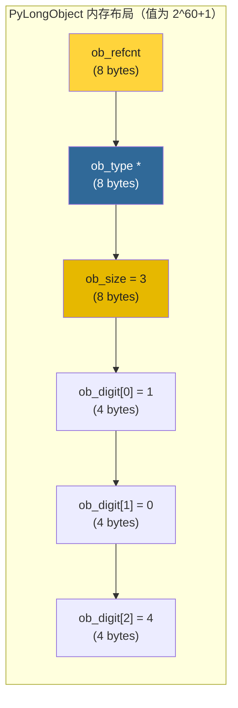
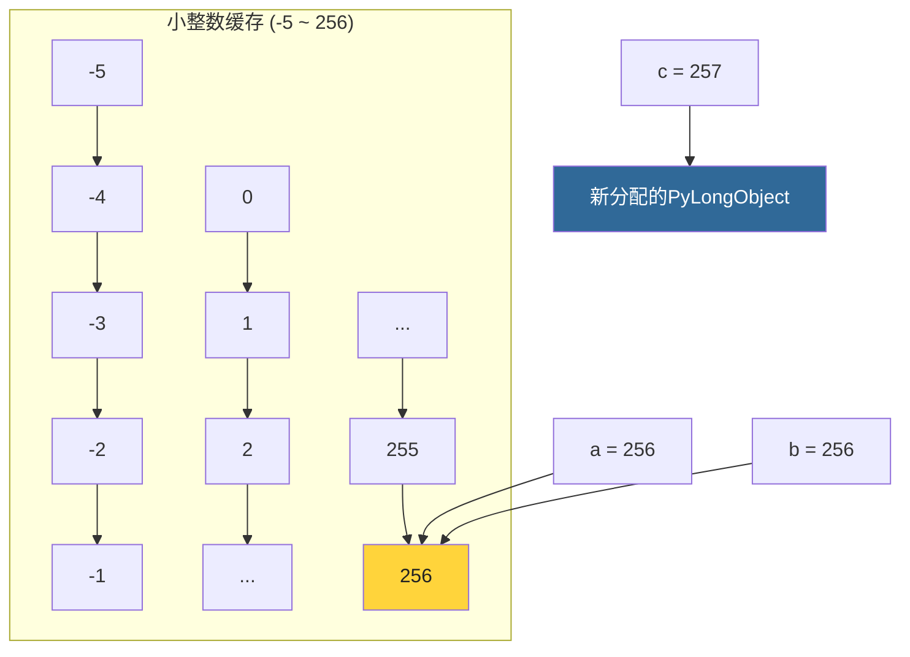
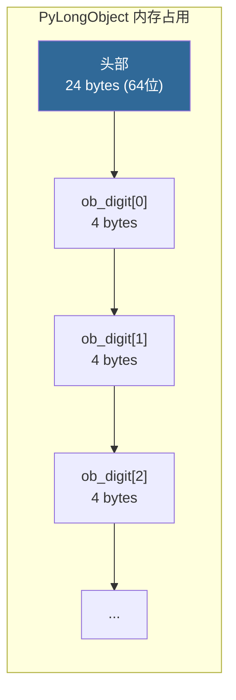

# 第5章 · int对象深度解析

> **本章要点**：深入分析Python中int对象的底层实现PyLongObject，理解任意精度整数的存储方式、小整数缓存机制以及大整数运算的算法。

---

## 5.1 为什么是PyLongObject？

在Python中，`int` 类型对应的是C层面的 `PyLongObject`。命名中的 "Long" 是历史遗留——Python 2中区分了 `int` 和 `long`，Python 3统一使用任意精度整数。

| 语言 | int范围 | 溢出行为 |
|------|---------|---------|
| C（32位） | `-2^31 ~ 2^31-1` | 未定义行为/回绕 |
| C（64位） | `-2^63 ~ 2^63-1` | 未定义行为/回绕 |
| Java | `-2^31 ~ 2^31-1` | 回绕 |
| **Python** | **任意精度** | **永不溢出** |

---

## 5.2 PyLongObject 结构体

### 5.2.1 定义

```c
// Include/cpython/longintrepr.h

typedef uint32_t digit;     // 每个"数字位"是30位有效数据
typedef int32_t sdigit;     // 有符号版本

typedef struct _longobject {
    PyObject_VAR_HEAD       // ob_refcnt, ob_type, ob_size
    digit ob_digit[1];      // 数字数组（实际长度由 ob_size 决定）
} PyLongObject;
```

### 5.2.2 内存布局



### 5.2.3 数值表示规则

```c
// 整数值 = Σ(ob_digit[i] × 2^(30×i)) × sign(ob_size)
// 其中 sign(ob_size):
//   ob_size > 0 → 正数
//   ob_size < 0 → 负数
//   ob_size == 0 → 零

// 示例：
// 42 的表示：
//   ob_size = 1, ob_digit[0] = 42

// 2^60 + 1 的表示：
//   ob_size = 3
//   ob_digit[0] = 1
//   ob_digit[1] = 0
//   ob_digit[2] = 4  (因为 4 × 2^60 = 2^62, 实际只用30位每digit)
```

> **关键设计**：每个 `digit`（`uint32_t`）只用**低30位**存储数值，高2位留给进位检测和符号处理。这被称为 **30-bit digit** 方案。

---

## 5.3 小整数缓存

### 5.3.1 源码实现

```c
// Objects/longobject.c

#ifndef NSMALLPOSINTS
#define NSMALLPOSINTS 257        // 0 到 256
#endif

#ifndef NSMALLNEGINTS
#define NSMALLNEGINTS 5          // -5 到 -1
#endif

// 小整数缓存数组
static PyLongObject small_ints[NSMALLNEGINTS + NSMALLPOSINTS];

// 初始化小整数
static PyObject *
get_small_int(sdigit ival)
{
    PyObject *v;
    // 检查是否在缓存范围内
    if (ival >= -NSMALLNEGINTS && ival < NSMALLPOSINTS) {
        v = (PyObject *)&small_ints[ival + NSMALLNEGINTS];
        Py_INCREF(v);  // 仍然增加引用计数
        return v;
    }
    return NULL;  // 不在缓存范围内，需要正常分配
}
```

### 5.3.2 验证小整数缓存

```python
a = 256
b = 256
print(a is b)   # True — 同一个缓存对象

c = 257
d = 257
print(c is d)   # 可能为 False — 每次创建新对象
# （在脚本中由于常量折叠可能为 True，在REPL中通常为 False）
```



---

## 5.4 大整数的创建与运算

### 5.4.1 PyLong_FromLong

```c
// Objects/longobject.c (简化)

PyObject *
PyLong_FromLong(long ival)
{
    // 先尝试小整数缓存
    if (ival >= -NSMALLNEGINTS && ival < NSMALLPOSINTS) {
        return get_small_int((sdigit)ival);
    }

    // 大整数：计算需要多少个digit
    size_t ndigits;
    // 分配 PyLongObject
    PyLongObject *v = _PyLong_New(ndigits);
    if (v == NULL) return NULL;

    // 设置 digit 值
    // ...

    return (PyObject *)v;
}
```

### 5.4.2 大整数加法

```c
// 核心算法：逐位相加，处理进位

static PyLongObject *
x_add(PyLongObject *a, PyLongObject *b)
{
    Py_ssize_t size_a = Py_ABS(Py_SIZE(a));
    Py_ssize_t size_b = Py_ABS(Py_SIZE(b));
    PyLongObject *z;
    Py_ssize_t i;
    digit carry = 0;

    // 确保 z 足够大
    z = _PyLong_New(Py_MAX(size_a, size_b) + 1);

    // 逐位相加
    for (i = 0; i < Py_MIN(size_a, size_b); i++) {
        carry += a->ob_digit[i] + b->ob_digit[i];
        z->ob_digit[i] = carry & PyLong_MASK;  // 低30位
        carry >>= PyLong_SHIFT;                 // 进位
    }
    // 处理剩余位...
    return z;
}
```

### 5.4.3 大整数乘法（Karatsuba算法）

对于大整数，CPython使用 **Karatsuba算法** 来优化乘法：

```c
// Objects/longobject.c

// 当数字位数超过 KARATSUBA_CUTOFF（默认70个digit）
// 时，使用 Karatsuba 算法而不是朴素 O(n²) 乘法

// Karatsuba: 将 n 位乘法分解为 3 次 n/2 位乘法
// X = X1*B^m + X0
// Y = Y1*B^m + Y0
// X*Y = X1*Y1*B^2m + ((X1+X0)*(Y1+Y0) - X1*Y1 - X0*Y0)*B^m + X0*Y0
```

---

## 5.5 int的不可变性

### 5.5.1 不可变的含义

```python
a = 42
print(id(a))    # 例如 4343838768

a += 1
print(id(a))    # 不同的地址！例如 4343838800
# a += 1 实际上创建了新的 int 对象 43
```

### 5.5.2 C层面的理解

```c
// int 没有修改自身的操作
// 所有算术操作都返回新的 PyLongObject

PyObject *
long_add(PyObject *a, PyObject *b)
{
    // ... 计算 a + b ...
    // 返回新分配的 PyLongObject
    return (PyObject *)z;
    // 不会修改 a 或 b！
}
```

---

## 5.6 Python层面追踪：从int到PyLongObject

```python
import ctypes
import sys

def show_int(value):
    """展示PyLongObject的内部结构"""
    addr = id(value)

    # 读取 ob_refcnt
    refcnt = ctypes.c_longlong.from_address(addr)
    print(f"值: {value}")
    print(f"地址: 0x{addr:x}")
    print(f"ob_refcnt: {refcnt.value}")

    # 读取 ob_size（偏移 16 — 64位平台）
    ob_size = ctypes.c_longlong.from_address(addr + 16)
    n_digits = abs(ob_size.value)
    sign = "正" if ob_size.value >= 0 else "负"
    print(f"ob_size: {ob_size.value} ({sign}, {n_digits} digits)")

    # 读取 ob_digit 数组（偏移 24）
    for i in range(min(n_digits, 5)):  # 最多显示5个digit
        digit = ctypes.c_uint32.from_address(addr + 24 + i * 4)
        print(f"  ob_digit[{i}] = {digit.value} (0x{digit.value:08x})")

# 测试小整数
show_int(42)

# 测试大整数
big = 2**100
show_int(big)
```

---

## 5.7 实战：int操作的性能分析

### 5.7.1 小整数 vs 大整数

```python
import time

# 小整数运算（使用缓存 + 单digit）
def small_int_ops():
    total = 0
    for i in range(10_000_000):
        total += i
    return total

# 大整数运算（每次创建多digit对象）
def big_int_ops():
    total = 0
    base = 2**1000  # 巨大的整数
    for _ in range(1_000):
        total += base
    return total

# 小整数操作极快（单digit + 缓存命中）
# 大整数操作较慢（多digit Karatsuba/逐位运算 + 频繁分配）
```

### 7.5.2 内存占用

```python
import sys

print(f"int(0):      {sys.getsizeof(0)} bytes")       # 28
print(f"int(1):      {sys.getsizeof(1)} bytes")       # 28
print(f"int(2**30):  {sys.getsizeof(2**30)} bytes")   # 32 (1 digit)
print(f"int(2**60):  {sys.getsizeof(2**60)} bytes")   # 32 (2 digits)
print(f"int(2**90):  {sys.getsizeof(2**90)} bytes")   # 36 (3 digits)
print(f"int(2**300): {sys.getsizeof(2**300)} bytes")  # 52 (10 digits)
```



---

## 5.8 本章小结

| 要点 | 细节 |
|------|------|
| **结构体** | `PyLongObject` = `PyObject_VAR_HEAD` + `ob_digit[]` |
| **每digit** | 30位有效数据（`uint32_t` 低30位） |
| **符号** | 通过 `ob_size` 的符号表示：正→pos，负→neg |
| **小整数缓存** | -5 ~ 256，预分配，永不释放 |
| **大整数运算** | 逐位运算（O(n)）+ Karatsuba乘法（O(n^1.58)） |
| **不可变性** | 所有算术操作返回新对象 |
| **Python 3.12优化** | 小整数设为immortal，减少引用计数开销 |

> **下一步**：在 [第6章](./ch06-list-object.md) 中，我们将深入分析Python中最常用的容器类型——list的动态扩容机制。
