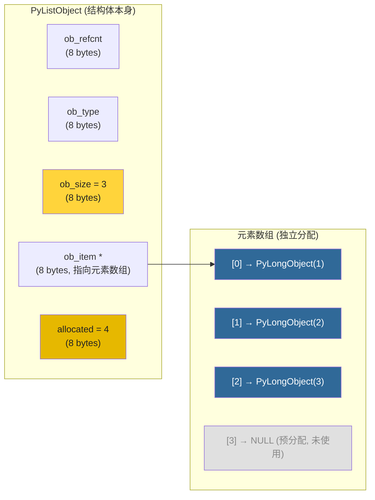
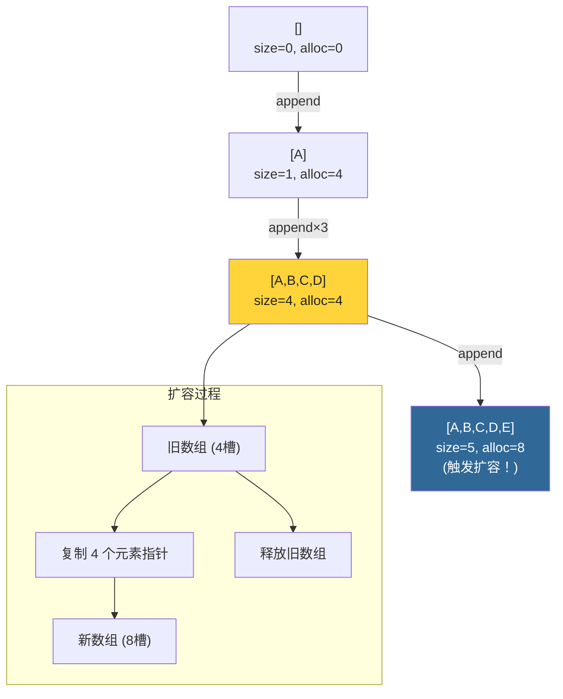
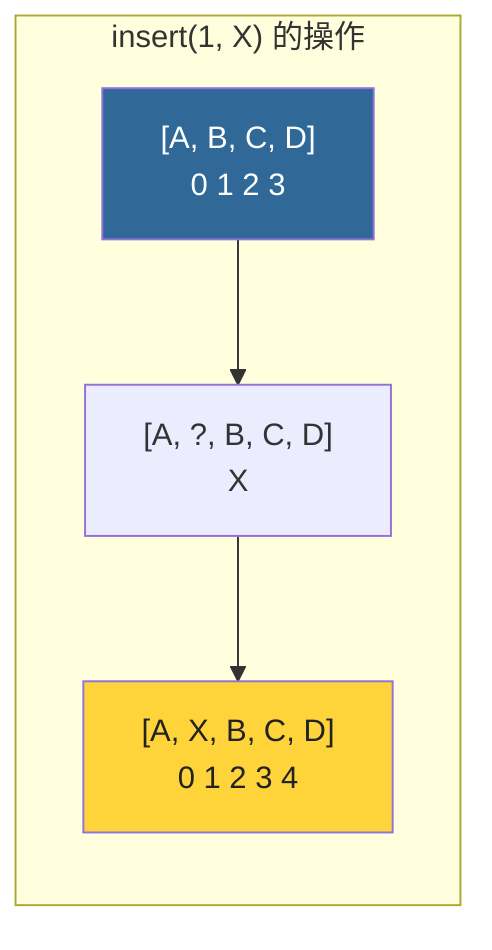

# 第6章 · list对象深度解析

> **本章要点**：深入分析PyListObject的结构体设计、动态扩容的"over-allocate"策略、常见操作的实现和时间复杂度，理解为什么list在某些场景下性能优异而在其他场景下需要谨慎使用。

---

## 6.1 PyListObject 结构体

### 6.1.1 定义

```c
// Include/cpython/listobject.h

typedef struct {
    PyObject_VAR_HEAD           // ob_refcnt, ob_type, ob_size
    /* ob_item 是指向元素数组的指针，NULL表示空列表 */
    PyObject **ob_item;         // 元素指针数组

    /* allocated 是已分配的元素槽位数 */
    Py_ssize_t allocated;
} PyListObject;
```

### 6.1.2 内存布局



**关键理解**：
- `ob_size` = 当前元素数量（3）
- `allocated` = 已分配的槽位（4，比实际需要多1个）
- `ob_item` 是一个独立的数组（不是内嵌在结构体中）

---

## 6.2 动态扩容机制

### 6.2.1 over-allocate 策略

```c
// Objects/listobject.c

static int
list_resize(PyListObject *self, Py_ssize_t newsize)
{
    PyObject **items;
    size_t new_allocated, num_allocated_bytes;

    /* 核心：over-allocate 策略 */
    if (newsize > self->allocated) {
        // 计算新分配大小
        new_allocated = (size_t)newsize +
                        (newsize >> 3) +         // 1/8 的增长因子
                        (newsize < 9 ? 3 : 6);   // 小数组的额外padding

        // 分配新数组
        items = PyMem_Realloc(self->ob_item,
                              new_allocated * sizeof(PyObject *));
        if (items == NULL) {
            PyErr_NoMemory();
            return -1;
        }
        self->ob_item = items;
        self->allocated = new_allocated;
    }

    // 更新 size
    Py_SET_SIZE(self, newsize);
    return 0;
}
```

### 6.2.2 扩容公式

```python
# 扩容公式（Python伪代码）
def over_allocate(newsize):
    new_allocated = newsize + (newsize >> 3)  # + 1/8
    if newsize < 9:
        new_allocated += 3   # 小数组额外 padding
    else:
        new_allocated += 6   # 大数组固定额外 padding
    return new_allocated

# 示例
# size=1  → allocated=4
# size=4  → allocated=4  (恰好填充)
# size=5  → allocated=8
# size=8  → allocated=12
# size=12 → allocated=18
```

### 6.2.3 扩容可视化



---

## 6.3 核心操作实现

### 6.3.1 append — O(1) 均摊

```c
// Objects/listobject.c

int
PyList_Append(PyObject *op, PyObject *newitem)
{
    // 类型检查
    if (PyList_Check(op)) {
        Py_ssize_t n = PyList_GET_SIZE(op);
        if (newitem == NULL) {
            PyErr_SetString(PyExc_TypeError, "can't append None");
            return -1;
        }

        // 确保有空间
        if (list_resize((PyListObject *)op, n + 1) < 0)
            return -1;

        // 放入新元素
        Py_INCREF(newitem);
        PyList_SET_ITEM(op, n, newitem);
        return 0;
    }
    // ... 非list类型的fallback处理
}
```

> `append` 在大多数情况下是 O(1)。仅在触发扩容时是 O(n)（需要复制数组），但由于 over-allocate 策略，扩容很少发生。

### 6.3.2 insert — O(n)

```c
// Objects/listobject.c

int
PyList_Insert(PyObject *op, Py_ssize_t where, PyObject *newitem)
{
    // 确保空间
    if (list_resize((PyListObject *)op, n + 1) < 0)
        return -1;

    // 将 [where, n-1] 的元素整体后移一位
    if (where < n) {
        memmove(&op->ob_item[where + 1],
                &op->ob_item[where],
                (n - where) * sizeof(PyObject *));
    }

    // 放置新元素
    Py_INCREF(newitem);
    op->ob_item[where] = newitem;
    return 0;
}
```



### 6.3.3 pop — O(1) 末尾 / O(n) 任意位置

```c
// 末尾 pop 是 O(1)
// 中间 pop 需要 memmove 移动后续元素
```

### 6.3.4 索引访问 — O(1)

```c
// list[index] 是直接数组索引
PyObject *
PyList_GetItem(PyObject *op, Py_ssize_t i)
{
    // 边界检查
    if (i < 0 || i >= Py_SIZE(op)) {
        PyErr_SetString(PyExc_IndexError, "list index out of range");
        return NULL;
    }
    return ((PyListObject *)op)->ob_item[i];
}
```

---

## 6.4 操作复杂度速查表

| 操作 | 时间复杂度 | 说明 |
|------|-----------|------|
| `lst[i]` | O(1) | 直接数组索引 |
| `lst[i] = x` | O(1) | 直接赋值 |
| `len(lst)` | O(1) | 读取 `ob_size` |
| `lst.append(x)` | O(1) 均摊 | 偶尔O(n)扩容 |
| `lst.insert(i, x)` | O(n) | 需要移动元素 |
| `lst.pop()` | O(1) | 末尾弹出 |
| `lst.pop(i)` | O(n) | 需要移动元素 |
| `lst.remove(x)` | O(n) | 查找 + 移动 |
| `x in lst` | O(n) | 线性搜索 |
| `lst.sort()` | O(n log n) | Timsort |
| `lst + lst` | O(n+m) | 创建新list |
| `lst[i:j]` | O(k) | k = j-i |

---

## 6.5 list 的 shrink 策略

当元素被删除后，list **不会立即收缩**：

```python
lst = list(range(1000))
print(f"分配: {sys.getsizeof(lst)}")  # ~9000 bytes

# 删除大部分元素
del lst[100:]
print(f"删除后: {sys.getsizeof(lst)}")  # 仍然 ~9000 bytes！
# allocated 不变！
```

list 只在以下情况收缩：
- 显式 `lst = lst[:]` （创建浅拷贝，恰好分配所需大小）
- 或某些特定操作触发的 `list_resize`

---

## 6.6 性能最佳实践

### 6.6.1 append vs insert(0)

```python
# ❌ 极慢！ O(n²)
result = []
for i in range(10000):
    result.insert(0, i)   # 每次都需要移动所有元素

# ✅ 快！O(n)
result = []
for i in range(10000):
    result.append(i)
result.reverse()           # O(n)，仅一次
```

### 6.6.2 预分配列表

```python
# ❌ 每次append都可能触发扩容
lst = []
for i in range(10000):
    lst.append(i)

# ✅ 预分配（避免多次扩容）
lst = [0] * 10000
for i in range(10000):
    lst[i] = i
```

### 6.6.3 列表推导式

```python
# 列表推导式内部预分配了正确大小，性能更好
lst = [i * 2 for i in range(10000)]

# 等效的 for 循环会多次 append，可能触发扩容
lst = []
for i in range(10000):
    lst.append(i * 2)
```

---

## 6.7 实战：观察列表扩容

```python
import sys

def watch_growth():
    """观察list扩容过程"""
    lst = []
    prev = sys.getsizeof(lst)
    print(f"{'length':>8} {'size':>8} {'alloc_est':>12}")
    print("-" * 32)

    for i in range(30):
        lst.append(i)
        curr = sys.getsizeof(lst)
        if curr != prev:
            n_elems = (curr - 56) // 8  # 56字节开销，每个元素8字节
            print(f"{len(lst):8d} {curr:8d} {n_elems:12d}")
            prev = curr

watch_growth()
# 输出将显示扩容点：0→4→8→12→18→27→...
```

---

## 6.8 本章小结

| 要点 | 细节 |
|------|------|
| **结构体** | `PyListObject` = PyVarObject + `ob_item*` + `allocated` |
| **元素存储** | `ob_item` 是独立分配的 `PyObject*` 数组 |
| **扩容策略** | `new_allocated = newsize + (newsize>>3) + (n<9 ? 3:6)` |
| **append** | O(1) 均摊，偶尔触发扩容 |
| **insert** | O(n)，需要 memmove |
| **索引访问** | O(1)，直接数组索引 |
| **收缩** | 删除不自动收缩 |

> **下一步**：在 [第7章](./ch07-dict-object.md) 中，我们将分析dict的哈希表实现，理解Python 3.6+ 引入的compact dict优化。
