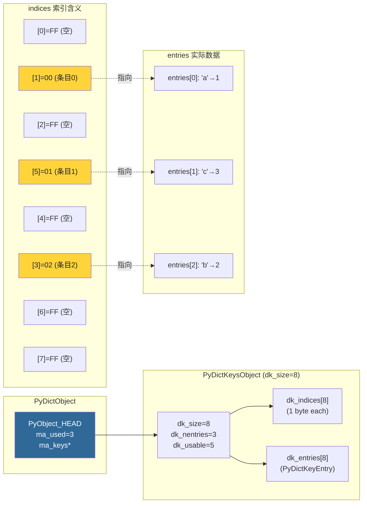
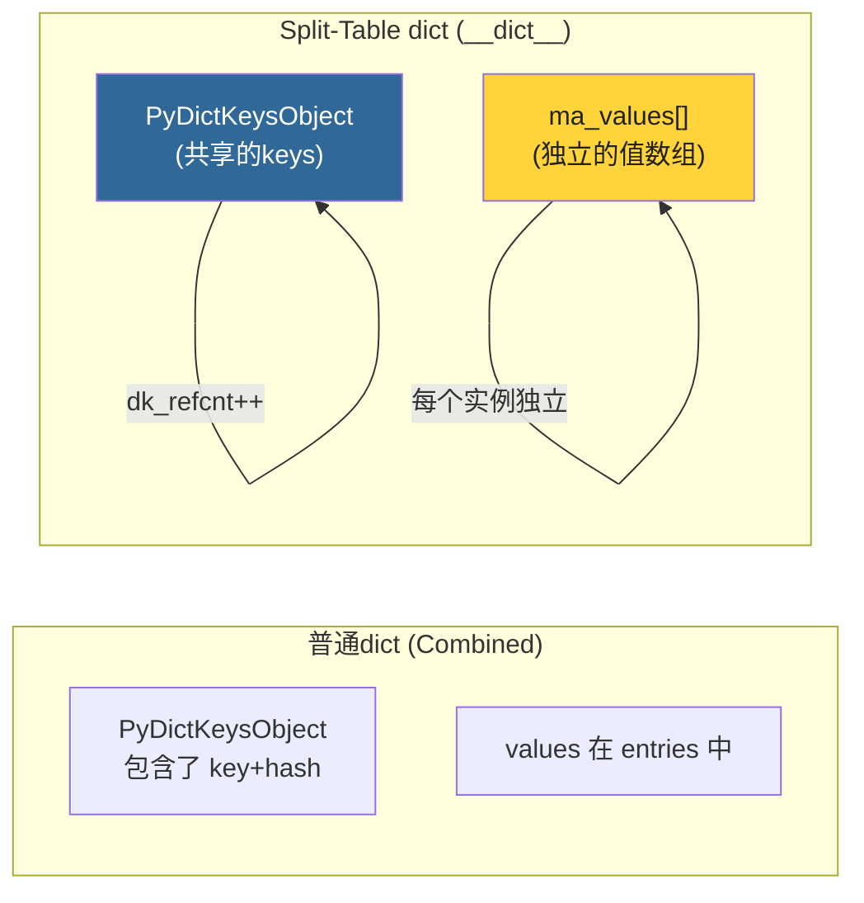
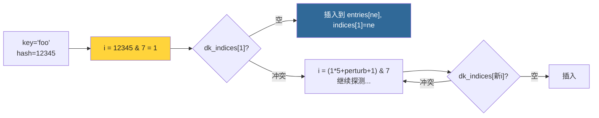

# 第7章 · dict对象深度解析

> **本章要点**：深入CPython中dict的哈希表实现，理解开放寻址策略、Python 3.6+引入的compact dict优化、dict的keys/values/items视图，以及字典操作的性能特征。

---

## 7.1 PyDictObject 结构体

### 7.1.1 Compact Dict (Python 3.6+)

Python 3.6 起引入了 **compact dict** 实现，将索引和条目分离为两个独立数组：

```c
// Include/cpython/dictobject.h (简化)

typedef struct {
    PyObject *me_key;        // 键
    PyObject *me_value;      // 值
    Py_hash_t me_hash;       // 键的缓存哈希值
} PyDictKeyEntry;

typedef struct _dictkeysobject PyDictKeysObject;

// PyDictKeysObject 包含了索引数组和条目数组
struct _dictkeysobject {
    Py_ssize_t dk_refcnt;           // 引用计数（支持keys视图共享）
    Py_ssize_t dk_size;             // 哈希表大小（总槽位数）
    dict_lookup_func dk_lookup;     // 查找函数
    Py_ssize_t dk_usable;           // 可用条目数
    Py_ssize_t dk_nentries;         // 已用条目数
    /* 后面紧跟：
     *   char dk_indices[dk_size];     索引数组（1字节/条目）
     *   PyDictKeyEntry dk_entries[];  条目数组
     */
};

typedef struct {
    PyObject_HEAD
    Py_ssize_t ma_used;              // 当前键值对数量
    uint64_t ma_version_tag;         // 版本标签（用于迭代时检测修改）
    PyDictKeysObject *ma_keys;       // 键表
    PyObject **ma_values;            // 值数组（仅 split-table）
} PyDictObject;
```

### 7.1.2 Compact Dict 内存布局



### 7.1.3 为什么叫 "Compact"？

**Python 3.5及之前**：索引和条目混合在一起（`PyDictEntry` 包含 key、value、hash + 状态标记）

**Python 3.6+（Compact）**：
- `dk_indices[]` — 只用 1 字节/槽位存储条目索引（或标记为空/已删除）
- `dk_entries[]` — 稠密存储实际数据

> **优势**：内存更紧凑（indices只需1字节），条目按插入顺序排列（自动保持插入顺序！），迭代更高效。

### 7.1.4 Split-Table 优化

当dict被用作对象的 `__dict__` 时，CPython使用 **split-table** 形式：



```c
// 同一类的多个实例共享同一个 PyDictKeysObject（键相同）
// 只有 ma_values 数组是每个实例独立的
// 例如：
class Point:
    def __init__(self, x, y):
        self.x = x     # 实例字典只有 {'x': ..., 'y': ...}
        self.y = y

p1 = Point(1, 2)
p2 = Point(3, 4)
// p1.__dict__ 和 p2.__dict__ 共享 keys，但 ma_values 不同
// 这大幅度减少了 __dict__ 的内存开销！
```

---

## 7.2 哈希表实现

### 7.2.1 开放寻址

CPython的dict使用**开放寻址**（Open Addressing）而非链地址法：

```
哈希值 → hash = hash(key)
索引   → i = hash & (dk_size - 1)

如果 dk_indices[i] 被占用：
  → 探测下一个位置 (i + perturbation) & (dk_size - 1)
  → perturbation 使用哈希值高位，减少聚集
```

```c
// Objects/dictobject.c (简化的探测逻辑)

// lookup 核心循环
for (perturb = hash;; perturb >>= PERTURB_SHIFT) {
    i = (i * 5 + perturb + 1) & mask;  // 线性探测 + 二次扰动

    ix = dk_indices[i];  // 读取索引字节

    if (ix == DKIX_EMPTY) {
        // 找到空位 → 键不存在
        return DKIX_EMPTY;
    }

    if (ix >= 0) {  // 有效条目
        entry = &dk_entries[ix];
        if (entry->me_hash == hash) {
            if (entry->me_key == key || PyObject_RichCompareBool(entry->me_key, key, Py_EQ)) {
                return ix;  // 找到了！
            }
        }
    }
    // ix == DKIX_DUMMY → 被删除的槽，继续探测
}
```

### 7.2.2 索引状态

```c
#define DKIX_EMPTY   (-1)    // 从未使用过
#define DKIX_DUMMY   (-2)    // 曾被使用，但已删除（墓碑）
// >= 0                     // 指向 entries 数组中的位置
```

### 7.2.3 探测序列



---

## 7.3 Resize 机制

### 7.3.1 何时Resize

```c
// dict在以下情况resize：
// 1. 插入时 dk_usable <= 0 (即填充率 >= 2/3)
// 2. 插入时 dk_nentries 过大（dk_size*2/3规则）

// Resize规则：
// - 如果 dk_nentries < 50000: new_size = used * 2 (最小为8)
// - 如果 dk_nentries >= 50000: new_size = used * 2 (保持)
// - new_size 必须是 2 的幂
```

### 7.3.2 Resize 过程

```python
import sys

d = {}
prev = sys.getsizeof(d)
print(f"初始: {prev} bytes, len=0")

for i in range(100):
    d[i] = i
    curr = sys.getsizeof(d)
    if curr != prev:
        print(f"插入到 {len(d)} 时 resize: {prev} → {curr}")
        prev = curr
```

---

## 7.4 哈希碰撞与性能

### 7.4.1 CPython的哈希函数

```c
// Python/pyhash.c (SipHash 算法)
// CPython 3.4+ 使用 SipHash-1-3 作为字符串哈希
// 关键特性：
// 1. 每次Python进程启动时生成随机种子（PYTHONHASHSEED）
// 2. 防止 Hash DoS 攻击（恶意构造碰撞键）
// 3. 散列分布均匀，减少探测次数
```

### 7.4.2 碰撞对性能的影响

```python
import time

def measure_lookup(n):
    d = {str(i): i for i in range(n)}
    start = time.perf_counter()
    for i in range(n):
        _ = d[str(i)]
    elapsed = time.perf_counter() - start
    return elapsed

for size in [10, 100, 1000, 10000]:
    t = measure_lookup(size)
    print(f"  {size:>5} keys, avg: {t/size*1e6:.0f} ns/lookup")
# 输出：几乎恒定的 O(1) 查找时间
```

### 7.4.3 自定义对象的哈希陷阱

```python
class BadKey:
    """坏示例：所有实例哈希值=0 → dict退化为O(n)"""
    def __init__(self, value): self.value = value
    def __hash__(self): return 0       # 灾难！
    def __eq__(self, other): return self.value == other.value

d = {BadKey(i): i for i in range(1000)}  # 每个插入都是线性探测
```

> **教训**：`__hash__` 应返回 [0, 2^64-1] 范围内均匀分布的值。

---

## 7.5 dict_keys / dict_values 视图

### 7.5.1 设计

`d.keys()` 和 `d.values()` 返回的是**视图对象**，它们与原始dict共享 `PyDictKeysObject`：

```c
// Objects/dictobject.c

// dict_keys 直接引用 dict 的 ma_keys（通过增加 dk_refcnt）
PyObject *
PyDict_Keys(PyObject *mp)
{
    PyDictKeysObject *keys = ((PyDictObject *)mp)->ma_keys;
    keys->dk_refcnt++;  // 共享！
    return new_dictview(mp, &PyDictKeys_Type);
}
```

### 7.5.2 视图的特性

```python
d = {'a': 1, 'b': 2, 'c': 3}

# 动态反映变化
keys = d.keys()
print(list(keys))   # ['a', 'b', 'c']

d['d'] = 4
print(list(keys))   # ['a', 'b', 'c', 'd'] ← 自动更新！
```

---

## 7.6 dict 操作复杂度

| 操作 | 时间复杂度 | 说明 |
|------|-----------|------|
| `d[key]` | O(1) 平均 | 哈希表查找 |
| `d[key] = val` | O(1) 平均 | 可能触发 resize (O(n)) |
| `del d[key]` | O(1) 平均 | 设置 DUMMY 标记 |
| `key in d` | O(1) 平均 | 同查找 |
| `len(d)` | O(1) | 读取 ma_used |
| `for k in d` | O(n) | 遍历 entries（紧凑！） |
| `d.keys()` / `d.values()` | O(1) | 返回视图，不拷贝 |
| `d1.update(d2)` | O(len(d2)) | |

### 7.6.1 dict vs list 查找性能

```python
import time

n = 100000
d = {i: True for i in range(n)}
lst = list(range(n))

# dict 查找
start = time.perf_counter()
for i in range(10000):
    _ = n // 2 in d
print(f"Dict in: {(time.perf_counter()-start)*1000:.2f} ms")  # ~0.3ms

# list 查找
start = time.perf_counter()
for i in range(10000):
    _ = n // 2 in lst
print(f"List in: {(time.perf_counter()-start)*1000:.2f} ms")  # ~150ms
# dict 比 list 快 ~500倍！
```

---

## 7.7 字典性能最佳实践

### 7.7.1 避免在迭代中修改

```python
# ❌ 运行时错误
d = {'a': 1, 'b': 2, 'c': 3}
for k in d:
    if k == 'b':
        del d[k]  # RuntimeError: dictionary changed size during iteration

# ✅ 先收集再删除
to_delete = [k for k in d if k == 'b']
for k in to_delete:
    del d[k]
```

### 7.7.2 dict 推导式

```python
# ✅ 高效：一次性构建
squares = {x: x*x for x in range(100)}

# ❌ 低效：多次插入，可能触发多次resize
squares = {}
for x in range(100):
    squares[x] = x*x
```

### 7.7.3 预分配大小

```python
# 如果知道最终大小，使用 dict.fromkeys 或其他方式预分配
# Python 3.x 中，dict 没有显式的预分配API，但推导式和 fromkeys 内部会优化
```

---

## 7.8 本章小结

| 要点 | 细节 |
|------|------|
| **结构体** | `PyDictObject` + `PyDictKeysObject`（索引+条目分离） |
| **Compact Dict** | Python 3.6+，indices 1字节/槽位，entries稠密存储 |
| **冲突解决** | 开放寻址 + 二次扰动探测 |
| **Resize** | 填充率 ≥ 2/3时触发 (`.dk_usable <= 0`) |
| **插入顺序** | 自动保持（entries按插入顺序排列） |
| **Keys视图** | 与dict共享 `PyDictKeysObject` |

> **下一步**：在 [第8章](./ch08-str-bytes-object.md) 中，我们将分析str和bytes对象的底层实现。
