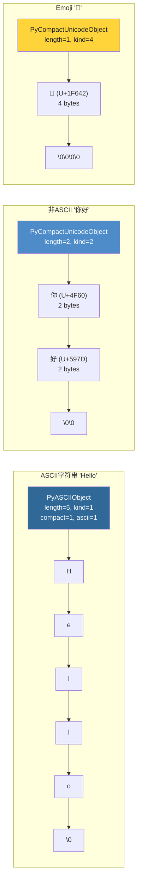
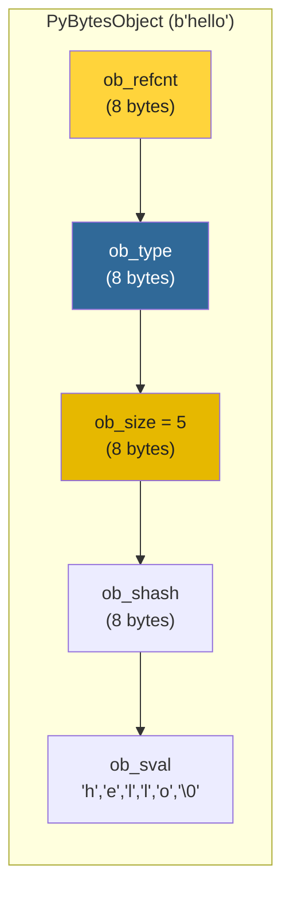

# 第8章 · str/bytes对象深度解析

> **本章要点**：深入分析Python中str（PyUnicodeObject）和bytes（PyBytesObject）的底层实现，包括字符串的紧凑表示、intern机制、以及bytes对象的buffer protocol。

---

## 8.1 PyUnicodeObject（str）

### 8.1.1 结构体定义

```c
// Include/cpython/unicodeobject.h (简化)

typedef struct {
    PyObject_HEAD
    Py_ssize_t length;           // 码点数量
    Py_hash_t hash;              // 缓存的哈希值（-1表示未计算）
    struct {
        unsigned int interned:2; // 是否被intern
        unsigned int kind:3;     // 字符类型：1/2/4字节
        unsigned int compact:1;  // 是否紧凑表示
        unsigned int ascii:1;    // 是否纯ASCII
        unsigned int ready:1;    // 是否已就绪
        // ...
    } state;
    wchar_t *wstr;               // 遗留wchar_t表示（废弃中）
} PyASCIIObject;

typedef struct {
    PyASCIIObject _base;
    Py_ssize_t utf8_length;      // UTF-8字节长度（紧凑表示中）
    char *utf8;                  // UTF-8编码缓存
    Py_ssize_t wstr_length;      // wstr长度
} PyCompactUnicodeObject;

typedef struct {
    PyCompactUnicodeObject _base;
    union {
        void *any;
        Py_UCS1 *latin1;         // 1字节/字符（Latin-1）
        Py_UCS2 *ucs2;           // 2字节/字符（UCS-2）
        Py_UCS4 *ucs4;           // 4字节/字符（UCS-4）
    } data;
} PyUnicodeObject;
```

### 8.1.2 Kind 类型

Python根据字符串中的最大码点选择最紧凑的存储方式：

| Kind | 每字符 | 适用字符范围 | 示例 |
|------|--------|-------------|------|
| `PyUnicode_1BYTE_KIND` | 1 byte | U+0000 ~ U+00FF (Latin-1) | "Hello" |
| `PyUnicode_2BYTE_KIND` | 2 bytes | U+0000 ~ U+FFFF (BMP) | "你好" |
| `PyUnicode_4BYTE_KIND` | 4 bytes | U+0000 ~ U+10FFFF | "🙂" (emoji) |

### 8.1.3 内存布局对比



---

## 8.2 字符串Intern机制

### 8.2.1 什么是Intern？

**Intern** 是一种字符串去重技术：相同内容的字符串在内存中只保存一份。

```python
a = "hello"
b = "hello"
print(a is b)  # True — 被intern了！

# 但动态创建的字符串默认不intern
c = "".join(["h", "e", "l", "l", "o"])
print(a is c)  # False
print(a == c)  # True — 值相同

# 手动intern
import sys
c = sys.intern(c)
print(a is c)  # True — 现在也指向同一个对象
```

### 8.2.2 C源码实现

```c
// Objects/unicodeobject.c

// Intern字典（全局）
static PyObject *interned = NULL;  // 实际是一个dict

void
PyUnicode_InternInPlace(PyObject **p)
{
    PyObject *t;

    // 检查是否已经在interned字典中
    t = PyDict_GetItem(interned, *p);
    if (t != NULL) {
        // 已有相同字符串，替换指针
        Py_DECREF(*p);
        Py_INCREF(t);
        *p = t;
        return;
    }

    // 新的字符串，加入interned字典
    PyDict_SetItem(interned, *p, *p);
    ((PyASCIIObject *)(*p))->state.interned = SSTATE_INTERNED_MORTAL;
}
```

### 8.2.3 Intern的三个级别

| 状态 | 含义 | 示例 |
|------|------|------|
| `SSTATE_NOT_INTERNED` | 未intern | 动态创建的字符串 |
| `SSTATE_INTERNED_MORTAL` | 已intern，可被GC回收 | `sys.intern()` 的字符串 |
| `SSTATE_INTERNED_IMMORTAL` | 永久intern，永不回收 | 标识符、单字符 |

---

## 8.3 紧凑字符串表示

### 8.3.1 紧凑 vs 非紧凑

Python 3.3 引入 **PEP 393（Flexible String Representation）**，实现了紧凑字符串：

```c
// 紧凑模式（compact=1）：
// 字符串数据紧跟在 PyASCIIObject/PyCompactUnicodeObject 之后分配
// → 单次 malloc，内存连续

// 非紧凑模式（compact=0）：
// 字符串数据通过 data.any 指针指向独立分配的内存
// → 两次 malloc（已废弃，仅用于兼容）
```

**优势**：cache友好、减少内存碎片、可轻松转换为C字符串（已有`\0`结尾）。

### 8.3.2 内存计算

```python
import sys

# ASCII紧凑字符串
print(sys.getsizeof(""))        # 49 bytes (PyASCIIObject base)
print(sys.getsizeof("a"))       # 50 bytes (base + 1 char)
print(sys.getsizeof("ab"))      # 51 bytes
print(sys.getsizeof("hello"))   # 54 bytes (49 + 5)

# 非ASCII字符串
print(sys.getsizeof("你好"))    # 更大的基础结构 + 4 bytes data
```

---

## 8.4 PyBytesObject（bytes）

### 8.4.1 结构体

```c
// Include/cpython/bytesobject.h

typedef struct {
    PyObject_VAR_HEAD           // ob_refcnt, ob_type, ob_size
    Py_hash_t ob_shash;         // 缓存的哈希值
    char ob_sval[1];            // 实际数据（变长数组）
} PyBytesObject;
```

### 8.4.2 内存布局



> **注意**：`ob_sval[1]` 是C语言变长数组技巧（FAM, Flexible Array Member）。实际分配时会分配 `sizeof(PyBytesObject) + ob_size + 1` 字节（+1是结尾的`\0`）。

---

## 8.5 Buffer Protocol

### 8.5.1 概念

`bytes` 对象支持 **Buffer Protocol**，允许其他代码直接访问底层内存而不需要拷贝：

```python
import ctypes

b = b"hello world"
buf = memoryview(b)     # 零拷贝视图
print(buf[0])           # 104 ('h')
print(buf.tobytes())    # 转换为bytes（会拷贝）
```

### 8.5.2 C层面接口

```c
// Include/cpython/abstract.h

// 获取buffer
int PyObject_GetBuffer(PyObject *obj, Py_buffer *view, int flags);

// Py_buffer 结构体
typedef struct bufferinfo {
    void *buf;           // 指向实际数据的指针
    PyObject *obj;       // 底层对象（持有引用）
    Py_ssize_t len;      // 数据长度
    Py_ssize_t itemsize; // 每个元素大小
    int readonly;        // 是否只读
    int ndim;            // 维度数
    char *format;        // 格式字符串
    Py_ssize_t *shape;   // 形状数组
    Py_ssize_t *strides; // 步长数组
    Py_ssize_t *suboffsets;
    void *internal;
} Py_buffer;
```

---

## 8.6 字符串操作性能

### 8.6.1 拼接优化

```python
# ❌ O(n²)：每次 + 都创建新字符串
result = ""
for s in large_list:
    result += s

# ✅ O(n)：join 预计算总长度，一次性分配
result = "".join(large_list)
```

`join` 的C实现会先计算总长度，一次性分配内存，然后逐段拷贝。

### 8.6.2 切片操作

```python
s = "hello world" * 10000

# 切片创建新字符串（拷贝数据）
sub = s[10:20]  # O(k)，k=10

# 巨大切片可能导致内存峰值
sub = s[:5000000]
```

---

## 8.7 str/bytes 互转

```python
# str → bytes (编码)
s = "你好"
b = s.encode("utf-8")    # b'\xe4\xbd\xa0\xe5\xa5\xbd'

# bytes → str (解码)
s2 = b.decode("utf-8")   # "你好"

# ASCII快速路径
b = b"hello"
s3 = b.decode("ascii")   # 不需要码表转换，O(n)
```

---

## 8.8 本章小结

| 类型 | 结构体 | 关键特性 |
|------|--------|---------|
| **str** | `PyUnicodeObject` | 紧凑表示(kind 1/2/4)、intern机制、哈希缓存 |
| **bytes** | `PyBytesObject` | 变长数组、buffer protocol支持、哈希缓存 |

| 概念 | 说明 |
|------|------|
| **Kind** | 自动选择最紧凑的字符宽度（1/2/4字节） |
| **Intern** | 字符串去重，字典查找 O(1) |
| **Compact** | PEP 393，单次malloc，末尾自带\0 |
| **Buffer Protocol** | 零拷贝访问底层内存 |

> **下一步**：在 [第9章](../part3-interpreter/ch09-bytecode-compiler.md) 中，我们将追踪Python代码从源码到字节码的编译过程。
