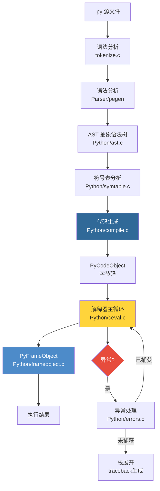

# 第3部分：解释器核心

> 本部分共4章，带你深入CPython的大脑——从.py源文件到字节码执行，理解Python代码是如何被编译和运行的。

---

## 📑 章节导航

| 章节 | 标题 | 你将学到 |
|------|------|---------|
| [第9章](./ch09-bytecode-compiler.md) | 字节码与编译器 | .py → AST → 符号表 → 字节码的完整编译流水线 |
| [第10章](./ch10-ceval-loop.md) | 解释器主循环 | ceval.c的computed goto、Tier 2优化器、计算栈帧 |
| [第11章](./ch11-function-frame.md) | 函数调用与栈帧 | PyFrameObject结构体、调用约定、参数传递、闭包实现 |
| [第12章](./ch12-exception.md) | 异常处理机制 | 异常表、try/except字节码、traceback生成与链式异常 |

---

## 🎯 学习目标

完成本部分后，你将能够：

1. ✅ 使用 `dis` 模块阅读和理解Python字节码
2. ✅ 解释 `ceval.c` 主循环如何分派和执行每条字节码指令
3. ✅ 理解函数调用的栈帧创建和销毁全过程
4. ✅ 掌握Python异常如何在C层面被捕获、匹配和传播

---

## 📐 知识地图

---

## 🔑 Part 3 核心概念速览

| 概念 | C源码位置 | 关键数据结构 |
|------|----------|-------------|
| 字节码 | `Python/compile.c` | `PyCodeObject`, `_Py_CODEUNIT` |
| 主循环 | `Python/ceval.c` | `_PyInterpreterFrame`, `tstate` |
| 栈帧 | `Include/cpython/frameobject.h` | `_PyInterpreterFrame` |
| 异常 | `Python/errors.c` | `PyExceptionTable`, `tstate->curexc_*` |

---

准备好了吗？从 [第9章 · 字节码与编译器](./ch09-bytecode-compiler.md) 开始吧！
