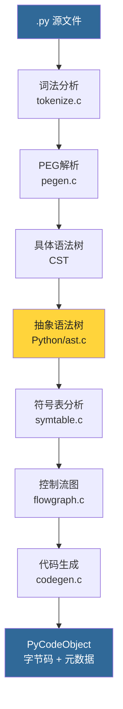
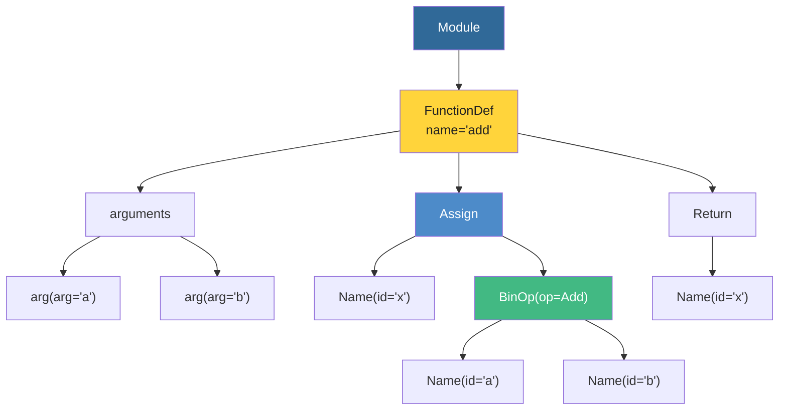
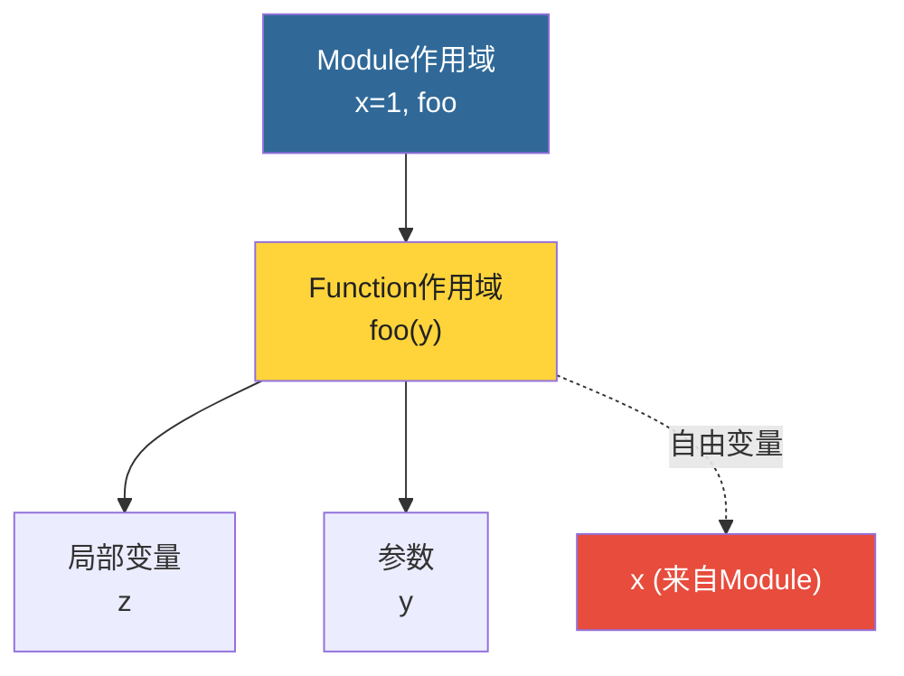
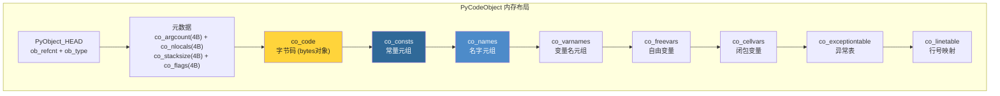

# 第9章 · 字节码与编译器

> **本章要点**：追踪Python代码从源码到字节码的完整编译流水线，理解AST的构建过程、符号表分析、以及字节码指令的生成。

---

## 9.1 编译流水线全景



---

## 9.2 从源码到AST

### 9.2.1 查看AST

```python
import ast

code = """
def add(a, b):
    x = a + b
    return x
"""

tree = ast.parse(code)
print(ast.dump(tree, indent=2))
```

输出：

```
Module(
  body=[
    FunctionDef(
      name='add',
      args=arguments(
        args=[arg(arg='a'), arg(arg='b')],
        ...
      ),
      body=[
        Assign(
          targets=[Name(id='x')],
          value=BinOp(left=Name(id='a'), op=Add(), right=Name(id='b'))
        ),
        Return(value=Name(id='x'))
      ]
    )
  ]
)
```

### 9.2.2 AST节点类型

```c
// Include/internal/pycore_ast.h

// 关键AST节点
typedef struct _mod {
    enum { Module, Interactive, Expression, FunctionType } kind;
    // ...
} mod_ty;

// 表达式节点
typedef struct _expr {
    enum {
        BoolOp, NamedExpr, BinOp, UnaryOp, Lambda,
        IfExp, Dict, Set, ListComp, SetComp,
        GeneratorExp, Await, Yield, YieldFrom,
        Compare, Call, FormattedValue, JoinedStr,
        Constant, Attribute, Subscript, Starred,
        Name, List, Tuple, Slice
    } kind;
    // ...
} expr_ty;
```

### 9.2.3 AST 树结构可视化



---

## 9.3 符号表分析

### 9.3.1 什么是符号表？

符号表记录了代码中所有名字（变量、函数、类）的作用域信息：

```python
import symtable

code = """
x = 1
def foo(y):
    z = x + y
    return z
"""

table = symtable.symtable(code, "<string>", "exec")
print(f"作用域: {table.get_type()}")     # module
print(f"符号: {table.get_symbols()}")

# 查看函数foo的作用域
foo_ste = table.lookup("foo")
foo_table = foo_ste.get_namespace()
print(f"foo符号: {foo_table.get_symbols()}")
for sym in foo_table.get_symbols():
    print(f"  {sym.get_name()}: scope={sym.get_scope()}")
```

### 9.3.2 C源码结构

```c
// Python/symtable.c

// 符号表条目
struct _symtable_entry {
    PyObject *ste_name;         // 作用域名
    PyObject *ste_symbols;      // dict: name → flags
    PyObject *ste_children;     // 子作用域列表
    int ste_type;               // Module/Function/Class...
    int ste_scope;              // 作用域类型
    // ... 更多标志位
};
```

### 9.3.3 作用域链



---

## 9.4 字节码指令

### 9.4.1 为什么是字节码？

字节码是介于Python源码和机器码之间的中间表示：
- 比直接执行AST高效（不需要每次解析语法）
- 比机器码可移植（跨平台）
- 指令粒度适中，方便优化

### 9.4.2 查看字节码

```python
import dis

def add(a, b):
    x = a + b
    return x

dis.dis(add)
```

输出：

```
  1           0 RESUME                   0

  2           2 LOAD_FAST                0 (a)
              4 LOAD_FAST                1 (b)
              6 BINARY_OP                0 (+)
             10 STORE_FAST               2 (x)

  3          12 LOAD_FAST                2 (x)
             14 RETURN_VALUE
```

### 9.4.3 关键字节码指令

| 指令 | 操作 | 说明 |
|------|------|------|
| `LOAD_FAST` | 加载局部变量 | 从 `fastlocals` 数组加载 |
| `LOAD_CONST` | 加载常量 | 从 `co_consts` 元组加载 |
| `LOAD_GLOBAL` | 加载全局变量 | 从 globals dict 加载 |
| `LOAD_ATTR` | 加载属性 | `obj.attr` |
| `STORE_FAST` | 存储局部变量 | 存入 `fastlocals` 数组 |
| `BINARY_OP` | 二元运算 | `+`, `-`, `*`, `/` 等 |
| `CALL` | 函数调用 | 调用可调用对象 |
| `RETURN_VALUE` | 返回值 | 从栈顶返回值 |
| `POP_TOP` | 弹出栈顶 | 丢弃值 |
| `JUMP_IF_TRUE_OR_POP` | 条件跳转 | `or` 运算符 |
| `FOR_ITER` | 循环迭代 | `for` 循环 |

### 9.4.4 Python 3.12 的新指令

Python 3.12 引入了一些新字节码（从 `Python/bytecodes.c` DSL 中可以看到）：

```c
// Python/bytecodes.c (简化示例)

inst(CALL, (unused/1, func, callable, args[oparg] -- res)) {
    res = PyObject_Vectorcall(callable, args, oparg, NULL);
    // ... 错误处理
}

inst(BINARY_OP, (unused/1, left, right -- res)) {
    // oparg 决定具体操作 (+, -, *, /, etc.)
    res = PyNumber_Add(left, right);
}
```

---

## 9.5 PyCodeObject

### 9.5.1 结构体

```c
// Include/cpython/code.h

typedef struct {
    PyObject_HEAD
    int co_argcount;             // 参数数量（仅位置参数）
    int co_kwonlyargcount;       // 仅关键字参数数量
    int co_nlocals;              // 局部变量数量
    int co_stacksize;            // 所需栈大小
    int co_flags;                // 标志位
    int co_firstlineno;          // 第一行行号
    PyObject *co_code;           // 字节码（bytes对象）
    PyObject *co_consts;         // 常量元组
    PyObject *co_names;          // 名字元组
    PyObject *co_varnames;       // 变量名元组
    PyObject *co_freevars;       // 自由变量名
    PyObject *co_cellvars;       // 闭包变量名
    PyObject *co_filename;       // 文件名
    PyObject *co_name;           // 函数名
    PyObject *co_linetable;      // 行号表（紧凑格式）
    PyObject *co_exceptiontable; // 异常处理表
    // ...
} PyCodeObject;
```

### 9.5.2 PyCodeObject 内存布局



### 9.5.4 代码对象示例

```python
def add(a, b):
    x = a + b
    return x

code = add.__code__
print(f"参数数量:  {code.co_argcount}")      # 2
print(f"局部变量:  {code.co_nlocals}")        # 3 (a, b, x)
print(f"栈大小:    {code.co_stacksize}")       # 2
print(f"常量:      {code.co_consts}")          # (None,)
print(f"变量名:    {code.co_varnames}")        # ('a', 'b', 'x')
print(f"字节码长度: {len(code.co_code)}")
```

---

## 9.6 编译过程源码追踪

### 9.6.1 编译入口

```c
// Python/pythonrun.c

// 内置函数 compile() 的C对应物
PyObject *
Py_CompileStringObject(const char *str, PyObject *filename,
                       int start, PyCompilerFlags *flags, int optimize)
{
    // 1. 解析为AST
    mod_ty mod = _PyParser_ASTFromString(str, filename, start, flags);

    // 2. 编译AST为代码对象
    PyCodeObject *co = _PyAST_Compile(mod, filename, flags, optimize);

    return (PyObject *)co;
}
```

### 9.6.2 编译阶段

```c
// Python/compile.c

// 编译器主入口
static PyCodeObject *
compiler_mod(struct compiler *c, mod_ty mod)
{
    // 1. 符号表分析
    PySymtable_BuildObject(mod, ...);

    // 2. 控制流图构建
    // 3. 基本块优化
    // 4. 代码生成
    // 5. 组装 PyCodeObject
}
```

---

## 9.7 实战：dis模块深入

```python
import dis

# 不同类型的字节码
print("=== 算术运算 ===")
dis.dis("x = 1 + 2 * 3")

print("\n=== 条件判断 ===")
dis.dis("if x > 0: y = 1 else: y = 0")

print("\n=== 循环 ===")
dis.dis("""
total = 0
for i in range(10):
    total += i
""")

print("\n=== 列表推导 ===")
dis.dis("[x*2 for x in range(5) if x > 2]")

print("\n=== 函数调用 ===")
dis.dis("print(len('hello'))")
```

---

## 9.8 Python 3.12 的 Tier 2 优化器

### 9.8.1 概念

Python 3.12 引入了 **Tier 2 优化器**，为未来的 JIT 编译打下基础：

```python
# Tier 1: 普通字节码解释（与之前相同）
# Tier 2: 优化器可以对字节码进行转换

# 可以开启 Tier 2 查看优化效果
import sys
# Python 3.12+ 中可以使用环境变量 PYTHON_UOPS 查看微操作
```

---

## 9.9 本章小结

| 阶段 | 输入 | 输出 | 关键文件 |
|------|------|------|---------|
| 词法分析 | .py 文本 | Token流 | `Parser/tokenize.c` |
| 语法分析 | Token流 | AST | `Parser/pegen.c`, `Python/ast.c` |
| 符号表 | AST | 符号表 | `Python/symtable.c` |
| 控制流图 | AST | CFG | `Python/flowgraph.c` |
| 代码生成 | CFG | PyCodeObject | `Python/codegen.c` |

> **下一步**：在 [第10章](./ch10-ceval-loop.md) 中，我们将进入CPython的心脏——ceval.c中的解释器主循环。
