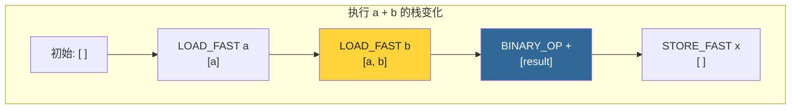
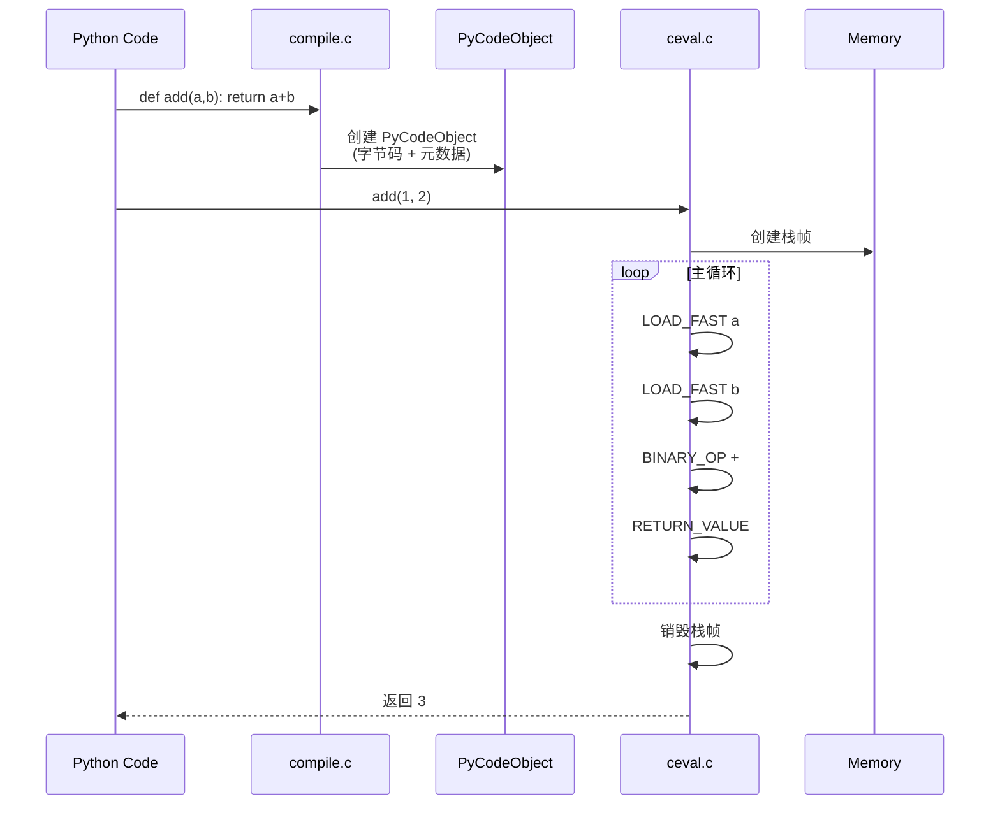
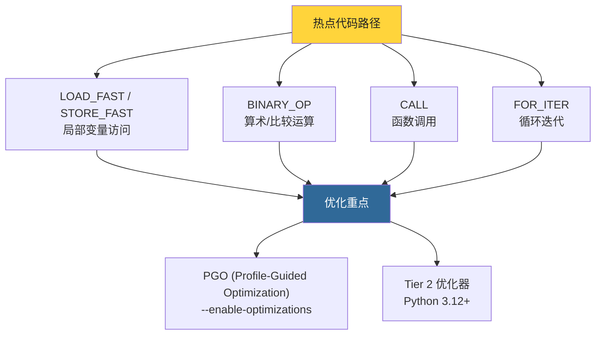

# 第10章 · 解释器主循环

> **本章要点**：深入分析CPython的心脏——ceval.c中的解释器主循环，理解字节码执行模型、计算栈帧操作、字节码分派机制（computed goto），以及Python 3.12引入的Tier 2优化器。

---

## 10.1 主循环全景

### 10.1.1 位置

解释器主循环在 `Python/ceval.c` 的 `_PyEval_EvalFrameDefault` 函数中。

```c
// Python/ceval.c (极大简化)

PyObject *
_PyEval_EvalFrameDefault(PyThreadState *tstate,
                         _PyInterpreterFrame *frame,
                         int throwflag)
{
    // ... 初始化 ...
    // opcode_targets 是一个 computed goto 跳转表

    // ===== 主循环 =====
    for (;;) {
        // 获取下一条指令
        NEXTOPARG();   // opcode = next_instr[-1]; oparg = next_instr[0];

        // 字节码分派
        DISPATCH();    // goto opcode_targets[opcode];

        // 每个字节码指令是一个 label
        // ...
    }
}
```

---

## 10.2 计算栈帧

### 10.2.1 栈的工作原理

CPython的字节码解释器使用一个**栈**来传递中间值：



### 10.2.2 栈指针

```c
// 栈顶指针是 frame->stack_pointer
// 局部变量在 fastlocals[0..nlocals-1]

// 入栈
#define PUSH(v)    do { *stack_pointer++ = (v); } while(0)

// 出栈
#define POP()      (*--stack_pointer)

// 栈顶
#define TOP()      (stack_pointer[-1])

// 设置栈顶
#define SET_TOP(v) stack_pointer[-1] = (v)

// 第二个元素
#define SECOND()    (stack_pointer[-2])
```

---

## 10.3 字节码分派机制

### 10.3.1 Computed Goto

CPython使用 **computed goto**（GCC扩展）来高效分派字节码：

```c
#if USE_COMPUTED_GOTOS
    // 定义跳转表标签
    #define TARGET(op) TARGET_##op:
    #define DISPATCH() \
        goto *opcode_targets[opcode]
#else
    // 回退到 switch 语句
    #define TARGET(op) case op:
    #define DISPATCH() continue
#endif

// 主循环中的使用：
for (;;) {
    opcode = NEXTOPARG();

    switch (opcode) {  // 仅在没有 computed goto 时使用
        TARGET(LOAD_FAST) {
            PyObject *value = GETLOCAL(oparg);
            if (value == NULL) { /* UnboundLocalError */ }
            Py_INCREF(value);
            PUSH(value);
            DISPATCH();
        }

        TARGET(BINARY_OP) {
            PyObject *right = POP();
            PyObject *left = TOP();
            PyObject *res = PyNumber_Add(left, right); // 简化
            Py_DECREF(left);
            Py_DECREF(right);
            SET_TOP(res);
            DISPATCH();
        }

        TARGET(RETURN_VALUE) {
            PyObject *retval = POP();
            // ... 清理工作 ...
            return retval;
        }

        // ... 更多指令 ...
    }
}
```

> Computed goto 比 switch 快约 15-20%，因为避免了多次分支预测失败。

---

## 10.4 关键指令实现

### 10.4.1 LOAD_FAST / STORE_FAST

```c
// 加载局部变量
TARGET(LOAD_FAST) {
    PyObject *value = GETLOCAL(oparg);
    if (value == NULL) {
        goto unbound_local_error;
    }
    Py_INCREF(value);
    PUSH(value);
    DISPATCH();
}

// 存储局部变量
TARGET(STORE_FAST) {
    PyObject *value = POP();
    SETLOCAL(oparg, value);
    DISPATCH();
}
```

### 10.4.2 CALL

```c
TARGET(CALL) {
    // oparg 包含调用信息（参数数量等）
    PyObject *callable = PEEK(oparg + 1);
    PyObject *result = PyObject_Vectorcall(
        callable,
        stack_pointer - oparg,
        oparg,
        NULL
    );
    // 清理栈，压入结果
    stack_pointer -= oparg + 1;
    PUSH(result);
    DISPATCH();
}
```

### 10.4.3 FOR_ITER

```c
TARGET(FOR_ITER) {
    PyObject *iter = TOP();
    PyObject *next = (*Py_TYPE(iter)->tp_iternext)(iter);

    if (next != NULL) {
        PUSH(next);       // 把 next 值压栈
        DISPATCH();       // 不跳转，执行下一条指令
    }
    if (_PyErr_Occurred(tstate)) {
        if (!_PyErr_ExceptionMatches(tstate, PyExc_StopIteration))
            goto error;
        _PyErr_Clear(tstate);
    }
    // StopIteration → 跳出循环
    STACK_SHRINK(1);      // 弹出迭代器
    JUMPBY(oparg);        // 跳转到循环后的第一条指令
    DISPATCH();
}
```

---

## 10.5 从源码到执行全链路



---

## 10.6 Python 3.12 的创新

### 10.6.1 bytecodes.c DSL

Python 3.12 将字节码定义集中到 `Python/bytecodes.c`：

```c
// Python/bytecodes.c — 字节码 DSL 示例

inst(BINARY_OP, (unused/1, left, right -- res)) {
    switch (oparg) {
        case NB_ADD:
            res = PyNumber_Add(left, right);
            break;
        case NB_SUBTRACT:
            res = PyNumber_Subtract(left, right);
            break;
        // ... 更多操作 ...
    }
}

inst(CALL, (unused/1, func, callable, args[oparg] -- res)) {
    res = PyObject_Vectorcall(callable, args, oparg, NULL);
}
```

这种定义方式使得代码生成器可以自动构建 `opcode_targets` 跳转表。

### 10.6.2 Tier 2 优化器

```c
// Python 3.12 的 Tier 2 优化器会将"热"字节码序列
// 转换为更高效的"超级指令"（super-instructions）：

// 例如：
// LOAD_FAST → LOAD_FAST → BINARY_OP
// 可能被优化为一个超级指令，减少分派开销
```

---

## 10.7 性能关键路径



---

## 10.8 实战：追踪字节码执行

```python
import sys
import dis

def trace_calls(frame, event, arg):
    """追踪函数调用"""
    if event == 'call':
        print(f"调用: {frame.f_code.co_name}")
        print(f"  字节码: {dis.Bytecode(frame.f_code).dis()}")
    return trace_calls

# 设置追踪
sys.settrace(trace_calls)

def factorial(n):
    if n <= 1:
        return 1
    return n * factorial(n - 1)

result = factorial(5)
print(f"结果: {result}")

sys.settrace(None)
```

---

## 10.9 本章小结

| 概念 | 关键点 |
|------|--------|
| **主循环** | `_PyEval_EvalFrameDefault` 中的 `for(;;)` 循环 |
| **栈帧** | 每个函数调用对应一个栈帧，包含局部变量和操作数栈 |
| **分派** | Computed goto（GCC）或 switch-case |
| **热点指令** | LOAD_FAST、STORE_FAST、BINARY_OP、CALL |
| **Tier 2** | Python 3.12+，将热字节码序列优化为超级指令 |

> **下一步**：在 [第11章](./ch11-function-frame.md) 中，我们将深入函数调用机制，理解栈帧的创建与销毁。
