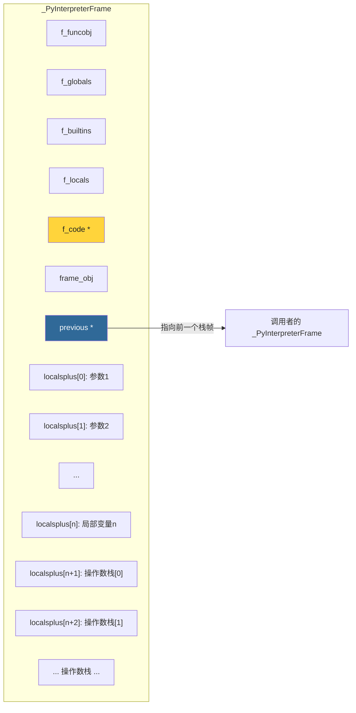
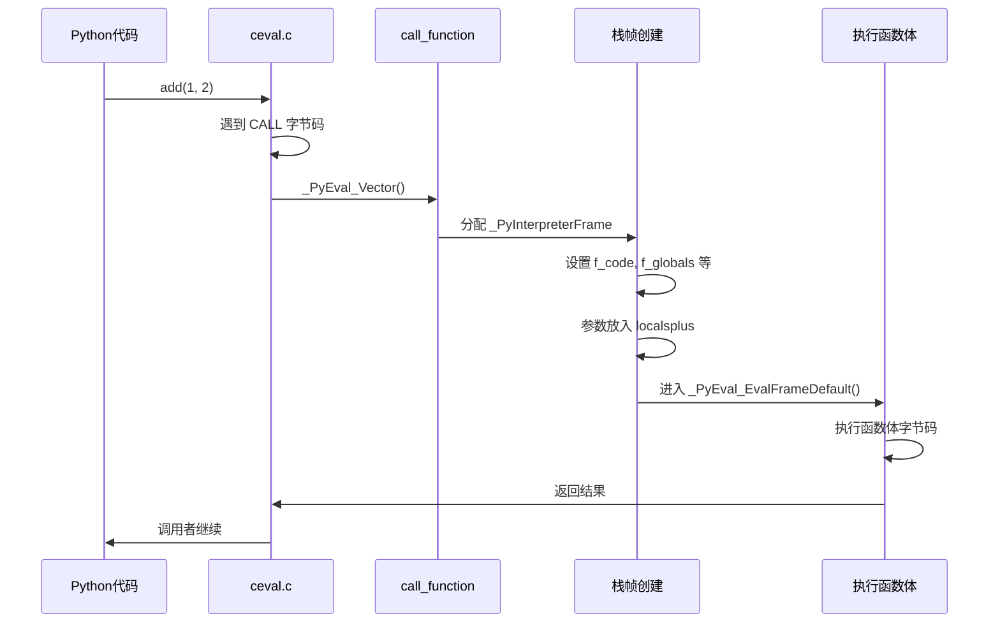
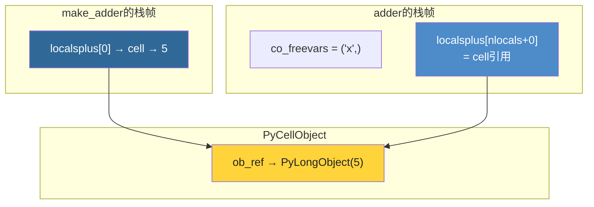

# 第11章 · 函数调用与栈帧

> **本章要点**：深入分析CPython中函数调用的底层机制，理解PyFrameObject的结构、调用约定、参数传递、局部变量管理以及闭包的实现原理。

---

## 11.1 PyFrameObject 结构体

### 11.1.1 定义（Python 3.12 简化版）

```c
// Include/internal/pycore_frame.h

typedef struct _PyInterpreterFrame {
    PyObject *f_funcobj;         // 被调用的函数对象（弱引用）
    PyObject *f_globals;         // 全局变量 dict
    PyObject *f_builtins;        // 内置函数 dict
    PyObject *f_locals;          // 局部变量 dict（或 NULL）
    PyCodeObject *f_code;        // 代码对象
    PyFrameObject *frame_obj;    // 关联的 frame 对象（惰性创建）
    struct _PyInterpreterFrame *previous;  // 前一个栈帧（调用链）

    // 以下字段内联在栈帧中
    PyObject *localsplus[1];     // 局部变量 + 闭包变量 + 操作数栈
} _PyInterpreterFrame;
```

### 11.1.2 栈帧内存布局



### 11.1.3 Python 3.12 的栈帧优化

Python 3.12 对栈帧做了重要优化：

```c
// Python 3.11之前：每次函数调用都创建 PyFrameObject
// Python 3.11：PyFrameObject 变为惰性创建
// Python 3.12：进一步优化，_PyInterpreterFrame 内联在C栈上

// localsplus 数组布局：
// [0..nlocals-1] : 局部变量（包括参数）
// [nlocals..nlocals+ncells-1] : 闭包变量
// [nlocals+ncells..] : 操作数栈（向高地址增长）
```

---

## 11.2 函数调用流程

### 11.2.1 调用链



### 11.2.2 核心源码

```c
// Python/ceval.c (简化)

PyObject *
_PyEval_Vector(PyThreadState *tstate,
               PyFunctionObject *func,
               PyObject *locals,
               PyObject *const *args,
               size_t argcount,
               PyObject *kwnames)
{
    // 1. 分配栈帧
    _PyInterpreterFrame *frame = _PyEvalFramePushAndInit(
        tstate, func, locals, args, argcount, kwnames
    );

    // 2. 进入主循环执行
    PyObject *retval = _PyEval_EvalFrame(tstate, frame, 0);

    // 3. 弹出栈帧
    _PyEvalFramePopAndClear(tstate, frame);

    return retval;
}
```

---

## 11.3 PyFunctionObject

### 11.3.1 结构体

```c
// Include/cpython/funcobject.h

typedef struct {
    PyObject_HEAD
    PyObject *func_code;         // __code__ (PyCodeObject)
    PyObject *func_globals;      // __globals__ (全局命名空间)
    PyObject *func_defaults;     // 默认参数元组
    PyObject *func_kwdefaults;   // 仅关键字默认参数
    PyObject *func_closure;      // 闭包（tuple of cell）
    PyObject *func_doc;          // __doc__
    PyObject *func_name;         // __name__
    PyObject *func_dict;         // __dict__ (属性字典)
    PyObject *func_weakreflist;  // 弱引用列表
    PyObject *func_module;       // __module__
    PyObject *func_annotations;  // __annotations__
    PyObject *func_qualname;     // __qualname__
    // ...
    vectorcallfunc vectorcall;   // 快速调用接口
} PyFunctionObject;
```

---

## 11.4 参数传递机制

### 11.4.1 参数类型

```python
def func(pos1, pos2, /, pos_or_kw, *, kw_only=42):
    pass

# pos1, pos2: 仅位置参数（/ 之前）
# pos_or_kw:  位置或关键字参数
# kw_only:    仅关键字参数（* 之后）
```

### 11.4.2 参数在栈帧中的布局

```c
// 调用 func(1, 2, 3, kw_only=42) 时
// localsplus 布局：
//
// [0]: pos1 = 1        ← 仅位置参数
// [1]: pos2 = 2        ← 仅位置参数
// [2]: pos_or_kw = 3   ← 位置/关键字参数
// [3]: kw_only = 42    ← 仅关键字参数
```

---

## 11.5 闭包实现

### 11.5.1 什么是闭包

```python
def make_adder(x):
    def adder(y):
        return x + y    # x 是自由变量
    return adder

add5 = make_adder(5)
print(add5(3))  # 8
```

### 11.5.2 Cell对象

```c
// Objects/cellobject.c

typedef struct {
    PyObject_HEAD
    PyObject *ob_ref;       // 闭包捕获的变量值
} PyCellObject;

// Cell 的 get/set
PyObject *
PyCell_Get(PyObject *op)
{
    return ((PyCellObject *)op)->ob_ref;
}

int
PyCell_Set(PyObject *op, PyObject *value)
{
    Py_XSETREF(((PyCellObject *)op)->ob_ref, Py_XNewRef(value));
    return 0;
}
```

### 11.5.3 闭包内存结构



---

## 11.6 调用性能优化

### 11.6.1 Vectorcall 协议

Python 3.8+ 引入了 **vectorcall** 协议，避免创建参数元组：

```c
// 传统调用（慢）：
// PyObject_Call() → 构建 args tuple → 调用 tp_call

// Vectorcall（快）：
// func->vectorcall(func, args_array, nargs, kwnames)
// 参数直接通过数组传递，无需构建元组
```

### 11.6.2 函数调用开销组成

```python
import time

def empty():
    pass

def with_args(a, b, c):
    pass

# 测量函数调用开销
start = time.perf_counter()
for _ in range(10_000_000):
    empty()
print(f"空函数调用: {time.perf_counter() - start:.3f}s")

start = time.perf_counter()
for _ in range(10_000_000):
    with_args(1, 2, 3)
print(f"带参调用: {time.perf_counter() - start:.3f}s")
```

---

## 11.7 实战：观察调用栈

```python
import traceback
import inspect

def c():
    # 打印调用栈
    traceback.print_stack()
    print("---")
    # 使用inspect获取帧信息
    frame = inspect.currentframe()
    while frame:
        print(f"文件: {frame.f_code.co_filename}, "
              f"函数: {frame.f_code.co_name}, "
              f"行号: {frame.f_lineno}")
        frame = frame.f_back

def b():
    c()

def a():
    b()

a()
```

---

## 11.8 本章小结

| 概念 | 关键点 |
|------|--------|
| **_PyInterpreterFrame** | Python 3.12的内联栈帧，惰性创建 PyFrameObject |
| **localsplus** | 局部变量 + 闭包变量 + 操作数栈的连续数组 |
| **闭包** | 通过 PyCellObject 捕获外部变量，支持修改 |
| **vectorcall** | 快速调用协议，避免参数元组构建开销 |
| **调用链** | previous指针串起的栈帧链表 |

> **下一步**：在 [第12章](./ch12-exception.md) 中，我们将分析CPython的异常处理机制。
