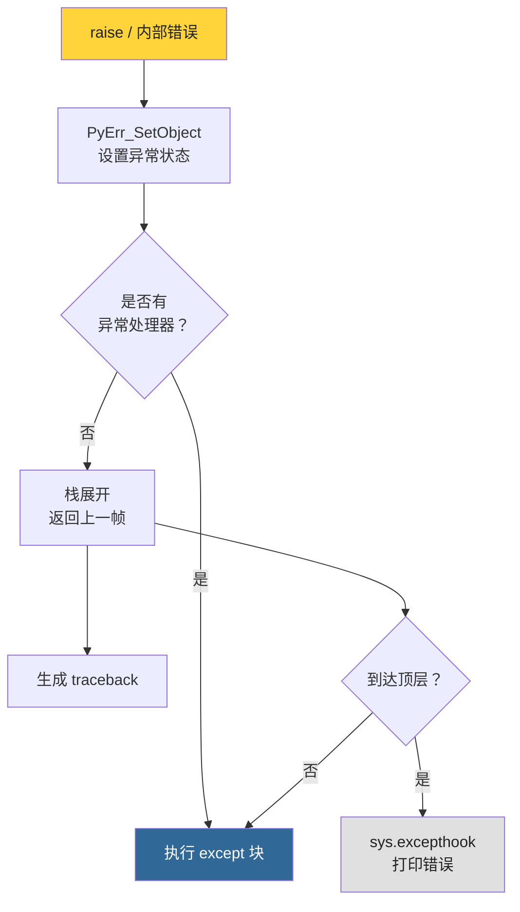
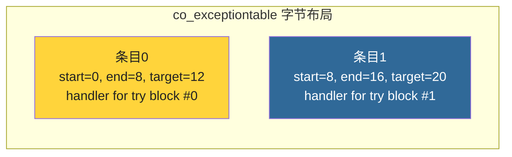

# 第12章 · 异常处理机制

> **本章要点**：深入分析CPython中异常处理的底层实现，包括异常表结构、try/except的字节码表示、异常匹配算法、traceback生成机制以及Python 3.12引入的改进。

---

## 12.1 异常处理架构



---

## 12.2 异常状态管理

### 12.2.1 线程状态中的异常

```c
// Include/cpython/pystate.h

typedef struct _ts {
    // ...
    PyObject *curexc_type;       // 当前异常类型
    PyObject *curexc_value;      // 当前异常值
    PyObject *curexc_traceback;  // 当前异常traceback
    // ...
} PyThreadState;
```

### 12.2.2 设置和清除异常

```c
// Python/errors.c

void
_PyErr_SetObject(PyThreadState *tstate, PyObject *exception, PyObject *value)
{
    Py_XSETREF(tstate->curexc_type, Py_XNewRef(exception));
    Py_XSETREF(tstate->curexc_value, Py_XNewRef(value));
    Py_XSETREF(tstate->curexc_traceback, NULL);
}

void
_PyErr_Clear(PyThreadState *tstate)
{
    Py_CLEAR(tstate->curexc_type);
    Py_CLEAR(tstate->curexc_value);
    Py_CLEAR(tstate->curexc_traceback);
}
```

---

## 12.3 异常表（Exception Table）

### 12.3.1 结构

`PyCodeObject` 中的 `co_exceptiontable` 记录了异常处理信息：

```python
def func(x):
    try:
        result = 1 / x
    except ZeroDivisionError:
        result = 0
    return result

import dis
dis.dis(func)
```

### 12.3.2 异常表条目

每个异常处理块在异常表中对应一个条目：

```c
// Python 3.12 异常表条目格式（保存在 bytes 中）
typedef struct {
    int start;      // try 块起始偏移
    int end;        // try 块结束偏移
    int target;     // except 块偏移（处理器入口）
    int depth;      // 栈深度变化
    int lasti;      // 最后指令信息
} ExceptionTableEntry;
```



---

## 12.4 try/except 的字节码

### 12.4.1 示例分析

```python
def divide(a, b):
    try:
        return a / b
    except ZeroDivisionError:
        return 0
```

对应的字节码：

```
             RESUME                   0

    try块:
             LOAD_FAST                a
             LOAD_FAST                b
             BINARY_OP                / (truediv)
             RETURN_VALUE

    except块:
             PUSH_EXC_INFO            ← 异常处理器入口
             LOAD_GLOBAL              ZeroDivisionError
             CHECK_EXC_MATCH          ← 检查异常类型是否匹配
             POP_JUMP_IF_FALSE        (跳转到 re-raise)
             POP_TOP
             LOAD_CONST               0
             RETURN_VALUE

    re-raise:
             RERAISE
```

### 12.4.2 新指令（Python 3.12）

| 指令 | 作用 |
|------|------|
| `PUSH_EXC_INFO` | 保存当前异常到栈上 |
| `CHECK_EXC_MATCH` | 检查异常类型是否匹配 |
| `POP_JUMP_IF_FALSE` | 不匹配则跳转到下一个处理器 |
| `RERAISE` | 重新抛出未处理的异常 |

---

## 12.5 异常匹配算法

```c
// Python/errors.c

int
PyErr_GivenExceptionMatches(PyObject *given_exc, PyObject *exc_type)
{
    // 1. 直接类型匹配
    if (given_exc == exc_type)
        return 1;

    // 2. 检查是否为元组（except (A, B, C)）
    if (PyTuple_Check(exc_type)) {
        for (Py_ssize_t i = 0; i < PyTuple_GET_SIZE(exc_type); i++) {
            if (PyErr_GivenExceptionMatches(
                    given_exc, PyTuple_GET_ITEM(exc_type, i)))
                return 1;
        }
        return 0;
    }

    // 3. 检查继承关系（issubclass）
    // Exception → ValueError → UnicodeError
    // 捕获 Exception 也会匹配 UnicodeError
    if (PyObject_IsSubclass(given_exc, exc_type))
        return 1;

    return 0;
}
```

---

## 12.6 Traceback生成

### 12.6.1 Python层面

```python
import traceback

def c():
    raise ValueError("出错了！")

def b():
    c()

def a():
    b()

try:
    a()
except ValueError as e:
    traceback.print_exc()
    # 打印完整的调用栈
```

### 12.6.2 C源码

```c
// Python/traceback.c

int
_PyTraceBack_Add(int use_lasti, int indent)
{
    // 为当前帧添加 traceback 条目
    // 记录文件名、行号、函数名等

    PyTracebackObject *tb = PyObject_GC_New(PyTracebackObject, ...);
    tb->tb_frame = current_frame;
    tb->tb_lasti = last_instruction_index;
    tb->tb_lineno = PyCode_Addr2Line(code_object, tb->tb_lasti);

    // 链接到异常状态
    tb->tb_next = tstate->curexc_traceback;
    tstate->curexc_traceback = (PyObject *)tb;
    return 0;
}
```

---

## 12.7 Python 3.12 的改进

### 12.7.1 PEP 626 — 精确行号

Python 3.10 引入的 PEP 626 使得调试信息更加精确。Python 3.12 继续改进了行号追踪。

```python
# 在 Python 3.9 及之前，traceback 行号可能不精确
# Python 3.10+ 提供了准确的错误位置

f = lambda a, b: a / b
f(1, 2)  # ok
f(1, 0)  # ZeroDivisionError: 精确指向 f(1, 0) 这一行
```

### 12.7.2 更好的错误消息

Python 3.12 进一步改进了错误消息的可读性：

```python
# Python 3.12:
# NameError: name 'foo' is not defined. Did you mean: 'for'?

# 提供了更智能的提示
```

---

## 12.8 finally 和上下文管理器

### 12.8.1 finally 的实现

`finally` 块的字节码在正常路径和异常路径都被复制了一份，确保无论怎样都会执行。

### 12.8.2 with 语句

```python
with open("file.txt") as f:
    data = f.read()

# 等价于：
# f = open("file.txt")
# try:
#     data = f.read()
# finally:
#     f.close()
```

---

## 12.9 本章小结

| 概念 | 关键点 |
|------|--------|
| **异常状态** | 存储在 `PyThreadState` 的 `curexc_*` 字段 |
| **异常表** | `co_exceptiontable`，记录 try/except 块映射 |
| **匹配算法** | 直接类型匹配 → 元组成员匹配 → 继承关系匹配 |
| **Traceback** | `PyTracebackObject` 链表，惰性创建 PyFrameObject |
| **Python 3.12** | PEP 626精确行号，更智能的错误消息 |

> **下一步**：在 [第13章](../part4-memory/ch13-pymalloc.md) 中，我们将深入CPython的内存管理系统。
