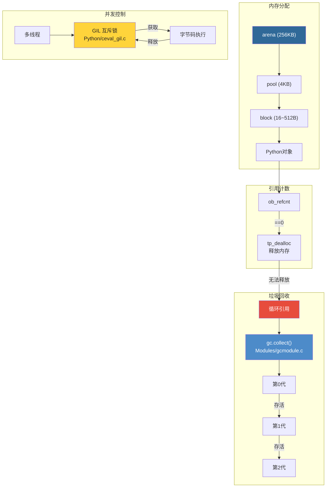

# 第4部分：内存与并发

> 本部分共3章，深入CPython的内存管理和并发模型——从pymalloc分配器到GIL的底层实现，再到分代垃圾回收机制。

---

## 📑 章节导航

| 章节 | 标题 | 你将学到 |
|------|------|---------|
| [第13章](./ch13-pymalloc.md) | 内存管理 | 三级内存层级(arena/pool/block)、pymalloc分配器、obmalloc.c源码 |
| [第14章](./ch14-gil-concurrency.md) | GIL与并发 | GIL的条件变量实现、获取/释放流程、PEP 684 per-interpreter GIL |
| [第15章](./ch15-gc.md) | 垃圾回收 | 引用计数机制、分代GC、循环检测算法、弱引用与终结器 |

---

## 🎯 学习目标

完成本部分后，你将能够：

1. ✅ 画出Python内存的 arena → pool → block 三级结构图
2. ✅ 解释为什么GIL存在，以及它对多线程性能的真实影响
3. ✅ 理解引用计数和分代GC如何协同工作防止内存泄漏
4. ✅ 使用 `gc` 和 `sys` 模块诊断和优化内存问题

---

## 📐 知识地图

---

## 🔑 Part 4 核心概念速览

| 概念 | C源码位置 | 关键函数 |
|------|----------|---------|
| pymalloc | `Objects/obmalloc.c` | `_PyObject_Malloc`, `pymalloc_alloc` |
| GIL | `Python/ceval_gil.c` | `take_gil`, `drop_gil` |
| GC | `Modules/gcmodule.c` | `collect`, `collect_generations` |
| 引用计数 | `Include/object.h` | `Py_INCREF`, `Py_DECREF` |

---

准备好了吗？从 [第13章 · 内存管理](./ch13-pymalloc.md) 开始吧！
