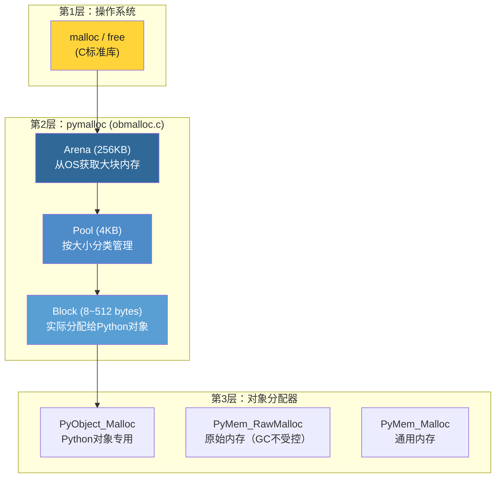
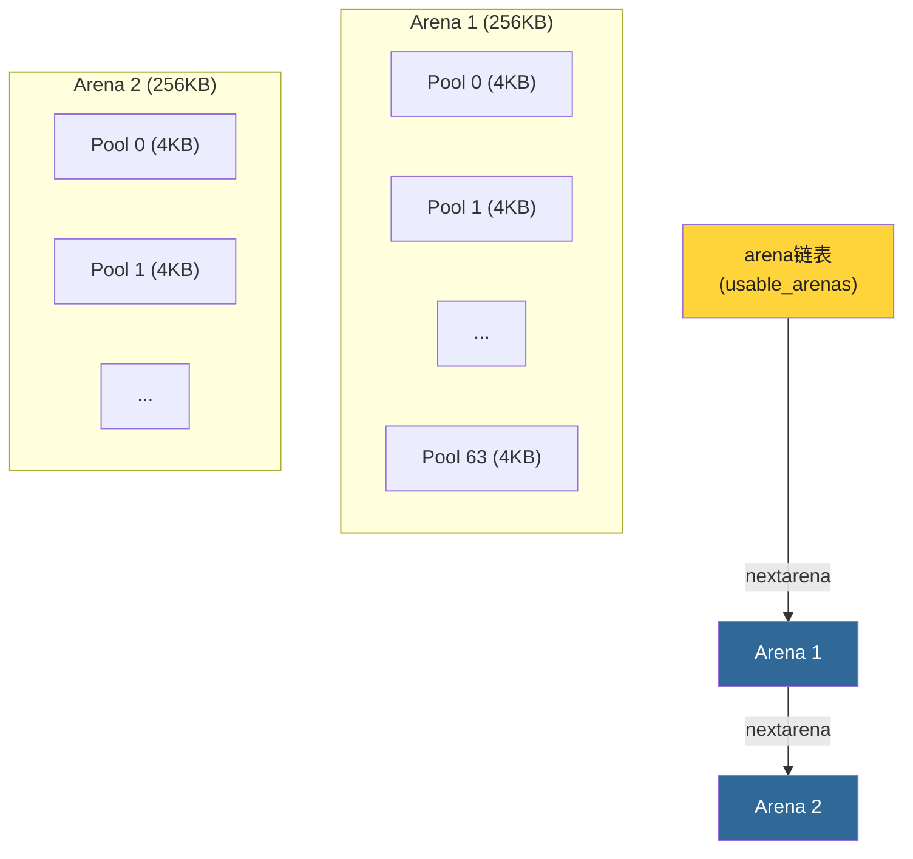
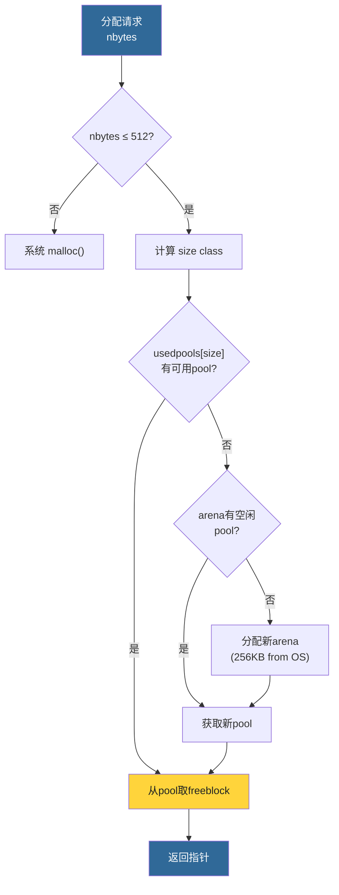

# 第13章 · 内存管理

> **本章要点**：深入分析CPython的三层内存管理架构——从操作系统的arena到pymalloc的pool和block，理解Python如何高效管理大量小对象的分配和释放。

---

## 13.1 内存管理架构全景

CPython的内存管理分为三个层次：



---

## 13.2 Block（最小分配单元）

### 13.2.1 大小分类

pymalloc只处理**小于等于512字节**的分配请求。更大的请求直接转发给系统的 `malloc`。

```c
// Objects/obmalloc.c

#define SMALL_REQUEST_THRESHOLD 512  // 512字节以下用pymalloc
#define NB_SMALL_SIZE_CLASSES 64     // 64个大小类别

// 大小类别：8, 16, 24, 32, ..., 512
// 步长 = 8 (对齐到8字节)
```

| 请求大小 | 分配的block大小 | size class index |
|---------|---------------|------------------|
| 1 ~ 8   | 8 bytes       | 0 |
| 9 ~ 16  | 16 bytes      | 1 |
| 17 ~ 24 | 24 bytes      | 2 |
| ...     | ...           | ... |
| 505 ~ 512 | 512 bytes  | 63 |
| ≥ 513   | → 系统 malloc | — |

### 13.2.2 Block状态

```c
// block的三种状态：
// - 未分配 (untouched)
// - 空闲 (free) — 之前用过，现在在freelist中
// - 已分配 (allocated)
```

---

## 13.3 Pool（池）

### 13.3.1 结构

每个pool固定4KB，管理同一size class的block：

```c
// Objects/obmalloc.c

#define POOL_SIZE 4096  // 4KB

struct pool_header {
    union { block *_padding; uint count; } ref;  // 已分配block数
    block *freeblock;         // 第一个空闲block
    struct pool_header *nextpool;   // 同size class的下一个pool
    struct pool_header *prevpool;   // 同size class的上一个pool
    uint arenaindex;          // 所属arena索引
    uint szidx;               // size class index
    uint nextoffset;          // 下一个未使用的block偏移
    uint maxnextoffset;       // 最大有效偏移
};

// pool数据：block数组紧随pool_header之后
```

### 13.3.2 Pool状态机


- **usedpools**: 双向链表，每个size class一条，包含所有非full的pool
- **full pools**: 从usedpools中移除
- **empty pools**: 被arena回收

---

## 13.4 Arena（竞技场）

### 13.4.1 结构

Arena从操作系统获取大块内存（256KB），然后划分给pool使用：

```c
// Objects/obmalloc.c

#define ARENA_SIZE (256 << 10)  // 256KB

struct arena_object {
    uintptr_t address;         // 内存基址
    block* pool_address;       // 下一个待分配的pool地址
    uint nfreepools;           // 空闲pool数量
    uint ntotalpools;          // 总pool数量
    struct pool_header* freepools;  // 空闲pool链表
    struct arena_object* nextarena;
    struct arena_object* prevarena;
};
```

### 13.4.2 Arena管理



---

## 13.5 分配流程

### 13.5.1 PyObject_Malloc 核心流程

```c
// Objects/obmalloc.c (大幅简化)

void *
_PyObject_Malloc(void *ctx, size_t nbytes)
{
    // 1. 大于512字节？→ 系统malloc
    if (nbytes > SMALL_REQUEST_THRESHOLD) {
        return malloc(nbytes);
    }

    // 2. 计算size class
    uint size = (uint)(nbytes - 1) >> 3;  // 对齐到8
    // size ∈ [0, 63]

    // 3. 找到对应size class的usedpool
    poolp pool = usedpools[size + size];

    if (pool != pool->nextpool) {
        // 4a. usedpool中有可用block
        // 从pool的freeblock链表取一个block
        bp = pool->freeblock;
        pool->freeblock = *(block **)bp;
        return (void *)bp;
    }

    // 4b. usedpool为空，需要新pool
    // 从arena获取新pool
    // 初始化pool的freeblock链表
    // 分配第一个block
    // ...
}
```

### 13.5.2 流程图



---

## 13.6 释放流程

```c
// Objects/obmalloc.c

void
_PyObject_Free(void *ctx, void *p)
{
    // 1. 获取block所属的pool（通过地址计算）
    poolp pool = POOL_ADDR(p);

    // 2. 将block加入pool的freelist头部
    *(block **)p = pool->freeblock;
    pool->freeblock = (block *)p;

    // 3. 更新引用计数
    pool->ref.count--;

    // 4. 如果pool变为empty，可能归还给arena
    // 如果pool从full变为非full，重新加入usedpools
}
```

---

## 13.7 内存调试

### 13.7.1 查看内存统计

```python
import sys

# --with-pydebug 编译的Python提供内存统计
if hasattr(sys, 'getallocatedblocks'):
    print(f"已分配block数: {sys.getallocatedblocks()}")
```

### 13.7.2 使用tracemalloc

```python
import tracemalloc

tracemalloc.start()

# 运行一些代码
lst = [i for i in range(100000)]
d = {str(i): i for i in range(10000)}

# 查看当前内存快照
snapshot = tracemalloc.take_snapshot()
top_stats = snapshot.statistics('lineno')

print("内存使用Top 5：")
for stat in top_stats[:5]:
    print(stat)

tracemalloc.stop()
```

---

## 13.8 本章小结

| 层级 | 大小 | 管理器 | 关键特性 |
|------|------|--------|---------|
| **Block** | 8~512 bytes | Pool | 按size class分类，freelist管理 |
| **Pool** | 4KB | Arena | 同size class的block集合 |
| **Arena** | 256KB | OS | 从系统获取，划分给pools |

| 概念 | 说明 |
|------|------|
| **SMALL_REQUEST_THRESHOLD** | 512字节，超过则走系统malloc |
| **NB_SMALL_SIZE_CLASSES** | 64个大小类别 |
| **usedpools** | 每个size class的双向链表，管理非full的pools |
| **freelist** | 每个pool内部释放的block通过freelist重用 |

> **下一步**：在 [第14章](./ch14-gil-concurrency.md) 中，我们将分析Python中最具争议的特性——GIL。
