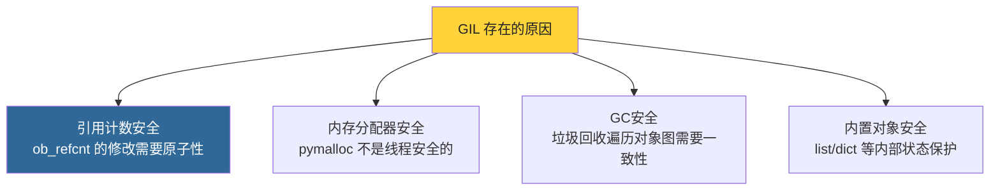
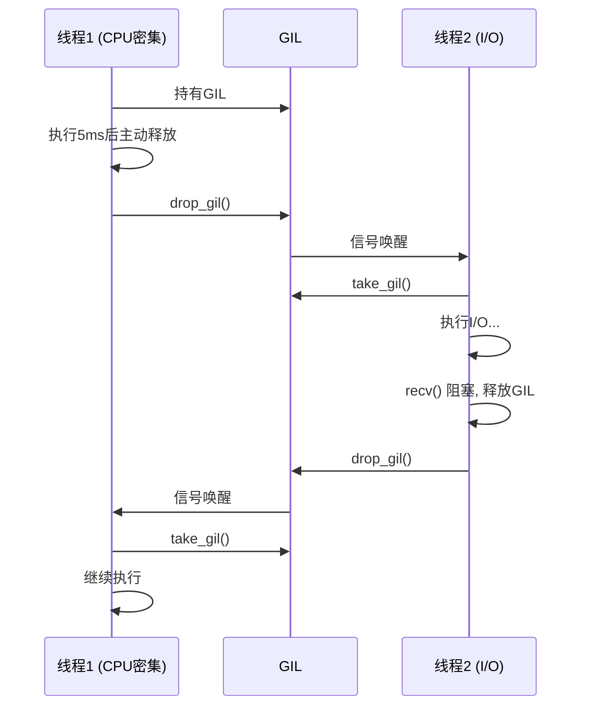
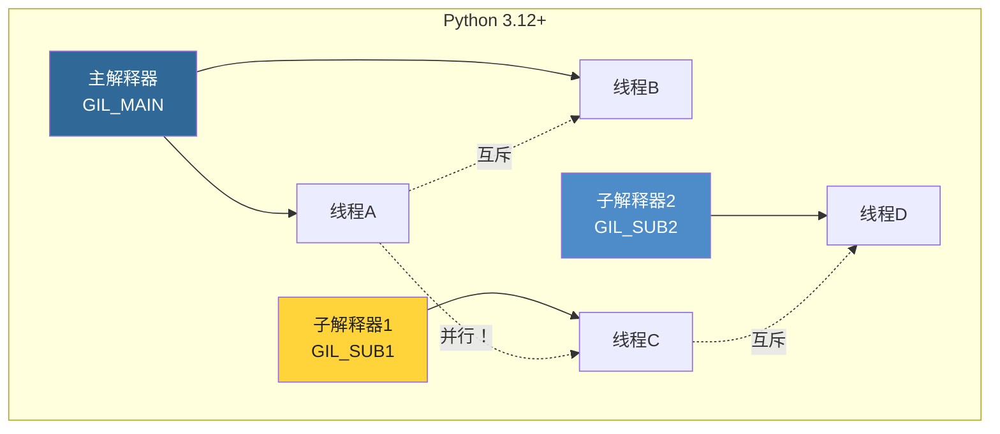

# 第14章 · GIL与并发

> **本章要点**：深入分析CPython的GIL（Global Interpreter Lock）底层实现，理解条件变量机制、GIL的获取与释放策略，以及Python 3.12引入的PEP 684（per-interpreter GIL）。

---

## 14.1 什么是GIL？

### 14.1.1 核心定义

**GIL（Global Interpreter Lock）** 是一个互斥锁，确保同一时刻只有一个线程执行Python字节码。

```python
import threading

counter = 0

def increment():
    global counter
    for _ in range(1_000_000):
        counter += 1  # 这个操作不是原子的！

threads = [threading.Thread(target=increment) for _ in range(10)]
for t in threads:
    t.start()
for t in threads:
    t.join()

print(counter)  # 预期: 10,000,000  实际: 可能小于这个数！
```

### 14.1.2 为什么需要GIL？



> **关键洞察**：GIL不是Python语言规范的一部分——它是CPython实现中的一个权衡。移除GIL需要对整个解释器做大量的细粒度锁改造（这正是nogil项目的目标）。

---

## 14.2 GIL的C源码实现

### 14.2.1 数据结构（Python 3.12）

```c
// Python/ceval_gil.c

// 每个解释器的GIL状态
struct _gil_runtime_state {
    // 持有GIL的线程ID（0表示空闲）
    unsigned long last_holder;

    // 互斥锁
    PyMutex mutex;

    // 条件变量 — 等待GIL的线程在此睡眠
    PyCOND_T cond;

    // 是否有线程在等待条件变量
    int cond_waiting;

    // GIL状态
    // -1: 未初始化
    //  0: 已释放
    //  1: 已被持有
    int locked;

    // 是否启用GIL（禁用=无GIL模式/自由线程模式）
    int enabled;

    // switch_interval: 线程切换间隔（默认 5ms = 5000μs）
    unsigned long switch_interval;
};
```

### 14.2.2 获取GIL

```c
// Python/ceval_gil.c (简化)

static void
take_gil(PyThreadState *tstate)
{
    // 1. 如果当前线程已经持有GIL，直接返回
    if (tstate->_status.holds_gil) {
        return;
    }

    // 2. 锁定互斥锁
    PyMutex_Lock(&gil->mutex);

    // 3. 如果GIL被其他线程持有，等待条件变量
    while (gil->locked || gil->last_holder == tstate->thread_id) {
        // 检查是否需要释放GIL（间隔到了）
        if (_Py_atomic_load_relaxed_int(&gil->locked)) {
            unsigned long interval = gil->switch_interval;
            // 等待，但有超时
            COND_TIMED_WAIT(&gil->cond, &gil->mutex, interval, ...);
        }
    }

    // 4. 标记GIL为已被当前线程持有
    gil->locked = 1;
    gil->last_holder = tstate->thread_id;
    tstate->_status.holds_gil = 1;

    PyMutex_Unlock(&gil->mutex);
}
```

### 14.2.3 释放GIL

```c
static void
drop_gil(PyThreadState *tstate)
{
    PyMutex_Lock(&gil->mutex);

    // 标记GIL为释放
    gil->locked = 0;
    tstate->_status.holds_gil = 0;

    // 唤醒等待的线程
    if (gil->cond_waiting) {
        COND_SIGNAL(&gil->cond);
    }

    PyMutex_Unlock(&gil->mutex);
}
```

---

## 14.3 GIL的释放时机

### 14.3.1 自动释放

GIL在以下时机自动释放：

| 时机 | 说明 |
|------|------|
| **每5ms** | `sys.setswitchinterval()` 控制 |
| **阻塞I/O** | `read()`, `socket.recv()`, `time.sleep()` |
| **C扩展显式释放** | `Py_BEGIN_ALLOW_THREADS` / `Py_END_ALLOW_THREADS` |

### 14.3.2 I/O操作中的GIL释放

```c
// 内置 I/O 操作会临时释放 GIL

// 例如 socket.recv 内部：
Py_BEGIN_ALLOW_THREADS
// GIL已释放，其他线程可以运行
result = recv(fd, buf, len, flags);
Py_END_ALLOW_THREADS
// GIL已重新获取
```



---

## 14.4 GIL对多线程的影响

### 14.4.1 CPU密集型任务

```python
import time
import threading

def cpu_bound():
    """CPU密集型：GIL是瓶颈"""
    total = 0
    for i in range(50_000_000):
        total += i
    return total

# 单线程
start = time.perf_counter()
cpu_bound()
single_time = time.perf_counter() - start

# 双线程（并不能加速！）
start = time.perf_counter()
t1 = threading.Thread(target=cpu_bound)
t2 = threading.Thread(target=cpu_bound)
t1.start(); t2.start()
t1.join(); t2.join()
multi_time = time.perf_counter() - start

print(f"单线程: {single_time:.2f}s")
print(f"双线程: {multi_time:.2f}s  (可能差不多，甚至更慢)")
```

### 14.4.2 I/O密集型任务

```python
import time
import threading
import urllib.request

def io_bound():
    """I/O密集型：GIL在I/O时释放"""
    for _ in range(10):
        urllib.request.urlopen("https://httpbin.org/delay/0.1")

# 单线程慢，多线程快 — I/O等待时GIL释放！
```

---

## 14.5 Python 3.12 — PEP 684 Per-Interpreter GIL

### 14.5.1 概念

Python 3.12 实现了 **PEP 684**，将GIL从"全局锁"变为"per-interpreter锁"：

```c
// Python 3.12: 每个子解释器有自己的GIL
// 不同解释器中的线程可以真正并行执行！

// Python/pystate.c

typedef struct _is {
    // ...
    struct _gil_runtime_state _gil;  // 每个解释器独立的GIL
    // ...
} PyInterpreterState;
```



### 14.5.2 使用子解释器

```python
# Python 3.12+ 的子解释器API（实验性）
import _xxsubinterpreters as interpreters

# 创建子解释器
interp_id = interpreters.create()

# 在子解释器中运行代码
interpreters.run_string(interp_id, "print('Hello from sub-interpreter!')")

# 销毁
interpreters.destroy(interp_id)
```

---

## 14.6 绕过GIL的策略

| 策略 | 适用场景 | 说明 |
|------|---------|------|
| **多进程** `multiprocessing` | CPU密集型 | 每个进程独立GIL，真正并行 |
| **C扩展** | 计算密集型 | 在C代码中释放GIL |
| **asyncio** | I/O密集型 | 单线程异步，避免锁竞争 |
| **子解释器** | 隔离并行 | Python 3.12+，实验性 |
| **nogil CPython** | 所有场景 | 社区fork，移除GIL |

---

## 14.7 本章小结

| 概念 | 关键点 |
|------|--------|
| **GIL本质** | 互斥锁，保护CPython内部状态 |
| **实现位置** | `Python/ceval_gil.c` |
| **释放时机** | 每5ms、I/O阻塞、C扩展显式释放 |
| **对CPU密集型** | 不能利用多核，甚至因锁竞争更慢 |
| **对I/O密集型** | 影响小，I/O等待时GIL自动释放 |
| **PEP 684** | Python 3.12 per-interpreter GIL，子解释器可真正并行 |

> **下一步**：在 [第15章](./ch15-gc.md) 中，我们将分析CPython的垃圾回收系统，它如何解决引用计数无法处理的循环引用问题。
