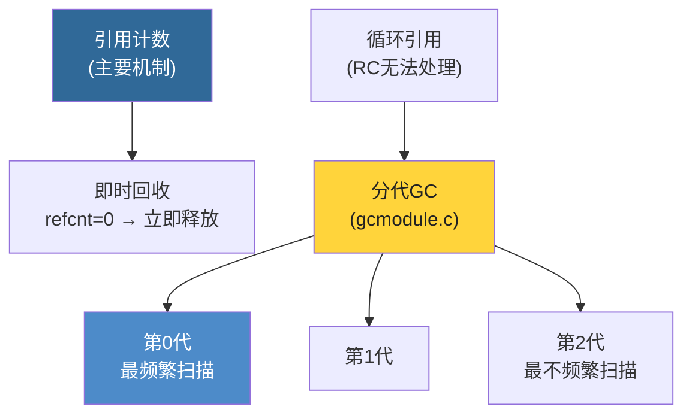
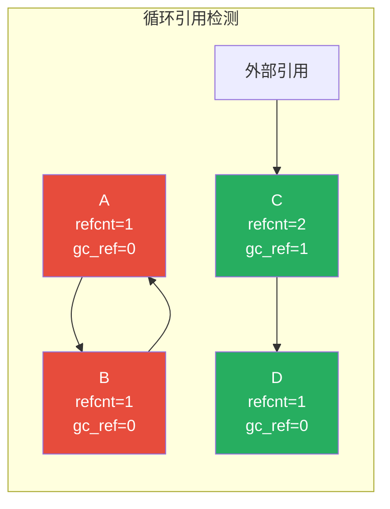
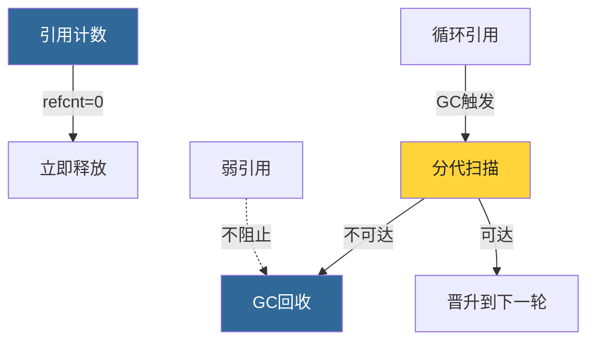

# 第15章 · 垃圾回收

> **本章要点**：深入分析CPython的垃圾回收系统，理解分代回收策略、循环引用检测算法、gc模块的核心源码，以及弱引用在GC中的作用。

---

## 15.1 CPython的GC架构

CPython使用**引用计数 + 分代垃圾回收**的混合策略：



---

## 15.2 分代回收策略

### 15.2.1 三代设计

```c
// Modules/gcmodule.c

#define NUM_GENERATIONS 3

// 各代的阈值（触发回收的阈值）
struct gc_generation {
    PyGC_Head head;                // 该代的对象链表头
    int threshold;                 // 触发GC的阈值
    int count;                     // 自上次回收以来的分配计数
};

// 默认阈值 (Python 3.12)
// 第0代: threshold=700,  count=分配数-释放数
// 第1代: threshold=10,   count=第0代回收次数
// 第2代: threshold=10,   count=第1代回收次数
```

### 15.2.2 "代"的假设

> **弱分代假设**：大多数对象存活时间很短。新创建的对象更可能成为垃圾。

- **第0代**：新创建的对象。回收最频繁。
- **第1代**：在第0代回收中存活的对象。
- **第2代**：存活时间最长的对象。回收最不频繁。

### 15.2.3 晋升过程


---

## 15.3 GC对象结构

### 15.3.1 PyGC_Head

支持GC的对象在头部嵌入 `PyGC_Head`：

```c
// Include/internal/pycore_gc.h

typedef struct {
    // 前向/后向指针，维护双向链表
    uintptr_t _gc_next;
    uintptr_t _gc_prev;

    // GC状态位
    // 使用低2位存储标记：
    //  bit 0: PREV_MASK_COLLECTING (是否正在被回收)
    //  bit 1: _PyGC_PREV_MASK_FINALIZED (是否已调用__del__)
} PyGC_Head;
```

### 15.3.2 支持GC的对象

```c
// list 对象示例：支持GC

typedef struct {
    PyObject_VAR_HEAD
    PyObject **ob_item;
    Py_ssize_t allocated;
} PyListObject;

// PyList_Type 中设置：
// Py_TPFLAGS_DEFAULT | Py_TPFLAGS_HAVE_GC
```

```c
// int 对象：不支持GC（不可变 + 不包含其他对象引用）

// PyLong_Type 中：
// Py_TPFLAGS_DEFAULT
// 没有 Py_TPFLAGS_HAVE_GC
```

---

## 15.4 循环引用检测算法

### 15.4.1 核心算法

CPython的GC使用 **标记-清除** 变体来检测循环引用：

```c
// Modules/gcmodule.c (算法简化)

// 阶段1：收集候选对象
//   将该代的所有对象放入一个临时集合

// 阶段2：计算有效引用计数
//   对每个候选对象，将其内部引用的对象的 "gc_ref" 减1
//   减完后 gc_ref > 0 的对象外部有引用 → 存活
//   减完后 gc_ref == 0 的对象只被循环内对象引用 → 可能是垃圾

// 阶段3：处理不可达对象
//   将 gc_ref == 0 的对象移到不可达链表

// 阶段4：处理 __del__ 终结器
//   有 __del__ 的对象需要特殊处理（不能随意回收）
```

### 15.4.2 可视化：循环检测



- A 和 B 形成循环，且无外部引用 → `gc_ref = 0` → **被回收**
- C 和 D：C有外部引用 → `gc_ref > 0` → **存活**，D也因此存活

---

## 15.5 gc模块

### 15.5.1 基本操作

```python
import gc

# 查看GC状态
print(f"GC启用: {gc.isenabled()}")

# 查看阈值
print(f"阈值: {gc.get_threshold()}")  # (700, 10, 10)

# 查看各代对象数
print(f"各代计数: {gc.get_count()}")

# 手动触发GC
gc.collect()

# 查看GC统计
print(f"GC统计: {gc.get_stats()}")
```

### 15.5.2 调优GC

```python
import gc

# 设置阈值
gc.set_threshold(1000, 15, 15)

# 禁用GC（如果你确定没有循环引用）
gc.disable()

# 重新启用
gc.enable()
```

### 15.5.3 gc.get_objects()

```python
import gc

# 获取所有被GC追踪的对象
all_objects = gc.get_objects()
print(f"总对象数: {len(all_objects)}")

# 查找特定类型的泄漏
lists = [obj for obj in gc.get_objects() if isinstance(obj, list)]
print(f"列表数量: {len(lists)}")
```

---

## 15.6 弱引用与GC

### 15.6.1 弱引用如何帮助GC

弱引用让GC知道某个对象是"弱可达"的，可以在回收后清理弱引用：

```python
import weakref
import gc

class Node:
    def __init__(self, name):
        self.name = name
        self.next = None

a = Node("A")
a_ref = weakref.ref(a)

print(a_ref())  # <__main__.Node object>

del a
print(a_ref())  # None — 弱引用自动失效
```

### 15.6.2 WeakSet / WeakValueDictionary

```python
import weakref

class Resource:
    def __init__(self, name):
        self.name = name

cache = weakref.WeakValueDictionary()

r = Resource("config")
cache["config"] = r

print(cache.get("config"))  # <Resource object>

del r
print(cache.get("config"))  # None — 自动从缓存移除
```

---

## 15.7 __del__ 终结器的陷阱

```python
import gc

class BadDesign:
    def __del__(self):
        print(f"{self} 被回收")

# 循环引用 + __del__ → GC无法处理！
a = BadDesign()
b = BadDesign()
a.other = b
b.other = a

del a, b

# GC会把这些对象放入 gc.garbage
print(gc.garbage)
```

> **最佳实践**：避免在 `__del__` 中创建循环引用。使用 `weakref` 或上下文管理器代替终结器。

---

## 15.8 内存泄漏检测

```python
import gc
import sys

def check_leak():
    """简单的内存泄漏检查"""
    gc.collect()
    before = len(gc.get_objects())

    # 运行可疑代码
    # ...

    gc.collect()
    after = len(gc.get_objects())

    print(f"对象数变化: {before} → {after} (差: {after - before})")
    return after - before
```

---

## 15.9 本章小结

| 概念 | 关键点 |
|------|--------|
| **双轨策略** | 引用计数（即时）+ 分代GC（循环引用） |
| **三代设计** | Gen0（最频繁）→ Gen1 → Gen2（最不频繁） |
| **检测算法** | 计算 gc_ref，gc_ref==0 且不可达 → 回收 |
| **PyGC_Head** | 支持GC的对象通过内嵌链表头部参与回收 |
| **弱引用** | 不阻止回收，回收后自动设None |
| **__del__ 陷阱** | 循环引用 + __del__ 导致对象不可回收 |



> **下一步**：在 [第16章](../part5-advanced/ch16-import-system.md) 中，我们将探索import系统的内部实现。
