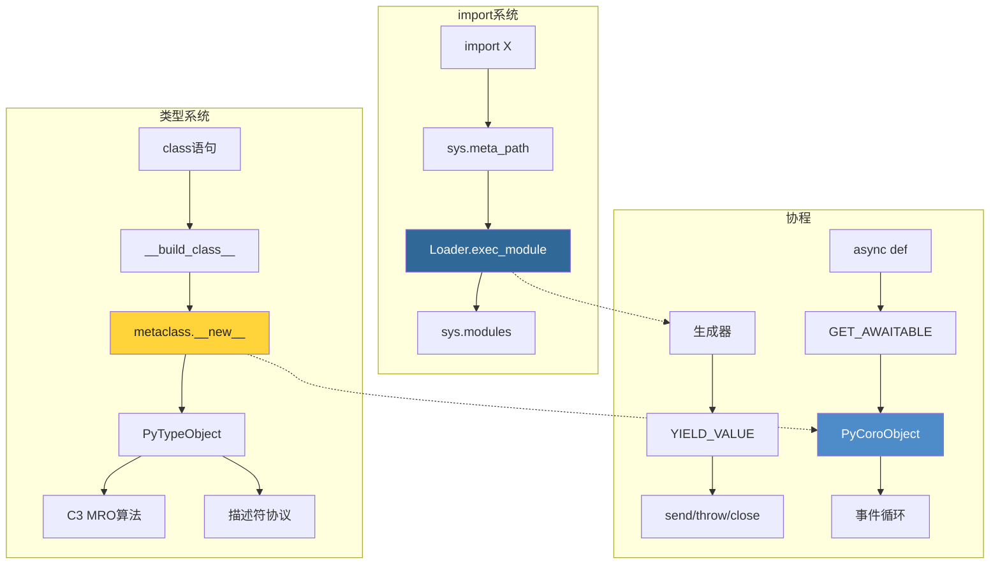

# 第5部分：高级主题

> 本部分共3章，在前四部分基础上深入CPython的高级特性——import系统的加载器机制、类型系统与元类的C实现、以及生成器与协程的底层调度。

---

## 📑 章节导航

| 章节 | 标题 | 你将学到 |
|------|------|---------|
| [第16章](./ch16-import-system.md) | import系统 | importlib引导、finders/loaders、sys.modules缓存、import hook |
| [第17章](./ch17-type-metaclass.md) | 类型系统与元类 | PyTypeObject完整结构、C3 MRO算法、描述符协议、`__slots__` |
| [第18章](./ch18-coroutine-generator.md) | 协程与生成器 | PyGenObject/CoroObject、yield/send/await底层、异步生成器 |

---

## 🎯 学习目标

完成本部分后，你将能够：

1. ✅ 自定义 import hook 实现虚拟模块加载和远程代码导入
2. ✅ 理解元类在C层面的执行路径并实现自定义元类
3. ✅ 画出生成器 yield/send/throw 的完整状态转换图
4. ✅ 解释 async/await 如何与事件循环在C层面协作

---

## 📐 知识地图

---

## 🔑 Part 5 核心概念速览

| 概念 | C源码位置 | 关键数据结构 |
|------|----------|-------------|
| import | `Python/import.c`, `importlib._bootstrap` | `sys.meta_path`, `sys.modules` |
| 类型/MRO | `Objects/typeobject.c` | `PyTypeObject`, `tp_mro` |
| 生成器 | `Objects/genobject.c` | `PyGenObject`, `gi_frame` |
| 协程 | `Objects/genobject.c` | `PyCoroObject`, `cr_await` |

---

准备好了吗？从 [第16章 · import系统](./ch16-import-system.md) 开始吧！
