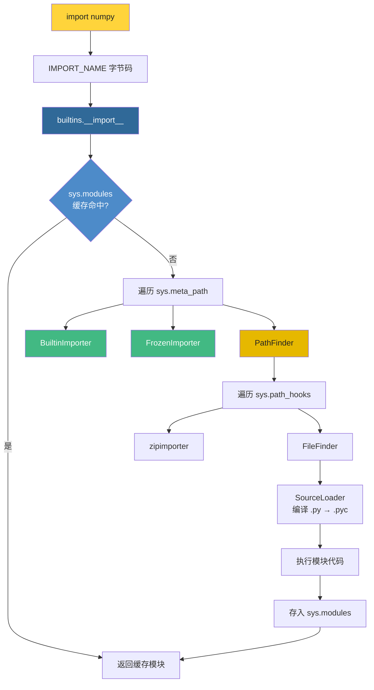
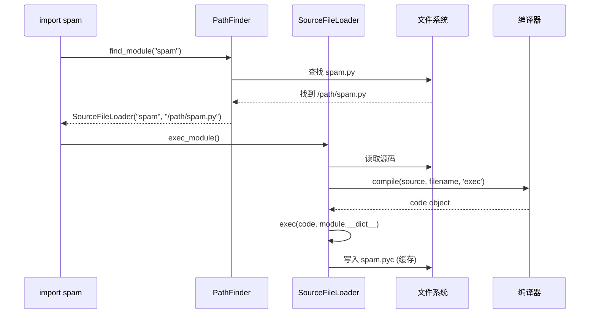

# 第16章 · import系统

> **本章要点**：深入分析Python import系统的底层实现，从C层面的`__import__`到importlib的加载器机制，理解模块查找、加载和缓存的完整流程。

---

## 16.1 import系统全景

Python的import系统是解释器最复杂的子系统之一。一个简单的 `import numpy` 背后涉及：



---

## 16.2 IMPORT_NAME 字节码

### 16.2.1 从Python语句到字节码

```python
import os
```

编译后变成：

```
  1           0 LOAD_CONST               0 (0)
              2 LOAD_CONST               1 (None)
              4 IMPORT_NAME              0 (os)
              6 STORE_NAME               0 (os)
```

`IMPORT_NAME` 是核心指令，实现在 `Python/ceval.c`：

```c
// Python/ceval.c (简化)
case TARGET(IMPORT_NAME): {
    PyObject *name = GETITEM(names, oparg);
    PyObject *fromlist = POP();   // import X 时 fromlist 为 None
    PyObject *level = POP();      // 相对导入层级，绝对导入为0

    res = import_name(tstate, frame, name, fromlist, level);
    // ...
}
```

### 16.2.2 import_name 内部调用链

```c
// Python/ceval.c
static PyObject *
import_name(PyThreadState *tstate, _PyInterpreterFrame *frame,
            PyObject *name, PyObject *fromlist, PyObject *level)
{
    // 最终调用 builtins.__import__
    _Py_IDENTIFIER(__import__);
    PyObject *import_func = _PyDict_GetItemIdWithError(
        builtins, &PyId___import__);
    if (import_func == NULL) return NULL;

    return PyObject_CallFunction(
        import_func, "OOOOi",
        name,          // "os"
        globals,       // 当前全局命名空间
        locals,        // 当前局部命名空间
        fromlist,      // None (对于 import X)
        level_int      // 0 (绝对导入)
    );
}
```

```python
# Python 层面的等效调用
import builtins
builtins.__import__("os", globals(), locals(), None, 0)
```

---

## 16.3 importlib：纯Python实现的导入引擎

### 16.3.1 引导悖论

一个有趣的问题：如果import系统本身是Python实现的，那谁来import importlib？

答案：**frozen module（冻结模块）**。

```c
// Python/pylifecycle.c
// CPython 启动时将 importlib._bootstrap 作为冻结模块加载
// 这些模块的字节码直接嵌入 Python 可执行文件中

// 冻结模块列表（部分）
static const struct _frozen _PyImport_FrozenModules[] = {
    {"importlib._bootstrap", _Py_M__importlib__bootstrap, SIZE},
    {"importlib._bootstrap_external", _Py_M__importlib__bootstrap_external, SIZE},
    // ...
};
```

### 16.3.2 sys.meta_path 和 sys.path_hooks

```python
import sys

# meta_path: Finder 列表，按顺序尝试
for finder in sys.meta_path:
    print(type(finder).__name__)

# 输出（典型）：
# BuiltinImporter   → 加载内置C模块（如 sys, math）
# FrozenImporter    → 加载冻结模块（如 importlib._bootstrap）
# PathFinder        → 查找文件系统路径中的模块
```

| Finder | 位置 | 查找范围 |
|--------|------|---------|
| `BuiltinImporter` | `sys.meta_path[0]` | C扩展模块（内置于解释器） |
| `FrozenImporter` | `sys.meta_path[1]` | 冻结的Python模块字节码 |
| `PathFinder` | `sys.meta_path[2]` | sys.path 中的文件系统路径 |

---

## 16.4 PathFinder 核心机制

### 16.4.1 sys.path 与路径钩子

```python
import sys

# sys.path 是模块搜索路径列表
print(sys.path[0])   # '' (当前目录)
print(sys.path[1])   # '/usr/lib/python312.zip'
print(sys.path[2])   # '/usr/lib/python3.12'

# path_hooks: 为每个路径条目找到合适的 Loader 工厂
for hook in sys.path_hooks:
    print(hook)

# 输出：
# <class 'zipimport.zipimporter'>   → 处理 .zip 文件
# <function FileFinder.path_hook>   → 处理文件系统目录
```

### 16.4.2 FileFinder 的查找流程

```python
# importlib._bootstrap_external.py (简化)
class FileFinder:
    def find_module(self, fullname, path=None):
        """在路径中查找模块"""
        # 1. 确定搜索路径
        tail_name = fullname.rpartition('.')[2]
        search_path = path if path else sys.path

        for entry in search_path:
            # 2. 尝试各种后缀
            for suffix, loader_class in self._loaders:
                file_path = os.path.join(entry, tail_name + suffix)
                if os.path.exists(file_path):
                    return loader_class(fullname, file_path)
        return None
```

`_loaders` 字典定义了文件类型与Loader的映射：

| 文件后缀 | Loader类 | 说明 |
|---------|---------|------|
| `.py` | `SourceFileLoader` | Python源文件 |
| `.pyc` | `SourcelessFileLoader` | 仅字节码文件 |
| `.so`/`.pyd` | `ExtensionFileLoader` | C扩展模块 |

### 16.4.3 SourceFileLoader 加载流程



---

## 16.5 sys.modules 缓存机制

### 16.5.1 缓存的作用

```python
import sys

# sys.modules 是一个普通dict，key是模块名，value是模块对象
# 重复import时直接返回缓存——不会重复执行模块代码
print(sys.modules['os'])    # <module 'os' from '...'>

# import的幂等性保障
import os       # 第一次：加载
import os       # 第二次：命中缓存，立即返回
assert sys.getrefcount(sys.modules['os']) > 2  # 引用计数增加
```

### 16.5.2 缓存的生命周期

```c
// Python/import.c
static PyObject *
import_find_and_load(PyThreadState *tstate, PyObject *abs_name)
{
    // 1. 先查缓存
    PyObject *mod = PyDict_GetItemWithError(interp->modules, abs_name);
    if (mod != NULL) {
        Py_INCREF(mod);
        return mod;  // 缓存命中，直接返回
    }

    // 2. 缓存未命中，遍历 finders
    // ...

    // 3. 加载成功后存入缓存
    if (mod != NULL) {
        _Py_IDENTIFIER(__spec__);
        PyObject *spec = _PyObject_GetAttrId(mod, &PyId___spec__);
        // ...
        PyDict_SetItem(interp->modules, abs_name, mod);
    }
    return mod;
}
```

> **关键设计**：`sys.modules` 同时充当缓存和模块注册表。删除 `sys.modules['X']` 后重新 import 会触发重新加载。

---

## 16.6 包导入与相对导入

### 16.6.1 包的 `__path__` 属性

```python
# 目录结构:
# mypkg/
#   __init__.py
#   submod.py

import mypkg
print(mypkg.__path__)   # ['/path/to/mypkg']

# __path__ 是一个列表，可以动态修改
mypkg.__path__.append('/other/location')
# 之后 import mypkg.xxx 也会在 /other/location 中查找
```

### 16.6.2 相对导入的底层实现

```python
# mypkg/submod.py
from . import sibling    # 相对导入
from ..parent import x   # 上级相对导入

# 编译后的字节码会包含层级信息（level参数）
# IMPORT_NAME 指令的 level 参数：
#   level=0 → 绝对导入 (import foo)
#   level=1 → from . import foo
#   level=2 → from .. import foo
```

```c
// Python/import.c
static PyObject *
resolve_name(PyThreadState *tstate, PyObject *name,
             PyObject *globals, int level)
{
    if (level == 0) {
        return name;  // 绝对导入，名称不变
    }

    // 相对导入：从 __package__ 或 __name__ 计算绝对名称
    PyObject *package = _PyDict_GetItemStringWithError(globals, "__package__");
    if (package == NULL) {
        package = _PyDict_GetItemStringWithError(globals, "__name__");
    }
    // 拼接: package + "." * (level-1) + name
    // ...
}
```

---

## 16.7 import hook 机制

### 16.7.1 自定义 Finder

```python
import sys
import os

class VirtualModuleFinder:
    """从内存中的虚拟模块加载——不依赖文件系统"""
    def __init__(self, modules):
        self._modules = modules

    def find_module(self, fullname, path=None):
        if fullname in self._modules:
            return VirtualModuleLoader(fullname, self._modules[fullname])
        return None

class VirtualModuleLoader:
    def __init__(self, fullname, source):
        self.fullname = fullname
        self.source = source

    def load_module(self, fullname):
        import types
        mod = types.ModuleType(fullname)
        mod.__file__ = f"<virtual:{fullname}>"
        mod.__loader__ = self
        exec(compile(self.source, mod.__file__, 'exec'), mod.__dict__)
        sys.modules[fullname] = mod
        return mod

# 注册到 meta_path
sys.meta_path.insert(0, VirtualModuleFinder({
    "mymod": "print('Hello from virtual module!')\nx = 42"
}))

import mymod   # Hello from virtual module!
print(mymod.x)  # 42
```

### 16.7.2 find_spec (Python 3.4+推荐方式)

```python
import importlib.abc
import importlib.machinery

class URLFinder(importlib.abc.MetaPathFinder):
    """从URL加载模块的Finder"""
    def __init__(self, base_url):
        self.base_url = base_url

    def find_spec(self, fullname, path, target=None):
        # find_spec 替代 find_module（更现代的接口）
        # 返回 ModuleSpec 对象
        spec = importlib.machinery.ModuleSpec(
            fullname,
            URLModuleLoader(self.base_url),
            origin=f"{self.base_url}/{fullname}.py"
        )
        return spec
```

---

## 16.8 实战：import的性能考量

### 16.8.1 首次导入的开销

```python
import time
import sys

def measure_import():
    # 清除缓存
    if 'math' in sys.modules:
        del sys.modules['math']

    start = time.perf_counter()
    import math
    elapsed = time.perf_counter() - start

    print(f"Import math: {elapsed*1000:.2f} ms")
    # 典型值：0.5-2ms（包含文件查找 + 字节码加载 + exec_module）

measure_import()

# 第二次导入（缓存命中）
start = time.perf_counter()
import math  # 已经是最快的操作，只是dict查找
print(f"Import math (cached): {(time.perf_counter()-start)*1e6:.1f} µs")
```

### 16.8.2 延迟导入模式

```python
# 模式1：函数内导入（避免启动时加载所有依赖）
def process_data(data):
    import numpy as np  # 只在需要时才导入
    return np.array(data).mean()

# 模式2：LazyLoader（Python 3.7+）
import importlib.util
spec = importlib.util.find_spec("numpy")
lazy_loader = importlib.util.LazyLoader(spec.loader)
spec.loader = lazy_loader
module = importlib.util.module_from_spec(spec)
sys.modules["numpy_lazy"] = module
lazy_loader.exec_module(module)  # 触发时才真正加载
```

---

## 16.9 本章小结

| 层次 | 组件 | 职责 |
|------|------|------|
| 字节码层 | `IMPORT_NAME` | 触发import，传递name/fromlist/level |
| C API层 | `builtins.__import__` | 调用importlib的入口 |
| Finder层 | `sys.meta_path` | 按顺序查找模块（Builtin→Frozen→Path） |
| Loader层 | `SourceFileLoader`等 | 实际加载：读源码→编译→执行→缓存 |
| 缓存层 | `sys.modules` | 字典缓存，保证幂等性 |

**核心原理回顾**：
- import本质是`__import__()` → finder.find_spec() → loader.exec_module()
- `sys.meta_path`和`sys.path_hooks`是扩展import行为的两个关键钩子
- 模块代码只在**第一次**import时执行，后续命中`sys.modules`缓存
- 相对导入通过`__package__`属性计算绝对名称，编译时编码为level参数
- frozen module机制解决了"谁来import importlib"的引导问题

> **下一步**：在 [第17章](./ch17-type-metaclass.md) 中，我们将深入Python的类型系统底层——解析PyTypeObject结构体、追踪C3线性化算法、理解元类和描述符的C实现。
