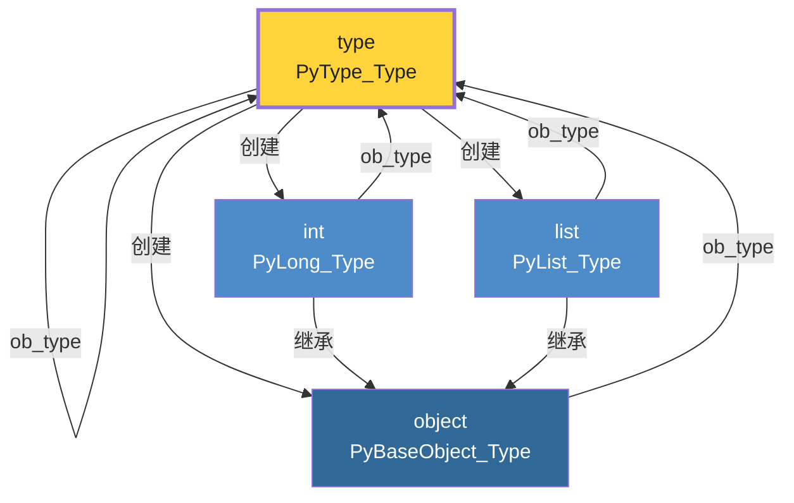
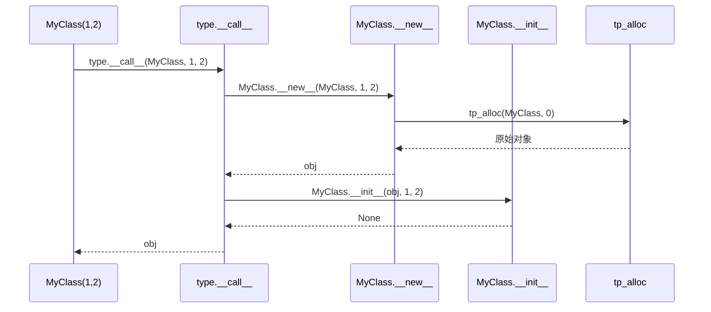
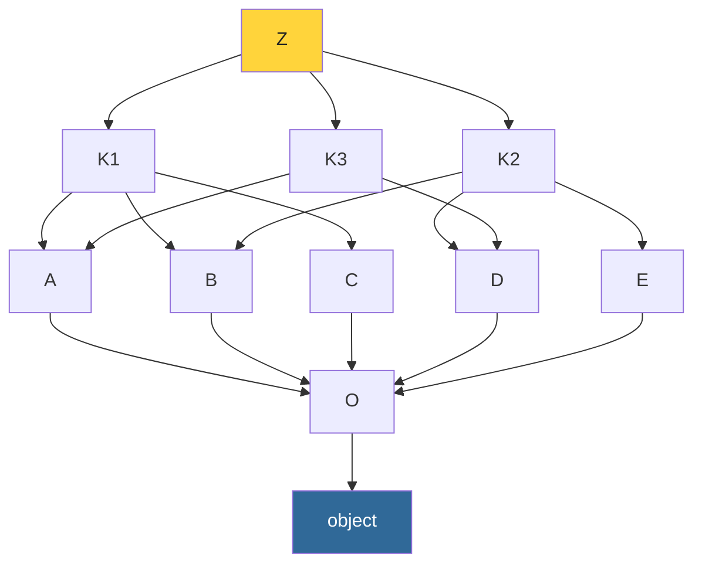
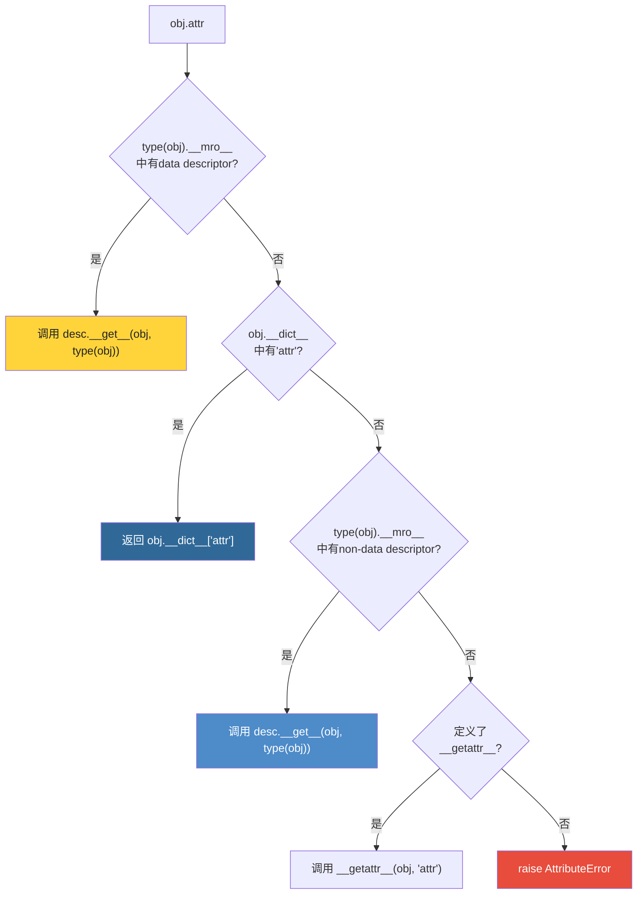

# 第17章 · 类型系统与元类

> **本章要点**：深入CPython的类型系统底层，解析PyTypeObject结构体、理解type对象的C实现、追踪元类的创建机制，并彻底搞懂C3线性化算法。

---

## 17.1 类型即对象：PyTypeObject

### 17.1.1 一切皆类型的统一模型



> **核心悖论**：`type` 的 `ob_type` 指向自己，`type` 是 `object` 的子类，`object` 又是 `type` 的实例。这是CPython类型系统最精妙的自指结构。

### 17.1.2 PyTypeObject 完整结构体

```c
// Include/cpython/object.h
typedef struct _typeobject {
    PyObject_VAR_HEAD                    // ob_refcnt, ob_type, ob_size
    const char *tp_name;                 // 类型名称（"int", "list"...）
    Py_ssize_t tp_basicsize;            // 实例的基础大小
    Py_ssize_t tp_itemsize;             // 变长对象的元素大小

    /* 方法集 */
    destructor tp_dealloc;              // 析构函数
    Py_ssize_t tp_vectorcall_offset;
    getattrfunc tp_getattr;             // __getattr__
    setattrfunc tp_setattr;             // __setattr__

    /* 数值操作 */
    PyNumberMethods *tp_as_number;      // +, -, *, / 等方法集
    PySequenceMethods *tp_as_sequence;  // [], len(), in 等方法集
    PyMappingMethods *tp_as_mapping;    // dict[key], keys() 等方法集

    /* 协议方法 */
    hashfunc tp_hash;                   // __hash__
    ternaryfunc tp_call;                // __call__
    reprfunc tp_str;                    // __str__
    getattrofunc tp_getattro;           // __getattribute__
    setattrofunc tp_setattro;           // __setattr__

    /* 元信息 */
    PyObject *tp_base;                  // 基类
    PyObject *tp_dict;                  // __dict__ (类属性命名空间)
    descrgetfunc tp_descr_get;          // __get__ (描述符)
    descrsetfunc tp_descr_set;          // __set__ (描述符)
    Py_ssize_t tp_dictoffset;           // __dict__ 在实例中的偏移
    initproc tp_init;                   // __init__
    allocfunc tp_alloc;                 // 实例内存分配
    newfunc tp_new;                     // __new__

    /* 其他 */
    PyObject *tp_bases;                 // MRO 基类元组
    PyObject *tp_mro;                   // 方法解析顺序
    PyObject *tp_subclasses;            // 弱引用子类列表
    PyObject *tp_weaklist;
    destructor tp_del;
    unsigned int tp_version_tag;        // 类型版本标记（用于缓存）
    // ... 更多字段
} PyTypeObject;
```

---

## 17.2 type 的C实现：Objects/typeobject.c

### 17.2.1 type.__new__：创建类对象

当执行 `class MyClass(Base): pass` 时，CPython 实际上调用 `type.__new__`：

```c
// Objects/typeobject.c
static PyObject *
type_new(PyTypeObject *metatype, PyObject *args, PyObject *kwds)
{
    // args: (name, bases, dict)
    // 例如：type("MyClass", (Base,), {"x": 1})

    PyObject *name, *bases, *dict;
    if (!PyArg_ParseTuple(args, "UO!O!:type.__new__",
                          &name,          // "MyClass"
                          &PyTuple_Type, &bases,  // (Base,)
                          &PyDict_Type, &dict))    // {"x": 1}
        return NULL;

    // 1. 确定元类（metatype）
    //    如果 bases 中有类型的元类更具体，使用最具体的元类
    PyTypeObject *metatype = _PyType_CalculateMetaclass(bases, dict);

    // 2. 调用 tp_alloc 分配 PyTypeObject 内存
    PyTypeObject *type = (PyTypeObject *)metatype->tp_alloc(metatype, 0);

    // 3. 设置类型属性
    type->tp_name = ...;       // "MyClass"
    type->tp_basicsize = ...;  // 计算实例大小
    type->tp_base = ...;       // Base

    // 4. 计算 MRO
    PyObject *mro = mro_implement(type, bases);

    // 5. 设置 tp_dict（从传入的 dict 复制）
    // 将方法、类变量存入 tp_dict

    return (PyObject *)type;
}
```

### 17.2.2 type.__call__：创建实例

```c
// Objects/typeobject.c
static PyObject *
type_call(PyTypeObject *type, PyObject *args, PyObject *kwds)
{
    // 当执行 MyClass(1, 2) 时，调用链为：
    // type.__call__(MyClass, 1, 2)
    //   → MyClass.__new__(MyClass, 1, 2)
    //   → MyClass.__init__(instance, 1, 2)

    // 1. 调用 tp_new 创建实例（分配内存）
    PyObject *obj = type->tp_new(type, args, kwds);
    if (obj == NULL) return NULL;

    // 2. 如果是同类型，调用 tp_init 初始化
    if (Py_TYPE(obj) == type) {
        if (type->tp_init != NULL) {
            int res = type->tp_init(obj, args, kwds);
            if (res < 0) {
                Py_DECREF(obj);
                return NULL;
            }
        }
    }

    return obj;
}
```



---

## 17.3 元类的创建机制

### 17.3.1 class语句的底层执行

```python
# Python代码
class Foo(metaclass=MyMeta):
    x = 1
    def method(self):
        pass
```

这段代码等价于：

```python
# 等价调用
Foo = MyMeta('Foo', (), {
    'x': 1,
    'method': <function method>,
    '__module__': '__main__',
    '__qualname__': 'Foo'
})
```

```c
// Python/compile.c (class语句的字节码生成，简化)
// class Foo(...):
//   编译为：
//   1. LOAD_BUILD_CLASS    → 加载 __build_class__ 函数
//   2. LOAD_CONST (code)   → 类体的code对象
//   3. LOAD_CONST 'Foo'    → 类名
//   4. LOAD_CONST (bases)  → 基类元组
//   5. CALL_FUNCTION 4     → __build_class__(body_func, 'Foo', *bases,
//                                             metaclass=..., **kwds)

// builtins.__build_class__ 内部：
// def __build_class__(func, name, *bases, metaclass=None, **kwds):
//     # 1. 执行类体，收集命名空间
//     ns = {}
//     exec(func, ns)
//
//     # 2. 确定元类
//     if metaclass is None:
//         metaclass = type(bases[0]) if bases else type
//
//     # 3. 元类创建类对象
//     return metaclass.__new__(metaclass, name, bases, ns)
```

### 17.3.2 元类的查找优先级

```c
// Objects/typeobject.c
// _PyType_CalculateMetaclass 的查找逻辑：

// 1. 如果 dict 中有 '__metaclass__'，使用它
// 2. 如果 bases 中有显式元类，使用最具体的
// 3. 如果所有 bases 都是 type 实例（无自定义元类），使用 type
// 4. 如果有冲突（bases 有不同元类且不是父子关系），抛出 TypeError
```

```python
# 示例：元类冲突
class MetaA(type): pass
class MetaB(type): pass

class BaseA(metaclass=MetaA): pass
class BaseB(metaclass=MetaB): pass

# TypeError: metaclass conflict:
# the metaclass of a derived class must be a (non-strict) subclass
# of the metaclasses of all its bases
class Bad(BaseA, BaseB): pass

# 解决方案：让一个元类继承另一个
class MetaAB(MetaA, MetaB): pass
class Good(BaseA, BaseB, metaclass=MetaAB): pass
```

---

## 17.4 MRO：C3线性化算法

### 17.4.1 为什么需要MRO

```python
class A: pass
class B(A): pass
class C(A): pass
class D(B, C): pass

# 经典类：深度优先，D → B → A → C → A（A重复！）
# 新式类（C3）：D → B → C → A → object（保证单调性）
print(D.__mro__)
# (D, B, C, A, object)
```

### 17.4.2 C3算法的形式化定义

```
L[C] = C + merge(L[B1], L[B2], ..., B1B2...)

其中 merge 规则：
1. 取第一个列表的头部H
2. 如果H不在任何其他列表的尾部出现，取出H
3. 否则取下一个列表的头部
4. 重复直到所有列表为空
5. 如果无法继续（死锁），报错
```

### 17.4.3 C实现

```c
// Objects/typeobject.c
static PyObject *
mro_implement(PyTypeObject *type, PyObject *bases)
{
    // 构建所有基类的线性化列表
    // to_merge = [L[B1], L[B2], ..., [B1, B2, ...]]

    PyObject *to_merge = PyList_New(n + 1);
    for (i = 0; i < n; i++) {
        PyObject *base = PyTuple_GET_ITEM(bases, i);
        // 获取基类的 MRO
        PyObject *base_mro = ((PyTypeObject *)base)->tp_mro;
        PyList_SET_ITEM(to_merge, i, base_mro);
    }
    // 最后一个元素是基类列表本身
    PyList_SET_ITEM(to_merge, n, bases);

    // 执行 merge 算法
    PyObject *result = PyList_New(0);
    while (PyList_GET_SIZE(to_merge) > 0) {
        int found = 0;
        for (i = 0; i < PyList_GET_SIZE(to_merge); i++) {
            PyObject *sublist = PyList_GET_ITEM(to_merge, i);
            if (PyList_GET_SIZE(sublist) == 0) continue;

            PyObject *head = PyList_GET_ITEM(sublist, 0);

            // 检查head是否在任何其他列表的尾部
            if (!tail_in_any(head, to_merge, i)) {
                // 取出head
                PyList_Append(result, head);
                // 从所有列表中移除head
                remove_from_all(head, to_merge);
                found = 1;
                break;
            }
        }
        if (!found) {
            // C3 无法解析 → TypeError
            PyErr_SetString(PyExc_TypeError,
                "Cannot create a consistent MRO");
            return NULL;
        }
    }

    type->tp_mro = PyList_AsTuple(result);
    return type->tp_mro;
}
```

### 17.4.4 实战：MRO可视化

```python
class O: pass
class A(O): pass
class B(O): pass
class C(O): pass
class D(O): pass
class E(O): pass
class K1(A, B, C): pass
class K2(D, B, E): pass
class K3(D, A): pass
class Z(K1, K2, K3): pass

def print_mro(cls):
    print(f"{cls.__name__}:", ' → '.join(c.__name__ for c in cls.__mro__))

print_mro(Z)
# Z: Z → K1 → K2 → K3 → D → A → B → C → E → O → object
```



---

## 17.5 描述符协议

### 17.5.1 描述符的本质

```c
// 描述符是定义了 __get__/__set__/__delete__ 的对象
// 在C层面，对应 PyTypeObject 中的：

typedef struct _typeobject {
    // ...
    descrgetfunc tp_descr_get;   // __get__(self, instance, owner)
    descrsetfunc tp_descr_set;   // __set__(self, instance, value)
    // __delete__ 通过 tp_descr_set 的 value=NULL 表示
} PyTypeObject;
```

### 17.5.2 属性查找优先级链



### 17.5.3 PyObject_GenericGetAttr 源码

```c
// Objects/object.c
PyObject *
PyObject_GenericGetAttr(PyObject *obj, PyObject *name)
{
    PyTypeObject *tp = Py_TYPE(obj);

    // 1. 沿 MRO 查找 data descriptor
    PyObject *descr = _PyType_Lookup(tp, name);
    if (descr != NULL) {
        descrgetfunc f = Py_TYPE(descr)->tp_descr_get;
        if (f != NULL && Py_TYPE(descr)->tp_descr_set != NULL) {
            // data descriptor (有 __set__)
            return f(descr, obj, (PyObject *)tp);
        }
    }

    // 2. 查找实例 __dict__
    PyObject *dict = *_PyObject_GetDictPtr(obj);
    if (dict != NULL) {
        PyObject *value = PyDict_GetItem(dict, name);
        if (value != NULL) {
            Py_INCREF(value);
            return value;
        }
    }

    // 3. 查找 non-data descriptor
    if (descr != NULL) {
        descrgetfunc f = Py_TYPE(descr)->tp_descr_get;
        if (f != NULL) {
            return f(descr, obj, (PyObject *)tp);
        }
        Py_INCREF(descr);
        return descr;
    }

    // 4. 回退到 __getattr__
    // ...
    PyErr_SetObject(PyExc_AttributeError, name);
    return NULL;
}
```

---

## 17.6 `__slots__` 的实现机制

### 17.6.1 为什么需要 `__slots__`

```python
# 默认情况：每个实例有一个 __dict__
class Normal:
    def __init__(self):
        self.x = 1
        self.y = 2

import sys
n = Normal()
print(sys.getsizeof(n.__dict__))  # ~104 bytes（dict本身的开销）

# 使用 __slots__：禁用 __dict__，使用固定偏移存取属性
class Slotted:
    __slots__ = ('x', 'y')
    def __init__(self):
        self.x = 1
        self.y = 2

s = Slotted()
# s.__dict__  → AttributeError! slots类没有 __dict__
print(sys.getsizeof(s))  # ~48 bytes（大幅减少）
```

### 17.6.2 C层面的实现

```c
// __slots__ 的核心是对 tp_basicsize 和 tp_dictoffset 的控制

// 普通类：
//   tp_basicsize = sizeof(PyObject_HEAD) + sizeof(PyObject *)  // __dict__ 指针
//   tp_dictoffset = sizeof(PyObject_HEAD)  // __dict__ 指针的偏移

// __slots__ 类：
//   tp_basicsize = sizeof(PyObject_HEAD) + N * sizeof(PyObject *)  // N个slot
//   tp_dictoffset = 0  // 无 __dict__

// member descriptors 直接映射到实例内存偏移：
typedef struct {
    const char *name;
    int type;       // T_INT, T_OBJECT, etc.
    Py_ssize_t offset;  // 在实例中的字节偏移
    int flags;
} PyMemberDef;
```

```python
# 查看slot类实例的内存布局
import ctypes

class Point:
    __slots__ = ('x', 'y')
    def __init__(self, x, y):
        self.x = x
        self.y = y

p = Point(10, 20)
addr = id(p)

# slot值直接存在实例内存中，通过固定偏移访问
# 不需要dict查找 → O(1) 精确偏移访问 → 更快更省内存
xref = ctypes.c_longlong.from_address(addr + 24)  # 偏移量取决于结构
print(f"p.x = {xref.value}")  # 直接从内存读取
```

---

## 17.7 实战：自定义元类在C层面的执行路径

```python
class LoggedMeta(type):
    """记录所有类创建的元类"""
    def __new__(mcs, name, bases, namespace):
        print(f"[Meta] Creating class: {name}")
        # 自动添加创建时间属性
        import time
        namespace['_created_at'] = time.time()
        return super().__new__(mcs, name, bases, namespace)

    def __call__(cls, *args, **kwargs):
        print(f"[Meta] Creating instance of {cls.__name__}")
        instance = super().__call__(*args, **kwargs)
        return instance

class MyClass(metaclass=LoggedMeta):
    def __init__(self, value):
        self.value = value

# 执行路径：
# 1. class MyClass → __build_class__ → LoggedMeta.__new__
#    输出: [Meta] Creating class: MyClass
#
# 2. MyClass(42) → LoggedMeta.__call__(MyClass, 42)
#    输出: [Meta] Creating instance of MyClass
#
# 3. 在C层面：
#    type_call(LoggedMeta, "MyClass", (), namespace)
#      → LoggedMeta->tp_new(LoggedMeta, "MyClass", (), namespace)
#      → type_call(MyClass, 42)
#        → MyClass->tp_new → MyClass->tp_init
#
obj = MyClass(42)
print(obj._created_at)  # 自动添加的时间戳
```

---

## 17.8 本章小结

| 概念 | C结构/函数 | 说明 |
|------|-----------|------|
| 类型对象 | `PyTypeObject` | 所有类型的基结构，包含方法表、属性偏移等 |
| type.__new__ | `type_new()` | `Objects/typeobject.c`，创建类对象 |
| type.__call__ | `type_call()` | 调用 tp_new → tp_init 创建实例 |
| 元类解析 | `_PyType_CalculateMetaclass()` | 确定最终元类 |
| MRO | `mro_implement()` | C3线性化算法的C实现 |
| 属性查找 | `PyObject_GenericGetAttr()` | data descriptor → `__dict__` → non-data desc → `__getattr__` |
| 描述符 | `tp_descr_get` / `tp_descr_set` | `__get__` / `__set__` 的C函数指针 |
| slots | `tp_basicsize` / `tp_dictoffset` | 用固定偏移替代 `__dict__`，省内存 |

**核心原理回顾**：
- 类创建流程：`class` 语句 → `__build_class__` → `metaclass.__new__()` → `type_new()`
- 实例创建流程：`MyClass()` → `type.__call__()` → `tp_new` → `tp_init`
- MRO 使用 C3 保证单调性，验证通过后存于 `tp_mro`
- 属性查找严格遵循 data descriptor → instance dict → non-data descriptor 优先级
- `__slots__` 的本质是用 `PyMemberDef` 数组替换 `__dict__`，空间换时间

> **下一步**：在 [第18章](./ch18-coroutine-generator.md) 中，我们将分析生成器和协程的C实现——从PyGenObject结构体到async/await底层，彻底搞懂Python的异步机制。
