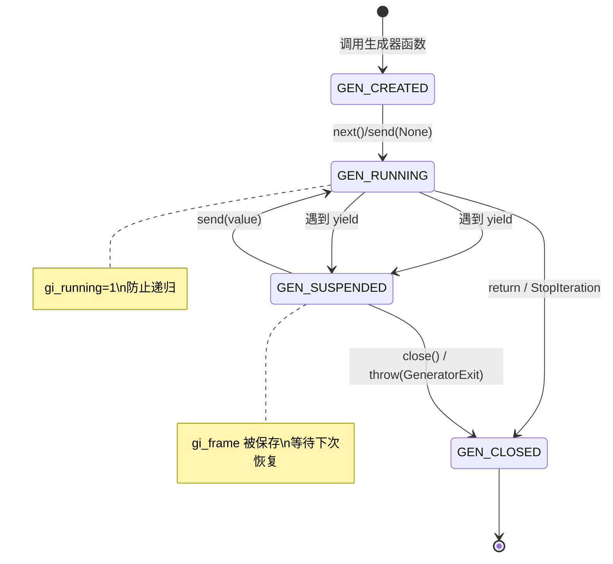
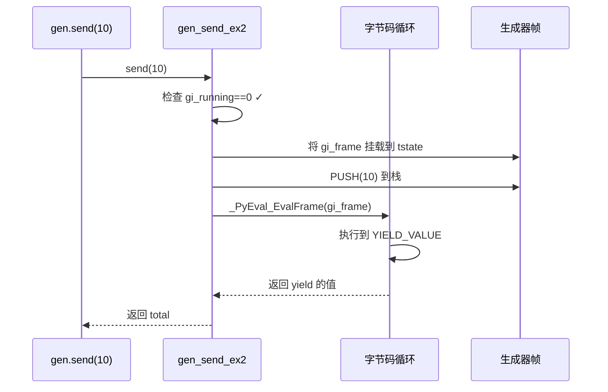
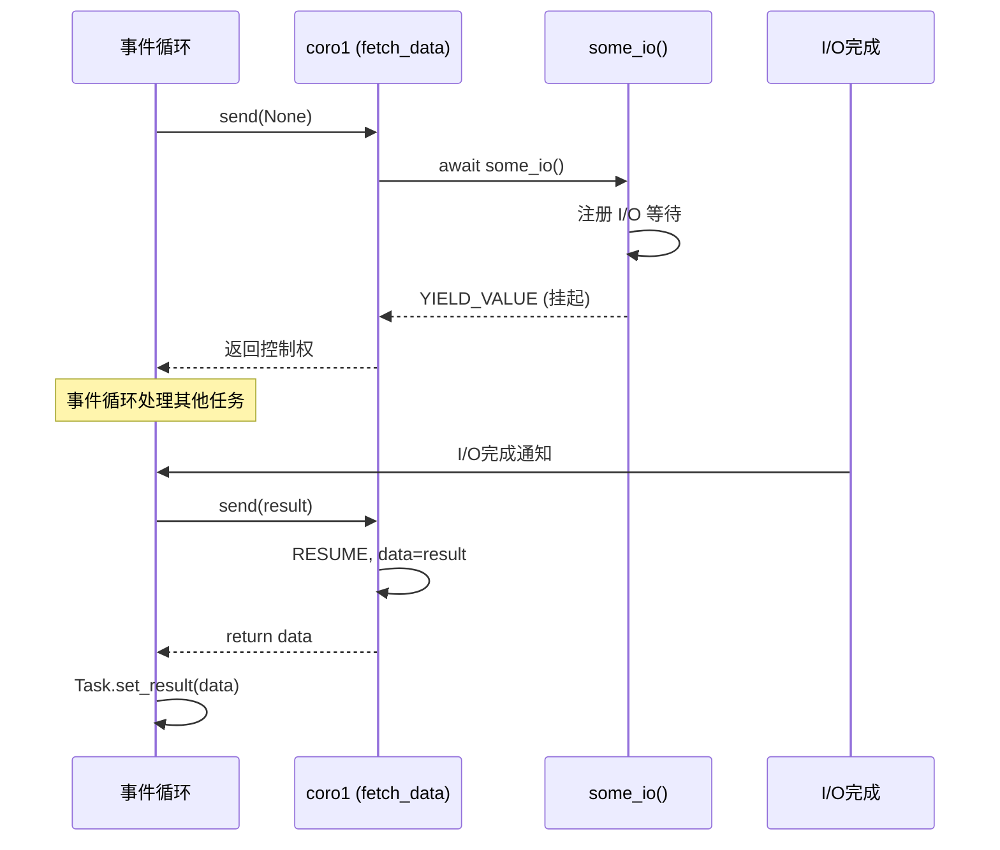

# 第18章 · 协程与生成器

> **本章要点**：深入CPython中生成器和协程的C实现，追踪yield/send/throw的底层机制，理解async/await在C层面如何被调度，以及Python 3.12中协程的最新优化。

---

## 18.1 生成器的C实现：PyGenObject

### 18.1.1 结构体定义

```c
// Include/cpython/genobject.h
typedef struct {
    PyObject_HEAD
    /* 代码对象和执行状态 */
    PyCodeObject *gi_code;       // 生成器函数的 code object
    PyObject *gi_name;           // 生成器函数名
    PyObject *gi_qualname;       // 限定名

    /* 执行上下文 */
    _PyInterpreterFrame *gi_frame;  // 当前栈帧（suspend时为NULL）
    int gi_frame_state;          // 帧状态：FRAME_CREATED/CLEARED/EXECUTING

    /* 异常状态 */
    PyObject *gi_exc_state;      // 异常信息

    /* 关闭状态 */
    char gi_running;             // 是否正在执行（防止递归send）
    char gi_closed;              // 是否已关闭
    PyObject *gi_weakreflist;    // 弱引用列表
} PyGenObject;
```

### 18.1.2 生命周期



---

## 18.2 yield 的底层实现

### 18.2.1 YIELD_VALUE 字节码

```python
def simple_gen():
    yield 1
    yield 2
    yield 3
```

```python
import dis
dis.dis(simple_gen)

# 输出：
#   2           0 LOAD_CONST               1 (1)
#               2 YIELD_VALUE              0
#               4 POP_TOP
#
#   3           6 LOAD_CONST               2 (2)
#               8 YIELD_VALUE              0
#              10 POP_TOP
#
#   4          12 LOAD_CONST               3 (3)
#              14 YIELD_VALUE              0
#              16 POP_TOP
#
#   5          18 LOAD_CONST               0 (None)
#              20 RETURN_VALUE
```

### 18.2.2 YIELD_VALUE 的C处理器

```c
// Python/ceval.c (简化)
case TARGET(YIELD_VALUE): {
    // 1. 获取要yield的值（在栈顶）
    PyObject *retval = POP();

    // 2. 获取当前帧的生成器对象
    PyGenObject *gen = _PyFrame_GetGenerator(frame);

    // 3. 保存帧状态，清除帧引用（暂停执行）
    gen->gi_frame_state = FRAME_CLEARED;
    gen->gi_frame = NULL;  // 帧将被保存，不在求值循环中

    // 4. 释放GIL前保存状态
    // ...

    // 5. 返回yield的值给调用者
    return retval;  // 返回到生成器外部的调用上下文
}
```

> **关键理解**：`YIELD_VALUE` 实际上是将当前帧从求值循环中"剥离"，返回控制权给调用者。生成器的 `gi_frame` 在挂起时被保存，恢复时重新挂载到求值循环。

---

## 18.3 send/throw/close 的底层机制

### 18.3.1 send的实现

```c
// Objects/genobject.c
static PyObject *
gen_send_ex2(PyGenObject *gen, PyObject *arg, PyObject **presult,
             int exc, int closing)
{
    PyThreadState *tstate = _PyThreadState_GET();

    // 1. 检查状态
    if (gen->gi_running) {
        PyErr_SetString(PyExc_ValueError,
            "generator already executing");
        return NULL;  // 防止递归send
    }
    if (gen->gi_closed) {
        PyErr_SetString(PyExc_StopIteration, "");
        return NULL;
    }

    // 2. 恢复执行
    gen->gi_running = 1;
    gen->gi_frame_state = FRAME_EXECUTING;
    // 将帧重新挂载到 tstate 的帧链
    gen->gi_frame->previous = tstate->frame;
    tstate->frame = gen->gi_frame;

    // 3. 将 send 的值推入栈（作为 yield 的返回值）
    if (arg != NULL) {
        Py_INCREF(arg);
        PUSH(arg);
    }

    // 4. 继续执行字节码循环
    PyObject *result = _PyEval_EvalFrame(tstate, gen->gi_frame, throwflag);

    // 5. 处理结果
    //    如果遇到 yield → result 是 yield 的值
    //    如果遇到 return → 设置 StopIteration
    //    如果遇到异常 → 传播

    gen->gi_running = 0;
    return result;
}
```

### 18.3.2 send vs next 的区别

```python
def accumulator():
    total = 0
    while True:
        value = yield total      # send的值成为yield的返回值
        if value is None:        # next()发送None
            continue
        total += value

acc = accumulator()
print(next(acc))         # 0  → 发送None，total += 0 被跳过
print(acc.send(10))      # 10 → value=10, total=10
print(acc.send(20))      # 30 → value=20, total=30
print(next(acc))         # 30 → value=None, total保持不变
```



### 18.3.3 throw的实现

```c
// Objects/genobject.c (简化)
static PyObject *
gen_throw(PyGenObject *gen, PyObject *args)
{
    PyObject *typ, *val = NULL, *tb = NULL;
    // 解析 throw(type, value, traceback)
    ...

    // 在生成器的下一次恢复点注入异常
    // throw的执行路径与send类似，但在执行帧之前设置异常
    return gen_send_ex2(gen, NULL, NULL, 1/*exc=1*/, 0);
}
```

```python
# throw 的用例：注入 CancelToken
def worker():
    try:
        while True:
            data = yield
            print(f"Processing: {data}")
    except KeyboardInterrupt:
        print("Worker cancelled")
        yield "CLEANUP_DONE"

w = worker()
next(w)                     # 启动生成器
print(w.send("task1"))      # Processing: task1
print(w.throw(KeyboardInterrupt))  # Worker cancelled → CLEANUP_DONE
```

---

## 18.4 yield from：委托生成器

### 18.4.1 语义等价

```python
# 以下两段代码在功能上等价

# 使用 yield from
def flatten(nested):
    for sublist in nested:
        yield from sublist

# 不使用 yield from（手动展开版本）
def flatten_manual(nested):
    for sublist in nested:
        _i = iter(sublist)
        _y = next(_i)
        while True:
            try:
                _s = yield _y
            except GeneratorExit as _e:
                _i.close()
                raise _e
            except BaseException as _e:
                _x = _i.throw(_e)
            else:
                _x = _i.send(_s)
            try:
                _y = next(_x if _s is None else _x)
            except StopIteration as _e:
                _r = _e.value
                break
        result = _r  # yield from 的返回值
```

### 18.4.2 C层面的实现

```c
// Objects/genobject.c
// yield from 在C层面通过 _PyGen_yf（yield from object）实现

typedef struct {
    PyObject_HEAD
    PyCodeObject *gi_code;
    // ...
    PyObject *gi_yieldfrom;  // ← 被委托的子生成器/迭代器
} PyGenObject;

// 当执行 SEND 字节码时：
// 如果 gi_yieldfrom != NULL：
//   1. 将 send/throw/close 转发给子生成器
//   2. 子生成器的 yield 值直接传递给外部调用者
//   3. 子生成器 StopIteration 时，它的返回值成为 yield from 的值
```

---

## 18.5 协程：PyCoroObject 与 async/await

### 18.5.1 协程的结构体

```c
// Include/cpython/genobject.h
typedef struct {
    PyObject_HEAD
    PyCodeObject *cr_code;         // 协程的代码对象
    PyObject *cr_name;
    PyObject *cr_qualname;

    _PyInterpreterFrame *cr_frame; // 协程帧
    int cr_frame_state;

    char cr_running;
    char cr_closed;

    PyObject *cr_origin;           // 创建调用栈（调试用）
    PyObject *cr_await;            // 当前await的对象
    PyObject *cr_exc_state;
    PyObject *cr_weakreflist;
} PyCoroObject;
```

> **协程 vs 生成器**：`PyCoroObject` 几乎与 `PyGenObject` 相同，关键区别在于 `cr_await` 字段——它跟踪当前被await的awaitable对象，使得协程可以链式await。

### 18.5.2 async def 的字节码

```python
async def fetch_data():
    data = await some_io()
    return data
```

```python
import dis
dis.dis(fetch_data)

# 输出：
#   2           0 LOAD_GLOBAL              0 (some_io)
#               2 PRECALL                  0
#               6 CALL                     0
#              16 GET_AWAITABLE            1     ← 获取 awaitable 对象
#              18 LOAD_CONST               0 (None)
#              20 SEND                     3     ← 发送 None 启动协程
#              22 YIELD_VALUE                    ← 挂起，返回给事件循环
#              24 RESUME                   0     ← 恢复时跳转这里
#              26 POP_TOP
#              28 STORE_FAST               0 (data)
#
#   3          30 LOAD_FAST                0 (data)
#              32 RETURN_VALUE
```

### 18.5.3 await 的执行流程



### 18.5.4 GET_AWAITABLE 和 SEND 字节码

```c
// Python/ceval.c (await 的字节码实现)

case TARGET(GET_AWAITABLE): {
    // 从栈顶获取对象，确保它是 awaitable
    PyObject *iterable = TOP();

    // 调用 __await__() 获取迭代器
    PyObject *iter = _PyCoro_GetAwaitableIter(iterable);
    // 等价于 Python: type(iterable).__await__(iterable).__iter__()

    SET_TOP(iter);  // 替换栈顶为迭代器
}

case TARGET(SEND): {
    // 向 awaitable 发送值（首次为 None）
    PyObject *v = POP();     // 发送的值
    PyObject *receiver = TOP();  // awaitable 迭代器

    // 调用 type(receiver).send(receiver, v)
    // 或 type(receiver).__next__(receiver)（当v为None时）
    PyObject *result = PyIter_Send(receiver, v);
    // ...
}
```

---

## 18.6 异步生成器：PyAsyncGenObject

### 18.6.1 结构体

```c
// Include/cpython/genobject.h
typedef struct {
    PyObject_HEAD
    PyCodeObject *ag_code;
    PyObject *ag_name;
    PyObject *ag_qualname;

    _PyInterpreterFrame *ag_frame;  // 协程帧（异步生成器也是协程）
    int ag_frame_state;

    char ag_running_async;   // 异步运行时标记
    char ag_closed;

    PyObject *ag_weakreflist;

    /* 异步生成器特有 */
    int ag_finalizer_state;  // 终结器状态
    int ag_hooks_inited;     // 钩子是否初始化
    int ag_closed_ag;        // aclose() 是否已调用
    PyObject *ag_finalizer;  // 终结器
} PyAsyncGenObject;
```

### 18.6.2 async for 的字节码

```python
async def reader():
    async for line in async_file():
        process(line)
```

```python
# 编译后的关键字节码序列：
# GET_AITER     → 调用 __aiter__() 获取异步迭代器
# GET_ANEXT     → 调用 __anext__()，返回 awaitable
# GET_AWAITABLE → 准备好 await
# SEND          → 发送 None，等待下一个值
# YIELD_VALUE   → 挂起，返回给事件循环
```

---

## 18.7 事件循环与C的衔接

### 18.7.1 asyncio.run 的调用链

```python
# Python代码
import asyncio
asyncio.run(main())

# 底层调用链：
# asyncio.run()
#   → Runner.run(main())
#     → loop.run_until_complete(main())
#       → Task.__step()  (在C中通过 send(None) 推进协程)
```

```c
// Modules/_asynciomodule.c (Task.__step 的C实现, 简化)
static PyObject *
task_step(TaskObj *task, PyObject *exc)
{
    // 获取协程对象
    PyObject *coro = task->task_coro;

    // 发送值推进协程（等价于 coro.send(None)）
    PyObject *result;
    if (exc) {
        result = PyObject_CallMethodOneArg(coro, &_Py_ID(throw), exc);
    } else {
        result = PyObject_CallMethodNoArgs(coro, &_Py_ID(send));
    }

    // 处理结果
    if (result == NULL) {
        // StopIteration → 任务完成
        if (PyErr_ExceptionMatches(PyExc_StopIteration)) {
            PyErr_Clear();
            // 标记任务完成
            task->task_state = STATE_FINISHED;
        }
        return NULL;
    }

    // 协程 yield 了 → 注册回调等待结果
    // result 是一个 Future-like 对象
    PyObject *wrapper = task_step_handle_result(task, result);
    return wrapper;
}
```

### 18.7.2 协程调度全景

```mermaid
sequenceDiagram
    participant User as asyncio.run(main())
    participant Loop as 事件循环
    participant Task as Task(coro)
    participant Coro as 协程帧

    User->>Loop: run_until_complete(main())
    Loop->>Task: _step()
    Task->>Coro: coro.send(None)
    Coro->>Coro: await some_io()
    Coro-->>Task: YIELD_VALUE (Future)
    Task->>Loop: add_done_callback(callback)
    Loop->>Loop: 处理其他任务...

    Note over Loop: I/O完成
    Loop->>Task: _wakeup(result)
    Task->>Coro: coro.send(result)
    Coro->>Coro: RESUME, 继续执行
    Coro-->>Task: return value / StopIteration
    Task->>Loop: set_result(value)
    Loop-->>User: 返回最终结果
```

---

## 18.8 生成器与协程的对比

| 特性 | 生成器 (Generator) | 协程 (Coroutine) |
|------|-------------------|-----------------|
| C结构体 | `PyGenObject` | `PyCoroObject` |
| 定义方式 | `def f(): yield` | `async def f(): await` |
| 挂起指令 | `YIELD_VALUE` | `YIELD_VALUE` (通过 await) |
| 恢复指令 | `SEND` → `YIELD_VALUE` | `SEND` → `GET_AWAITABLE` → ... |
| 发送值 | `gen.send(x)` | `coro.send(x)` (通常由事件循环调用) |
| 关键字段 | `gi_frame`, `gi_running` | `cr_frame`, `cr_await` |
| 用途 | 惰性迭代、数据管道 | 异步I/O、并发任务 |
| 关闭方式 | `gen.close()` → `GeneratorExit` | `coro.close()` → `GeneratorExit` |

---

## 18.9 性能对比与实践

### 18.9.1 生成器 vs 列表的内存开销

```python
import sys

# 方式1：使用列表（全部加载到内存）
numbers_list = [i for i in range(1_000_000)]
print(f"List memory: {sys.getsizeof(numbers_list) / 1024 / 1024:.2f} MB")
# 约 8 MB

# 方式2：使用生成器（惰性求值）
numbers_gen = (i for i in range(1_000_000))
print(f"Generator memory: {sys.getsizeof(numbers_gen)} bytes")
# 约 200 bytes（！）
```

### 18.9.2 协程并发性能

```python
import asyncio
import time

async def io_bound_task(n):
    """模拟I/O密集任务"""
    await asyncio.sleep(0.1)  # 模拟I/O等待
    return n * 2

async def main_concurrent():
    # 并发执行100个任务
    tasks = [io_bound_task(i) for i in range(100)]
    start = time.perf_counter()
    results = await asyncio.gather(*tasks)
    elapsed = time.perf_counter() - start
    print(f"100个并发协程: {elapsed:.3f}s")
    # 典型值：~0.1s（几乎等于单个任务的时间）
    return results

asyncio.run(main_concurrent())
```

---

## 18.10 本章小结

| 概念 | 核心C结构 | 关键文件 |
|------|----------|---------|
| 生成器 | `PyGenObject` | `Objects/genobject.c` |
| 协程 | `PyCoroObject` | `Objects/genobject.c` |
| 异步生成器 | `PyAsyncGenObject` | `Objects/genobject.c` |
| yield | `YIELD_VALUE` 字节码 | `Python/ceval.c` |
| send | `gen_send_ex2()` | `Objects/genobject.c` |
| await | `GET_AWAITABLE` + `SEND` | `Python/ceval.c` |
| 事件循环 | `Task.__step` | `Modules/_asynciomodule.c` |

**核心原理回顾**：
- 生成器和协程共享同一个C文件（`Objects/genobject.c`），本质都是"可暂停的帧"
- `yield` 通过 `YIELD_VALUE` 将帧从求值循环中剥离，保存于 `gi_frame`/`cr_frame`
- `send(value)` 通过 `gen_send_ex2()` 重新挂载帧并推入值，继续执行
- `yield from` 在C层面通过 `gi_yieldfrom` 字段实现子生成器的委托转发
- `await` 本质是对 awaitable 对象调用 `send(None)`，由事件循环而非用户代码触发
- 生成器的内存优势来源于惰性求值——只保存一个帧而非整个数据集

> 🎉 **恭喜完成全书！** 从CPython源码结构到协程实现，你已经完整遍历了Python解释器的核心机制。建议回顾 [首页](/README.md) 的总览图，将各章节串联为完整的知识体系。学以致用——去读CPython源码、写C扩展、甚至为CPython贡献代码吧！
